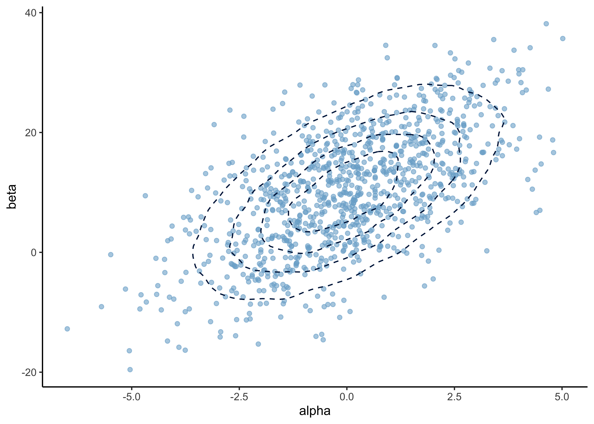
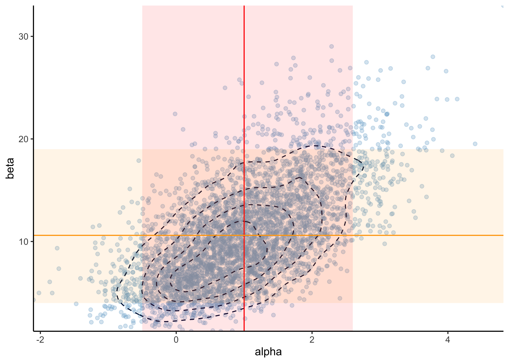
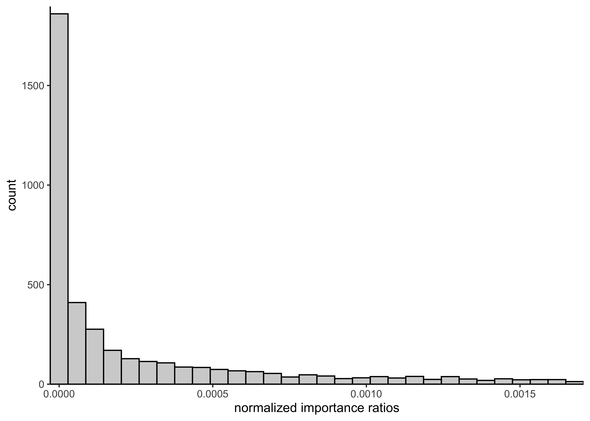
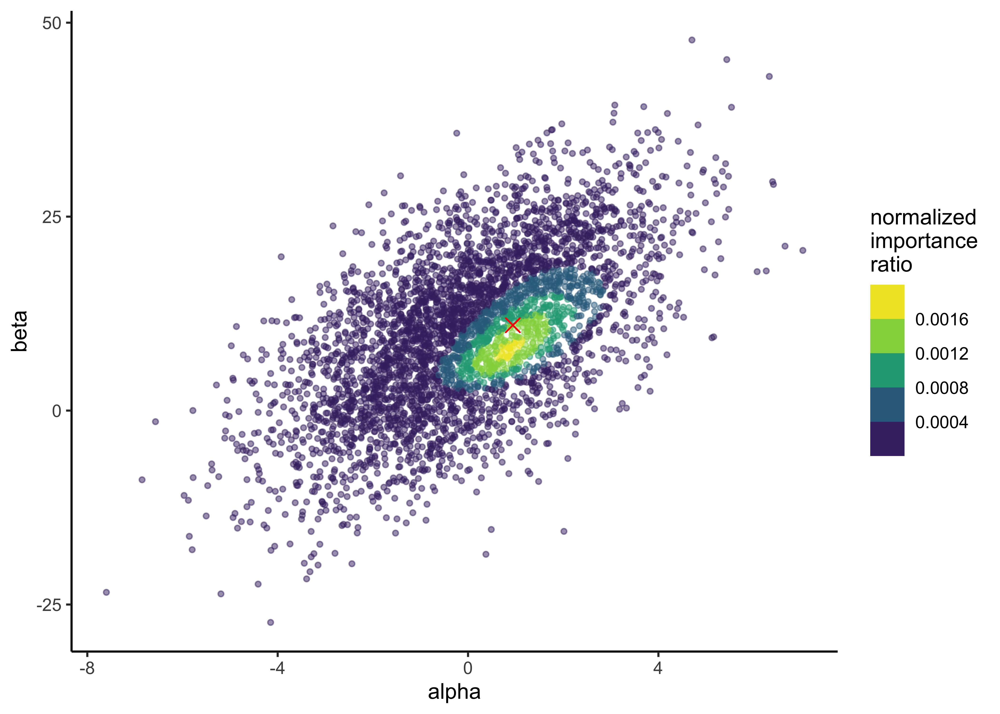

# Assignment 4

2021-09-23

**[Assignment 4](https://github.com/jhrcook/bayesian-data-analysis-course/tree/master/course-material/assignment-04.pdf)**

## Setup


```r
knitr::opts_chunk$set(echo = TRUE, comment = "#>", dpi = 300)

for (f in list.files(here::here("src"), pattern = "R$", full.names = TRUE)) {
  source(f)
}

library(glue)
library(tidyverse)

theme_set(theme_classic())

light_blue <- "#7AAED1"
dark_blue <- "#011F4B"
```

## Exercise 1. Bioassay model

**In this exercise, you will use a dose-response relation model that is used in Section 3.7.**
**The used likelihood is the same, but instead of uniform priors, we will use a bivariate normal distribution as the joint prior distribution of the parameters $\alpha$ and $\beta$.**

Below is a description of the bioassay from the reading instructions (with some minor changes to help the grammar):

> The example is from Racine *et al.* (1986) (see ref in the end of the BDA3).
> [This] Swiss company makes classification[s] of chemicals to different toxicity categories defined by [governmental] authorities (like [the] EU).
> Toxicity classification is based on [the] lethal dose 50% (LD50) which [indicates] what amount of [a] chemical [that] kills 50% of the subjects.
> [The] [s]maller the LD50, [the] more lethal the chemical is.
> The original paper mentions "1983 Swiss poison Regulation" which defines [the] following categories for chemicals orally given to rats (mg/ml):

| Class | LD50      |
|:-----:|:---------:|
| 1     | <5        |
| 2     | 5-50      |
| 3     | 50-500    |
| 4     | 500-2000  |
| 5     | 2000-5000 |

> To reduce the number of rats needed in the experiments, the company started to use Bayesian methods.
> The paper mentions that in those days, [the] use of just 20 rats to define the classification was very little.
> [The] book gives the LD50 in log(g/ml).
> When the result from demo3_6 is transformed to mg/ml, we see that the mean LD50 is about 900 and $p(500 < LD50 < 2000) \approx 0.99$.
> Thus, the tested chemical can be classified as category 4 toxic.

**a) In the prior distribution for $\alpha, \beta)$, the marginal distributions are $\alpha \sim N(0, 2^2)$ and $\beta \sim N(10, 10^2)$, and the correlation between them is $\text{corr}(\alpha, \beta) = 0.6$.**
**Report the mean (vector of two values) and covariance (two by two matrix) of the bivariate normal distribution.**

The definition of a bivariate normal distribution is

$$
\begin{pmatrix} X_1 \\ X_2 \end{pmatrix}
\sim N
\begin{bmatrix}
  \begin{pmatrix} \mu_1 \\ \mu_2 \end{pmatrix} ,
  \begin{pmatrix}
    \sigma_1^2 & \rho \sigma_2 \sigma_1 \\
    \rho \sigma_1 \sigma_2 & \sigma_2^2 \\
  \end{pmatrix}
\end{bmatrix}
$$

Because $\alpha$ and $\beta$ are both normal distributions, but the mean vector is

$$
\begin{pmatrix} \mu_\alpha \\ \mu_\beta \end{pmatrix} =
\begin{pmatrix} 0 \\ 10 \end{pmatrix}
$$

and the covariance matrix is

$$
\begin{aligned}
\begin{pmatrix}
  \sigma_\alpha^2 & \rho \sigma_\beta \sigma_\alpha \\
  \rho \sigma_\alpha \sigma_\beta & \sigma_\beta^2 \\
\end{pmatrix} &=
\begin{pmatrix}
  2^2 & 0.6 \times 10 \times 2 \\
  0.6 \times 2 \times 10 & 10^2 \\
\end{pmatrix} \\
&= \begin{pmatrix}
  4 & 12 \\
  12 & 100 \\
\end{pmatrix}
\end{aligned}
$$


```r
get_prior_parameters <- function() {
  mu_a <- 0
  sigma_a <- 2
  mu_b <- 10
  sigma_b <- 10
  rho <- 0.6
  cov_value <- rho * sigma_a * sigma_b

  mu <- c(mu_a, mu_b)
  cov_mat <- matrix(
    c(sigma_a^2, cov_value, cov_value, sigma_b^2),
    nrow = 2,
    byrow = FALSE
  )

  return(list(mu = mu, cov_mat = cov_mat))
}

sample_from_prior <- function(n) {
  params <- get_prior_parameters()
  bvn <- MASS::mvrnorm(n, mu = params$mu, Sigma = params$cov_mat)
  return(bvn)
}

plot_df <- as.data.frame(sample_from_prior(1e5)) %>%
  as_tibble() %>%
  set_names("alpha", "beta")

plot_points_and_density <- function(df,
                                    x,
                                    y,
                                    n_samples = 1000,
                                    point_alpha = 0.6,
                                    density_bins = 5) {
  df %>%
    ggplot(aes(x = {{ x }}, y = {{ y }})) +
    geom_point(
      data = sample_n(df, size = min(c(nrow(df), n_samples))),
      alpha = point_alpha,
      color = light_blue
    ) +
    geom_density_2d(bins = density_bins, linetype = 2, color = dark_blue)
}

plot_points_and_density(plot_df, alpha, beta)
```



source: [PennState, Elberl College of Science: "4.2 - Bivariate Normal Distribution"](https://online.stat.psu.edu/stat505/lesson/4/4.2)

**b) You are given 4000 independent draws from the posterior distribution of the model.**
**Report the mean as well as 5% and 95% quantiles separately for both $\alpha$ and $\beta$.**
**Report also the Monte Carlo standard errors (MCSEs) for the mean and quantile estimates.**
**Explain in words what does Monte Carlo standard error mean and how you decided the number of digits to show.**


```r
bioassay_posterior <- read_data(
  "bioassay_posterior.txt",
  read_tsv,
  col_names = FALSE
)
```

```
#> Rows: 4000 Columns: 2
```

```
#> ── Column specification ────────────────────────────────────────────────────────────────────────────────────────────────────────
#> Delimiter: "\t"
#> dbl (2): X1, X2
```

```
#> 
#> ℹ Use `spec()` to retrieve the full column specification for this data.
#> ℹ Specify the column types or set `show_col_types = FALSE` to quiet this message.
```

```r
colnames(bioassay_posterior) <- c("alpha", "beta")
head(bioassay_posterior)
```

```
#> # A tibble: 6 × 2
#>     alpha  beta
#>     <dbl> <dbl>
#> 1 -0.0205 10.0 
#> 2  1.22    4.50
#> 3  3.05   16.2 
#> 4  1.32    4.92
#> 5  1.36   12.9 
#> 6  1.09    5.94
```


```r
p <- plot_points_and_density(
  bioassay_posterior,
  alpha,
  beta,
  n_samples = Inf,
  point_alpha = 0.3
)
p
```


MCSE accuracy of averages: $s_\theta / \sqrt(S)$ where $s_\theta$ is the standard deviation of the draws and $S$ is the number of draws.


```r
apply(bioassay_posterior, 2, function(s) {
  sd(s) / sqrt(length(s))
})
```

```
#>      alpha       beta 
#> 0.01482435 0.07560016
```

Calculate the means of the posterior distributions.


```r
print("Posterior means:")
```

```
#> [1] "Posterior means:"
```

```r
apply(bioassay_posterior, 2, mean)
```

```
#>      alpha       beta 
#>  0.9852263 10.5964813
```

Calculate the MCSE of the quantiles.


```r
apply(bioassay_posterior, 2, function(x) {
  unlist(c(
    aaltobda::mcse_quantile(x, 0.05),
    aaltobda::mcse_quantile(x, 0.95)
  ))
})
```

```
#>           alpha       beta
#> mcse 0.02600412 0.07043125
#> mcse 0.04206342 0.24121289
```


```r
print("Posterior 5% and 95% quantiles:")
```

```
#> [1] "Posterior 5% and 95% quantiles:"
```

```r
apply(bioassay_posterior, 2, function(x) {
  quantile(x, c(0.05, 0.95))
})
```

```
#>          alpha      beta
#> 5%  -0.4675914  3.991403
#> 95%  2.6102028 19.340365
```

Accounting for the precisions of MCSE:

- $\mu_\alpha = 1.0$ with 5% and 95% CI: $(-0.5, 2.6)$
- $\mu_\beta = 10.6$ with 5% and 95% CI: $(4.0, 19)$

MCSE is the expected error from the stochastic process of Monte Carlo simulations.
Here, it is used to determine the number of digits to report where we report the digits where the MCSE is 0.


```r
p +
  geom_vline(xintercept = 1.0, color = "red") +
  geom_ribbon(aes(xmin = -0.5, xmax = 2.6), alpha = 0.1, fill = "red") +
  geom_hline(yintercept = 10.6, color = "orange") +
  geom_ribbon(aes(ymin = 4.0, ymax = 19), alpha = 0.1, fill = "orange") +
  scale_x_continuous(expand = expansion(0)) +
  scale_y_continuous(expand = expansion(0))
```



**c) Implement a function for computing the log importance ratios (log importance weights) when the importance sampling target distribution is the posterior distribution, and the proposal distribution is the prior distribution from question a).**
**Explain in words why it’s better to compute log ratios instead of ratios.**

It is better to compute log ratios to avoid overflow or underflow that can occur more easily when using the ratios.

As hinted in the assignment (see PDF), because we are using the prior distribution as the proposal distribution, the calculation of the importance weights is much easier.

The importance weight $w(\theta^s)$ is calculated as follows:

$$
w(\theta^s) = \frac{q(\theta^s|y)}{g(\theta^s)}
$$

With the proposal distribution $g$ set as the prior distribution, $g(\theta) = p(\theta)$, the equation simplifies to:

$$
\begin{aligned}
w(\theta^s) &= \frac{q(\theta^s|y)}{g(\theta^s)} \\
 &= \frac{p(\theta^s) p(y|\theta^s)}{p(\theta^s)} \\
 &= p(y|\theta^s)
\end{aligned}
$$
Thus, the importance weight is just the likelihood for the model.
In the question(again, see the PDF), we are asked to use `aaltobda::bioassaylp()` to calculate the logarithm of the likelihood.


```r
log_importance_weights <- function(a, b) {
  bioassay_data <- read_bioassay_data(show_col_types = FALSE)
  aaltobda::bioassaylp(
    alpha = a,
    beta = b,
    x = bioassay_data$x,
    y = bioassay_data$y,
    n = bioassay_data$n
  )
}

# Test data.
alpha <- c(1.896, -3.6, 0.374, 0.964, -3.123, -1.581)
beta <- c(24.76, 20.04, 6.15, 18.65, 8.16, 17.4)

test_results <- round(log_importance_weights(alpha, beta), 2)
stop_if_not_all_close_to(
  test_results,
  c(-8.95, -23.47, -6.02, -8.13, -16.61, -14.57)
)
```

**d) Implement a function for computing normalized importance ratios from the unnormalized log ratios in question c).**
**In other words, exponentiate the log ratios and scale them such that they sum to one.**
**Explain in words what is the effect of exponentiating and scaling so that sum is one.**

The normalized importance weights are just the exponentiated log importance weights divided by the total to sum to one.
This is conducted in `normalized_importance_weights()`, below.


```r
normalized_importance_weights <- function(alpha, beta) {
  weights <- exp(log_importance_weights(alpha, beta))
  return(weights / sum(weights))
}

# Test data.
test_results <- round(
  normalized_importance_weights(alpha = alpha, beta = beta), 3
)
stop_if_not_all_close_to(
  test_results,
  c(0.045, 0.000, 0.852, 0.103, 0.000, 0.000)
)
```

The exponentiation is to put the importance weights into a linear-scale instead of a log-scale in which they are calculated.
They are normalized such that they sum to one so they can be used to scale the values of $\theta$ without changing the mean of $\theta$ for importance sampling.
Also, normalizing to sum to 1 makes them comparable regardless of the values of $\theta$.


**e) Sample 4000 draws of $\alpha$ and $\beta$ from the prior distribution from a).**
**Compute and plot a histogram of the 4000 normalized importance ratios.**
**Use the functions you implemented in c) and d).**


```r
prior_draws <- sample_from_prior(4000)
norm_importance_ratios <- normalized_importance_weights(
  alpha = prior_draws[, 1],
  beta = prior_draws[, 2]
)

plot_single_hist(
  x = norm_importance_ratios, bins = 30, alpha = 0.3, color = "black"
) +
  labs(x = "normalized importance ratios")
```



**f) Using the importance ratios, compute the importance sampling effective sample size $S_\text{eff}$ and report it.**

From equation 10.4 in *BDA3*:

$$
S_\text{eff} = \frac{1}{\sum^S (\tilde{w}(\theta^s))^2}
$$

where $\tilde{w}(\theta^s)$ are the *normalized* importance weights.


```r
S_eff <- function(alpha, beta) {
  w_tilde <- normalized_importance_weights(alpha, beta)
  s_eff <- 1 / sum(w_tilde^2)
  return(s_eff)
}

# Test data.
test_results <- round(
  S_eff(alpha = alpha, beta = beta), 3
)
stop_if_not_close_to(test_results, 1.354)
```


```r
bioassy_s_eff <- S_eff(bioassay_posterior$alpha, bioassay_posterior$beta)
glue("S_eff for posterior draws of bioassy model: {round(bioassy_s_eff, 3)}")
```

```
#> S_eff for posterior draws of bioassy model: 3066.061
```

**g) Explain in your own words what the importance sampling effective sample size represents.**
**Also explain how the effective sample size is seen in the histogram of the weights that you plotted in e).**

The importance sampling effective sample size indicates how well the samples from the importance sampling cover the density of the target distribution $q(\theta|y)$.
Ideally, the weights are uniform, resulting in a $S_\text{eff}$ near the true number of draws (i.e. 4000 in this case).
If there are some samples with very high importance, then $S_\text{eff}$ gets smaller to indicate that the sampling did accurately cover the target distribution.


```r
prior_s_eff <- S_eff(prior_draws[, 1], prior_draws[, 2])
glue("S_eff for prior draws of bioassy model: {round(prior_s_eff, 3)}")
```

```
#> S_eff for prior draws of bioassy model: 1116.397
```

The $S_\text{eff}$ for the prior draws is calculated above.
We can see that even though there were 4000 draws, the effective sampling size is about 1116.
This means that the prior samples do no accurately sample from the target distribution.
We can see this in the histogram with most importance weights near 0 and a thick tail of higher values.
This is also shown in the plot below of the prior samples colored by their importance ratios.
There is a density of higher importance ratios in one region of the samples, likely indicating where there is a lot of posterior density for the model.


```r
p <- tibble(
  alpha = prior_draws[, 1],
  beta = prior_draws[, 2],
  norm_imp_ratio = norm_importance_ratios
) %>%
  ggplot(aes(x = alpha, y = beta, color = norm_imp_ratio)) +
  geom_point(size = 1, alpha = 0.5) +
  scale_color_viridis_b() +
  labs(x = "alpha", y = "beta", color = "normalized\nimportance\nratio")
p
```


**h) Implement a function for computing the posterior mean using importance sampling, and compute the mean using your 4000 draws.**
**Explain in your own words the computation for importance sampling.**
**Report the means for $\alpha$ and $\beta$, and also the Monte Carlo standard errors (MCSEs) for the mean estimates.**
**Report the number of digits for the means based on the MCSEs.**

**Hint. Use the same equation for the MCSE of $\text{E}[\theta]$ as earlier $\sqrt{\text{Var}[\theta]/S}$, but now replace $S$ with $S_\text{eff}$.**
**To compute $\text{Var}[\theta]$ with importance sampling, use the identity $\text{Var}[\theta] = \text{E}[\theta^2] − \text{E}[\theta]^2$.**

The posterior mean (expectation) of $\theta = (\alpha, \beta)$ can be computed using importance sampling using the following equation (eq. 10.3 in *BDA3*):

$$
\text{E}(h(\theta|y)) = \frac{\frac{1}{S} \sum^S h(\theta^s) w(\theta^s)}{\frac{1}{S} \sum^S w(\theta^s)} \\
w(\theta^s) = \frac{q(\theta^s|y)}{g(\theta^s)}
$$

where $w(\theta^s)$ is the importance weight calculated as the quotient of the target distribution $q$ and the proposal distribution $g$.
The importance weights are calculated in `log_importance_weights()` in question c).

In this case, $h(\theta|y)$ is the posterior distribution of $\theta$ and $\text{E}(h(\theta|y))$ is the mean of the posterior distribution of $\theta$.
$h(\theta)$ is the prior distribution.
Thus, the algorithm is weight prior draws by their importance weight.


```r
posterior_mean <- function(alpha, beta) {
  weights <- exp(log_importance_weights(alpha, beta))
  theta <- tibble(alpha = alpha, beta = beta)

  # Remove values that have NA weights (lazy solution).
  if (any(is.na(weights))) {
    num_missing <- sum(is.na(weights))
    warning(glue("NA weights - removing {num_missing} sample(s)."))
    theta <- theta[!is.na(weights), ]
    weights <- weights[!is.na(weights)]
  }

  denominator <- sum(weights)
  mu_theta_post <- apply(theta, 2, function(x) {
    sum(x * weights) / sum(weights)
  })
  return(mu_theta_post)
}

test_results <- round(posterior_mean(alpha = alpha, beta = beta), 3)
stop_if_not_all_close_to(test_results, c(0.503, 8.275))
```

Importance sampling is really just a method for weighting possible values of $\theta$ by their importance ratio.
In this case, because we used the prior distribution at the proposal distribution, the importance ratio is the probability of $\theta$ under the unnormalized posterior distribution.
Thus, this procedure weights possible values of $\theta$ by how likely they are given the posterior distribution.


```r
prior_a <- prior_draws[, 1]
prior_b <- prior_draws[, 2]

post_means <- posterior_mean(prior_a, prior_b)
post_means
```

```
#>      alpha       beta 
#>  0.9692832 10.7213716
```

As stated in the hint with the question, we can calculate the MCSE of $\text{E}[\theta]$ as $\sqrt{\text{Var}[\theta]/S},$, using $S_\text{eff}$ for $S$, and $\text{Var}[\theta]$ as $\text{E}[\theta^2] − \text{E}[\theta]^2$


```r
e_theta_squared <- posterior_mean(prior_a^2, prior_b^2)
```

```
#> Warning in posterior_mean(prior_a^2, prior_b^2): NA weights - removing 70
#> sample(s).
```

```r
var_theta <- abs(e_theta_squared - (post_means^2))
s_eff <- S_eff(prior_a, prior_b)
mcse <- sqrt(var_theta / s_eff)
mcse
```

```
#>      alpha       beta 
#> 0.01003902 0.30847776
```


```r
a_post_mean <- round(post_means[[1]], 2)
b_post_mean <- round(post_means[[2]], 0)
glue("alpha post mean: {a_post_mean}, beta post mean: {b_post_mean}")
```

```
#> alpha post mean: 0.97, beta post mean: 11
```

The posterior means for $\alpha$ and $\beta$ are indicated by the red dot over-layed on the distribution of importance weights from a previous question.


```r
p + geom_point(x = a_post_mean, y = b_post_mean, color = "red", shape = 4, size = 3)
```


