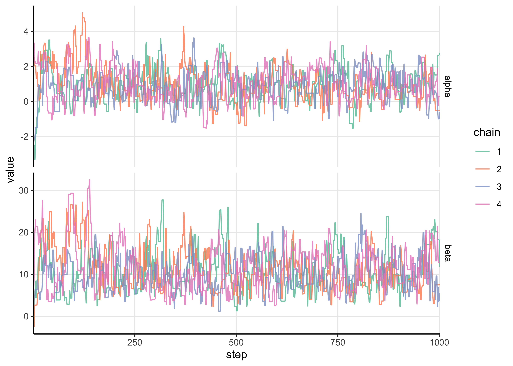
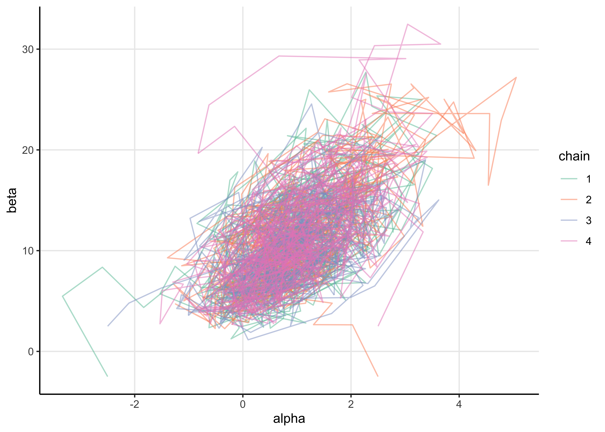
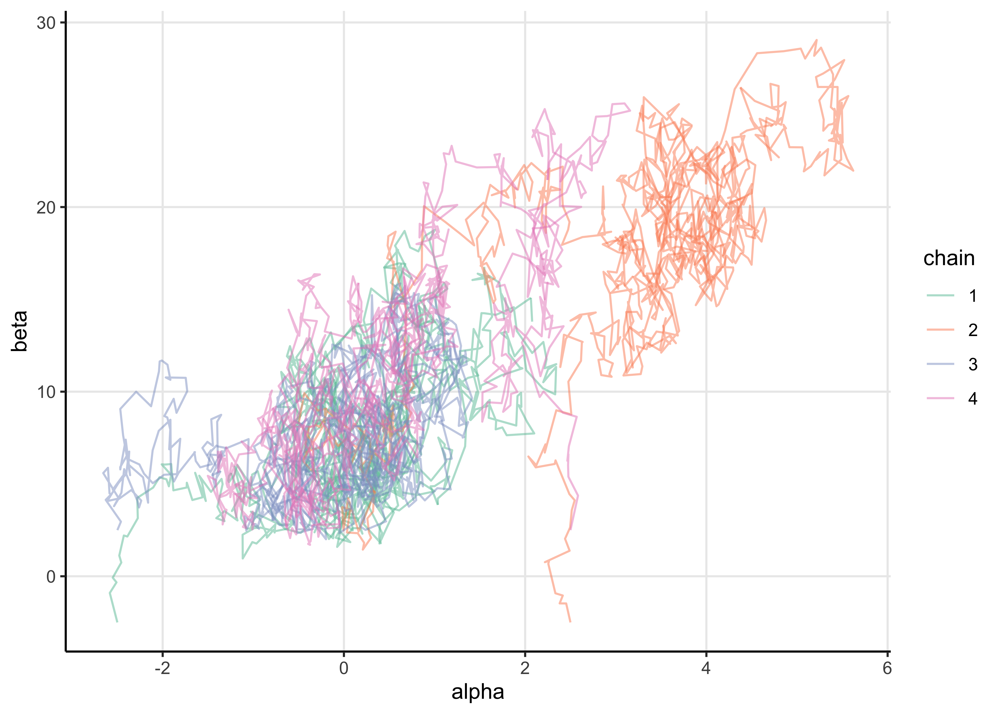
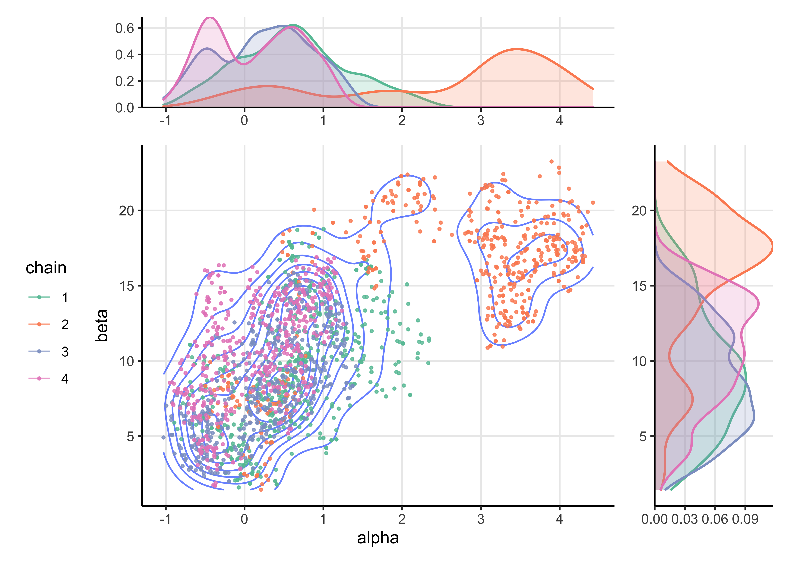
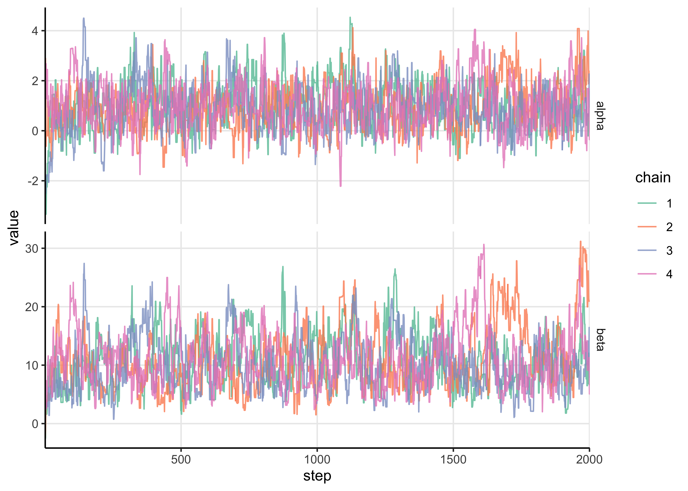

# Assignment 5

2021-10-01

**[Assignment 5](https://github.com/jhrcook/bayesian-data-analysis-course/tree/master/course-material/assignment-05.pdf)**

## Setup


```r
knitr::opts_chunk$set(echo = TRUE, comment = "#>", dpi = 300)

for (f in list.files(here::here("src"), pattern = "R$", full.names = TRUE)) {
  source(f)
}

library(glue)
library(patchwork)
library(tidyverse)

theme_set(
  theme_classic() +
    theme(
      strip.background = element_blank(),
      panel.grid.major = element_line()
    )
)

bioassay <- read_bioassay_data()
bioassay
```

```
## # A tibble: 4 × 3
##       x     n     y
##   <dbl> <dbl> <dbl>
## 1 -0.86     5     0
## 2 -0.3      5     1
## 3 -0.05     5     3
## 4  0.73     5     5
```

## Generalized linear model: Bioassay with Metropolis

**Metropolis algorithm: Replicate the computations for the bioassay example of section 3.7 in BDA3 using the Metropolis algorithm.**
**The Metropolis algorithm is described in BDA3 Chapter 11.2.**
**More information on the bioassay data can be found in Section 3.7 in BDA3, and in Chapter 3 notes.**

### Exercise 1.

**Implement the Metropolis algorithm as an R function for the bioassay data. Use the Gaussian prior as in Assignment 4, that is**

$$
\begin{bmatrix}
\alpha \\ \beta
\end{bmatrix} \sim \text{N} (\mu_0, \Sigma_0)
\quad \text{where} \quad
\mu_0 = \begin{bmatrix} 0 \\ 10 \end{bmatrix}
\quad \text{and} \quad
\Sigma_0 = \begin{bmatrix} 2^2 & 12 \\ 12 & 10^2 \end{bmatrix}
$$

**a) Start by implementing a function called density_ratio to compute the density ratio function, $r$ in Eq. (11.1) in BDA3.**

$$
r = \frac{p(\theta^*|y)}{p(\theta^{t-1}|y)}
$$


```r
prob_theta_under_prior <- function(a, b) {
  mu <- c(0, 10)
  sigma <- matrix(c(2^2, 12, 12, 10^2), nrow = 2)
  mvtnorm::dmvnorm(c(a, b), mean = mu, sigma = sigma)
}


log_posterior_prob <- function(a, b, x, y, n) {
  log_likelihood <- aaltobda::bioassaylp(
    alpha = a, beta = b, x = x, y = y, n = n
  )
  prior_prob <- prob_theta_under_prior(a, b)
  log_post <- log_likelihood + log(prior_prob)
  return(log_post)
}

density_ratio <- function(alpha_propose,
                          alpha_previous,
                          beta_propose,
                          beta_previous,
                          x,
                          y,
                          n) {
  log_post_new <- log_posterior_prob(alpha_propose, beta_propose, x, y, n)
  log_post_old <- log_posterior_prob(alpha_previous, beta_previous, x, y, n)
  return(exp(log_post_new - log_post_old))
}
```


```r
test_1 <- density_ratio(
  alpha_propose = 1.89, alpha_previous = 0.374,
  beta_propose = 24.76, beta_previous = 20.04,
  x = bioassay$x, y = bioassay$y, n = bioassay$n
)
stop_if_not_close_to(test_1, 1.305179)

test_2 <- density_ratio(
  alpha_propose = 0.374, alpha_previous = 1.89,
  beta_propose = 20.04, beta_previous = 24.76,
  x = bioassay$x, y = bioassay$y, n = bioassay$n
)
stop_if_not_close_to(test_2, 0.7661784)
```

**b) Now implement a function called `Metropolis_bioassay()` which implements the Metropolis algorithm using the `density_ratio()`.**


```r
# Helper function to turn the chains into a data frame.
chain_to_df <- function(chain, names) {
  purrr::map_dfr(chain, ~ as.data.frame(t(.x))) %>%
    tibble::as_tibble() %>%
    purrr::set_names(names)
}


propose_theta <- function(theta_old, a_sigma = 1, b_sigma = 5) {
  c(
    rnorm(1, mean = theta_old[[1]], sd = a_sigma),
    rnorm(1, mean = theta_old[[2]], sd = b_sigma)
  )
}

Metropolis_bioassay <- function(theta_t0,
                                x,
                                y,
                                n,
                                alpha_jump = 1,
                                beta_jump = 5,
                                N = 1000,
                                quiet = FALSE) {
  theta_t <- unlist(theta_t0)
  chain <- as.list(rep(NA_real_, n = N + 1))
  chain[[1]] <- theta_t

  n_accepts <- 0

  for (t in seq(2, N + 1)) {
    theta_star <- propose_theta(
      theta_t,
      a_sigma = alpha_jump, b_sigma = beta_jump
    )

    density_ratio <- density_ratio(
      alpha_propose = theta_star[[1]],
      alpha_previous = theta_t[[1]],
      beta_propose = theta_star[[2]],
      beta_previous = theta_t[[2]],
      x = x,
      y = y,
      n = n
    )

    accept <- runif(1) < min(c(1, density_ratio))
    if (accept) {
      theta_t <- theta_star
      n_accepts <- n_accepts + 1
    }
    chain[[t]] <- theta_t
  }
  if (!quiet) {
    frac_accepts <- n_accepts / N
    message(glue::glue("fraction of accepted jumps: {frac_accepts}"))
  }
  return(chain_to_df(chain, names = c("alpha", "beta")))
}
```


```r
# Plot the trace of the chains.
plot_trace <- function(chains_df, alpha = 0.8) {
  chains_df %>%
    group_by(chain) %>%
    mutate(step = row_number()) %>%
    ungroup() %>%
    pivot_longer(-c(chain, step)) %>%
    ggplot(aes(x = step, y = value)) +
    facet_grid(rows = vars(name), scales = "free_y") +
    geom_line(aes(color = chain), alpha = alpha) +
    scale_color_brewer(type = "qual", palette = "Set2") +
    scale_x_continuous(expand = expansion(c(0, 0)))
}

# Plot the chains in 2 dimensions.
plot_chains <- function(chains_df, alpha = 0.8) {
  chains_df %>%
    ggplot(aes(x = alpha, y = beta)) +
    geom_path(aes(color = chain), alpha = alpha) +
    scale_color_brewer(type = "qual", palette = "Set2")
}

# Plot the posterior density of `x`. Used by `plot_posterior()`.
plot_posterior_density <- function(chains_df, x, color) {
  chains_df %>%
    ggplot(aes(x = {{ x }}, color = {{ color }}, fill = {{ color }})) +
    geom_density(size = 0.7, alpha = 0.2) +
    scale_color_brewer(type = "qual", palette = "Set2") +
    scale_fill_brewer(type = "qual", palette = "Set2") +
    theme(legend.position = "none", axis.title = element_blank())
}

# Plot the posterior distributions after removing warm-up steps.
plot_posterior <- function(chains_df, alpha = 0.8, size = 0.6, warm_up = 0.5) {
  chains_without_warmup <- chains_df %>%
    group_by(chain) %>%
    mutate(step = row_number()) %>%
    ungroup() %>%
    filter(step > (max(step) * !!warm_up))

  scatter <- chains_without_warmup %>%
    ggplot(aes(x = alpha, y = beta)) +
    geom_density_2d(alpha = 0.7) +
    geom_point(aes(color = chain), size = size, alpha = alpha) +
    scale_color_brewer(type = "qual", palette = "Set2") +
    theme(legend.position = "left")

  alpha_dist <- plot_posterior_density(chains_without_warmup, alpha, chain) +
    scale_y_continuous(expand = expansion(c(0, 0)))
  beta_dist <- plot_posterior_density(chains_without_warmup, beta, chain) +
    scale_y_continuous(expand = expansion(c(0, 0))) +
    coord_flip()

  patch_design <- "
    AAAA#
    BBBBC
    BBBBC
    BBBBC
    BBBBC
  "
  patch <- alpha_dist + scatter + beta_dist + plot_layout(design = patch_design)
  return(patch)
}
```

Run the Metropolis algorithm with the default values from the question.
I chose a grid of starting points $(\pm 2.5, \pm 2.5)$ and ran four chains for 1,000 iterations.


```r
starting_points <- list(
  c(-2.5, -2.5), c(2.5, -2.5), c(-2.5, 2.5), c(2.5, 2.5)
)

set.seed(0)
metropolis_chains <- purrr::map_dfr(
  seq(1, 4),
  ~ Metropolis_bioassay(
    starting_points[[.x]],
    x = bioassay$x,
    y = bioassay$y,
    n = bioassay$n
  ) %>%
    add_column(chain = as.character(.x))
)
```

```
#> fraction of accepted jumps: 0.402
```

```
#> fraction of accepted jumps: 0.428
```

```
#> fraction of accepted jumps: 0.445
```

```
#> fraction of accepted jumps: 0.456
```

```r
plot_trace(metropolis_chains)
```



```r
plot_chains(metropolis_chains, alpha = 0.5)
```



```r
plot_posterior(metropolis_chains)
```


The chains mixed well, but I tried reducing the proposal distributions standard deviations by an order of magnitude.


```r
set.seed(0)
metropolis_chains <- purrr::map_dfr(
  seq(1, 4),
  ~ Metropolis_bioassay(
    starting_points[[.x]],
    x = bioassay$x,
    y = bioassay$y,
    n = bioassay$n,
    alpha_jump = 0.1,
    beta_jump = 1
  ) %>%
    add_column(chain = as.character(.x))
)
```

```
#> fraction of accepted jumps: 0.847
```

```
#> fraction of accepted jumps: 0.866
```

```
#> fraction of accepted jumps: 0.889
```

```
#> fraction of accepted jumps: 0.858
```

```r
plot_trace(metropolis_chains)
```


```r
plot_chains(metropolis_chains, alpha = 0.5)
```



```r
plot_posterior(metropolis_chains)
```



<br> <!-- For some reason this is need to fix some weird formatting behavior. -->

The chains did not mix well with these smaller proposal distribution standard deviations.
Below, I try slightly larger values for the jump sizes and also run 2,000 total iterations (1,000 warm-up steps).


```r
set.seed(0)
metropolis_chains <- purrr::map_dfr(
  seq(1, 4),
  ~ Metropolis_bioassay(
    starting_points[[.x]],
    x = bioassay$x,
    y = bioassay$y,
    n = bioassay$n,
    alpha_jump = 1,
    beta_jump = 3,
    N = 2000
  ) %>%
    add_column(chain = as.character(.x))
)
```

```
#> fraction of accepted jumps: 0.4955
```

```
#> fraction of accepted jumps: 0.523
```

```
#> fraction of accepted jumps: 0.519
```

```
#> fraction of accepted jumps: 0.5285
```

```r
plot_trace(metropolis_chains)
```



```r
plot_chains(metropolis_chains, alpha = 0.5)
```


```r
plot_posterior(metropolis_chains)
```


### Exercise 2.

**a) Describe in your own words in one paragraph the basic idea of the Metropolis algorithm (see BDA3 Section 11.2, and lecture video 5.1).**

The Metropolis algorithm is a biased random walk through the space of the model parameters.
The bias is calculated by the ratio of the unnormalized probability of a new set of values to that of the current values.
If the new location has a higher probability, the random walk will always go to the proposed location, otherwise, the new position is accepted with a probability equal to the ratio.
This way, the random walk will always tend towards space with higher probability, and then once in a region with relatively high probabilty, will still explore the space at a frequency proportional to the probability density of the region.

**b) The proposal distribution (related to jumping rule) you used.**
**Describe briefly in words how you chose the final proposal distribution you used for the reported results.**

I chose the final distribution because it produced, visually, good mixing of the chains and exploration of the parameter space.

**c) The initial points of your Metropolis chains (or the explicit mechanism for generating them).**

I just chose a grid to make sure there was enough variability in the starting locations.
This strategy helped me to understand the effect (if any) of the starting location of the chain on its exploration of the posterior.

**d) Report the chain length or the number of iterations for each chain. Run the simulations long enough for approximate convergence (see BDA Section 11.4, and lecture 5.2).**

I ran the chain for 2,000 steps, 1,000 of which were warm-ups.

**e) Report the warm-up length (see BDA Section 11.4, and lecture 5.2).**

The warm-up length was 1,000 steps.

**f) The number of Metropolis chains used. It is important that multiple Metropolis chains are run for evaluating convergence (see BDA Section 11.4, and lecture 5.2).**

I used 4 chains to make sure that the starting location was not influential in the final location of the chains.

**g) Plot all chains for $\alpha$ in a single line-plot. Overlapping the chains in this way helps in visually assessing whether chains have converged or not.**

(I have already plotted the traces in Exercise 1.)

**h) Do the same for $\beta$.**

(I have already plotted the traces in Exercise 1.)

### Exercise 3

**In complex scenarios, visual assessment is not sufficient and $\widehat{R}$ is a more robust indicator of convergence of the Markov chains.**
**Use $\widehat{R}$ for convergence analysis.**
**You can either use Eq. (11.4) in *BDA3* or the more recent version described here.**
**You should specify which $\widehat{R}$ you used.**
**In R the best choice is to use function `Rhat()` from [the] package 'rstan'**
**Remember to remove the warm-up samples before computing $\widehat{R}$.**
**Report the $\widehat{R}$ values for $\alpha$ and $\beta$ separately.**
**Report the values for the proposal distribution you finally used.**


```r
long_chains_df_to_matrix <- function(chains_df,
                                     mdl_param,
                                     drop_cols = c(),
                                     warm_up = -1) {
  chains_df %>%
    select(-c(tidyselect::any_of(drop_cols))) %>%
    group_by(chain) %>%
    mutate(idx__ = row_number()) %>%
    ungroup() %>%
    filter(idx__ > warm_up) %>%
    pivot_wider(idx__, names_from = chain, values_from = {{ mdl_param }}) %>%
    select(-idx__) %>%
    as.matrix()
}
```


```r
alpha_rhat <- rstan::Rhat(
  long_chains_df_to_matrix(
    metropolis_chains, alpha,
    drop_cols = "beta", warm_up = 1000
  )
)

print(glue("alpha Rhat: {round(alpha_rhat, 3)}"))
```

```
#> alpha Rhat: 1.027
```

```r
beta_rhat <- rstan::Rhat(
  long_chains_df_to_matrix(
    metropolis_chains, beta,
    drop_cols = "alpha", warm_up = 1000
  )
)

print(glue("beta Rhat: {round(beta_rhat, 3)}"))
```

```
#> beta Rhat: 1.056
```

**a) Describe briefly in your own words the basic idea of $\widehat{R}$ and how to to interpret the obtained $\widehat{R}$ values.**

$\widehat{R}$ is a metric for how well the chains have converged by comparing the variance within and between chains to the within-chain variance alone.
If the value is 1, then the between- and within-chain variance are about equal meaning that the chains have both converged and mixed.
If it is above 1, this is likely because the between-chain variance is greater than the within-chain variance indicating that the chains have yet to mix.
The value itself represents the degree to which the estimate of the parameter posterior would change if the chains were able to full mix.

**b) Tell whether you obtained good $\widehat{R}$ with first try, or whether you needed to run more iterations or how did you modify the proposal distribution.**

The $\widehat{R}$ for $\alpha$ looks fine, but the value for $\beta$ is a bit large.
I would just run the chains for a bit longer, perhaps 3,000 steps, or I could continue tweaking the standard deviations of the jump/proposal distribution.

### Exercise 4

**Plot the draws for $\alpha$ and $\beta$ (scatter plot) and include this plot in your report.**
**You can compare the results to Figure 3.3b in BDA3 to verify that your code gives sensible results **
**Notice though that the results in Figure 3.3b are generated from posterior with a uniform prior, so even when if your algorithm works perfectly, the results will look slightly different (although fairly similar).**

Below is the same plot that was created in Exercise 2.


```r
plot_posterior(metropolis_chains)
```


---


```r
sessionInfo()
```

```
#> R version 4.1.2 (2021-11-01)
#> Platform: x86_64-apple-darwin17.0 (64-bit)
#> Running under: macOS Big Sur 10.16
#> 
#> Matrix products: default
#> BLAS:   /Library/Frameworks/R.framework/Versions/4.1/Resources/lib/libRblas.0.dylib
#> LAPACK: /Library/Frameworks/R.framework/Versions/4.1/Resources/lib/libRlapack.dylib
#> 
#> locale:
#> [1] en_US.UTF-8/en_US.UTF-8/en_US.UTF-8/C/en_US.UTF-8/en_US.UTF-8
#> 
#> attached base packages:
#> [1] stats     graphics  grDevices datasets  utils     methods   base     
#> 
#> other attached packages:
#>  [1] forcats_0.5.1   stringr_1.4.0   dplyr_1.0.7     purrr_0.3.4    
#>  [5] readr_2.0.1     tidyr_1.1.3     tibble_3.1.3    ggplot2_3.3.5  
#>  [9] tidyverse_1.3.1 patchwork_1.1.1 glue_1.4.2     
#> 
#> loaded via a namespace (and not attached):
#>  [1] matrixStats_0.61.0   fs_1.5.0             lubridate_1.7.10    
#>  [4] bit64_4.0.5          RColorBrewer_1.1-2   httr_1.4.2          
#>  [7] rprojroot_2.0.2      rstan_2.21.2         tools_4.1.2         
#> [10] backports_1.2.1      bslib_0.2.5.1        utf8_1.2.2          
#> [13] R6_2.5.0             DBI_1.1.1            colorspace_2.0-2    
#> [16] withr_2.4.2          gridExtra_2.3        tidyselect_1.1.1    
#> [19] prettyunits_1.1.1    processx_3.5.2       curl_4.3.2          
#> [22] bit_4.0.4            compiler_4.1.2       cli_3.0.1           
#> [25] rvest_1.0.1          xml2_1.3.2           isoband_0.2.5       
#> [28] labeling_0.4.2       bookdown_0.24        sass_0.4.0          
#> [31] scales_1.1.1         checkmate_2.0.0      aaltobda_0.3.1      
#> [34] mvtnorm_1.1-2        callr_3.7.0          StanHeaders_2.21.0-7
#> [37] digest_0.6.27        rmarkdown_2.10       pkgconfig_2.0.3     
#> [40] htmltools_0.5.1.1    dbplyr_2.1.1         highr_0.9           
#> [43] rlang_0.4.11         readxl_1.3.1         rstudioapi_0.13     
#> [46] jquerylib_0.1.4      farver_2.1.0         generics_0.1.0      
#> [49] jsonlite_1.7.2       vroom_1.5.4          inline_0.3.19       
#> [52] magrittr_2.0.1       loo_2.4.1            Rcpp_1.0.7          
#> [55] munsell_0.5.0        fansi_0.5.0          lifecycle_1.0.0     
#> [58] stringi_1.7.3        yaml_2.2.1           MASS_7.3-54         
#> [61] pkgbuild_1.2.0       grid_4.1.2           parallel_4.1.2      
#> [64] crayon_1.4.1         haven_2.4.3          hms_1.1.0           
#> [67] knitr_1.33           ps_1.6.0             pillar_1.6.2        
#> [70] codetools_0.2-18     clisymbols_1.2.0     stats4_4.1.2        
#> [73] reprex_2.0.1         evaluate_0.14        V8_3.4.2            
#> [76] RcppParallel_5.1.4   renv_0.14.0          modelr_0.1.8        
#> [79] vctrs_0.3.8          tzdb_0.1.2           cellranger_1.1.0    
#> [82] gtable_0.3.0         assertthat_0.2.1     xfun_0.25           
#> [85] broom_0.7.9          ellipsis_0.3.2       here_1.0.1
```
