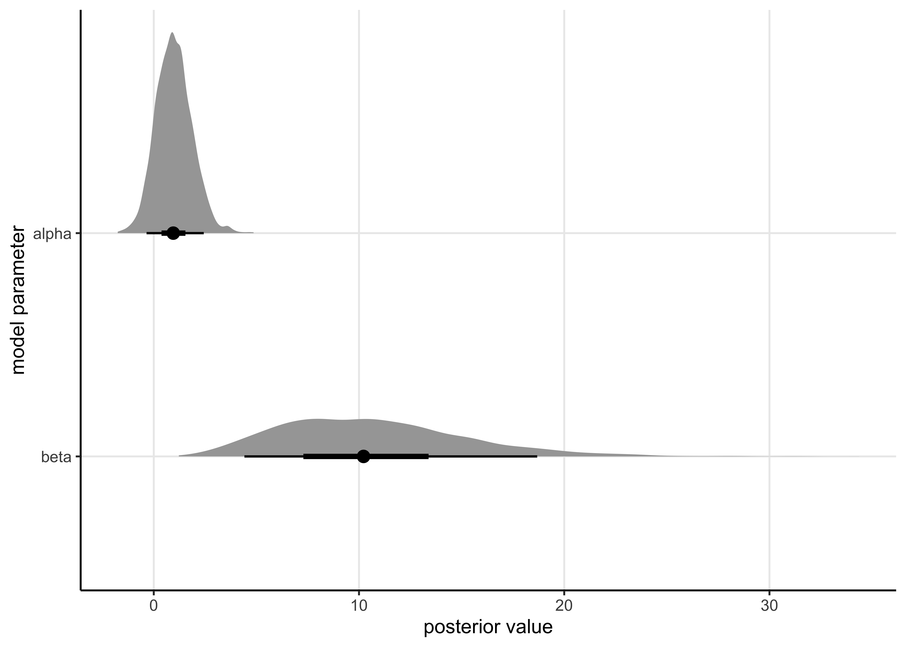
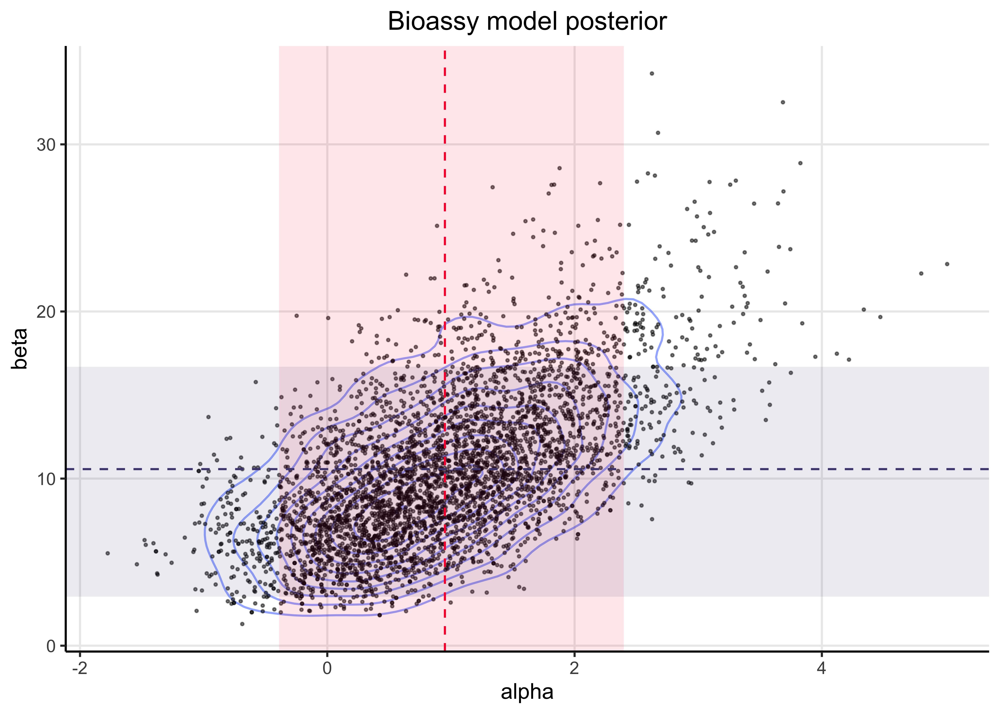

# Assignment 6

2021-10-07

**[Assignment 6](https://github.com/jhrcook/bayesian-data-analysis-course/tree/master/course-material/assignment-06.pdf)**

## Setup


```r
knitr::opts_chunk$set(echo = TRUE, comment = "#>", dpi = 300)

for (f in list.files(here::here("src"), pattern = "R$", full.names = TRUE)) {
  source(f)
}

library(rstan)
library(tidybayes)
library(bayesplot)
library(tidyverse)

theme_set(
  theme_classic() +
    theme(
      plot.title = element_text(hjust = 0.5),
      panel.grid.major = element_line()
    )
)

rstan_options(auto_write = TRUE)
```

## Exercise 1. Generalized linear model: Bioassay with Stan

**Replicate the computations for the bioassay example of section 3.7 (BDA3) using Stan.**

The model is located in "[models/assignment06-bioassay.stan](https://github.com/jhrcook/bayesian-data-analysis-course/tree/master/course-material/models/assignment06-bioassay.stan).
I have copied it below:

```
data {
  int<lower=0> N;    // number of data points
  vector[N] x;       // dose
  int<lower=0> n[N]; // number of animals
  int<lower=0> y[N]; // number of deaths

  vector[2] mu;                // prior on mean of theta
  matrix<lower=0>[2, 2] sigma; // prior on covariance matrix of theta
}

parameters {
  vector[2] mdl_params;
}

transformed parameters {
  vector[N] theta;
  theta = mdl_params[1] + mdl_params[2] * x;
}

model {
  mdl_params ~ multi_normal(mu, sigma);
  y ~ binomial_logit(n, theta);
}
```


### 1. Write down the model for the bioassay data in Stan syntax.

**Use the Gaussian prior as in Assignment 4 and 5, that is:**

$$
\begin{bmatrix}
\alpha \\ \beta
\end{bmatrix} \sim \text{N} (\mu_0, \Sigma_0)
\quad \text{where} \quad
\mu_0 = \begin{bmatrix} 0 \\ 10 \end{bmatrix}
\quad \text{and} \quad
\Sigma_0 = \begin{bmatrix} 2^2 & 12 \\ 12 & 10^2 \end{bmatrix}
$$

**Hint!**
**You will need Stan functions `multi_normal` and `binomial_logit` for implementing the prior and observation model, respectively.**
**In Stan code, it is easiest to declare a variable (say `theta`) which is a two-element vector so that the first value denotes $\alpha$ and latter one $\beta$.**
**This is because the `multi_normal` function that you need for implementing the prior requires a vector as an input.**


```r
bioassay <- read_bioassay_data()
```

```
#> Rows: 4 Columns: 1
```

```
#> ── Column specification ────────────────────────────────────────────────────────────────────────────────────────────────────────
#> Delimiter: "\t"
#> chr (1): x n y
```

```
#> 
#> ℹ Use `spec()` to retrieve the full column specification for this data.
#> ℹ Specify the column types or set `show_col_types = FALSE` to quiet this message.
```

```r
bioassay_mdl_posterior <- stan(
  file = here::here("models", "assignment06-bioassay.stan"),
  data = list(
    N = nrow(bioassay),
    x = bioassay$x,
    n = bioassay$n,
    y = bioassay$y,
    mu = c(0, 10),
    sigma = matrix(c(2^2, 12, 12, 10^2), nrow = 2)
  )
)
```

```
#> 
#> SAMPLING FOR MODEL 'assignment06-bioassay' NOW (CHAIN 1).
#> Chain 1: 
#> Chain 1: Gradient evaluation took 5.5e-05 seconds
#> Chain 1: 1000 transitions using 10 leapfrog steps per transition would take 0.55 seconds.
#> Chain 1: Adjust your expectations accordingly!
#> Chain 1: 
#> Chain 1: 
#> Chain 1: Iteration:    1 / 2000 [  0%]  (Warmup)
#> Chain 1: Iteration:  200 / 2000 [ 10%]  (Warmup)
#> Chain 1: Iteration:  400 / 2000 [ 20%]  (Warmup)
#> Chain 1: Iteration:  600 / 2000 [ 30%]  (Warmup)
#> Chain 1: Iteration:  800 / 2000 [ 40%]  (Warmup)
#> Chain 1: Iteration: 1000 / 2000 [ 50%]  (Warmup)
#> Chain 1: Iteration: 1001 / 2000 [ 50%]  (Sampling)
#> Chain 1: Iteration: 1200 / 2000 [ 60%]  (Sampling)
#> Chain 1: Iteration: 1400 / 2000 [ 70%]  (Sampling)
#> Chain 1: Iteration: 1600 / 2000 [ 80%]  (Sampling)
#> Chain 1: Iteration: 1800 / 2000 [ 90%]  (Sampling)
#> Chain 1: Iteration: 2000 / 2000 [100%]  (Sampling)
#> Chain 1: 
#> Chain 1:  Elapsed Time: 0.03982 seconds (Warm-up)
#> Chain 1:                0.033487 seconds (Sampling)
#> Chain 1:                0.073307 seconds (Total)
#> Chain 1: 
#> 
#> SAMPLING FOR MODEL 'assignment06-bioassay' NOW (CHAIN 2).
#> Chain 2: 
#> Chain 2: Gradient evaluation took 1.3e-05 seconds
#> Chain 2: 1000 transitions using 10 leapfrog steps per transition would take 0.13 seconds.
#> Chain 2: Adjust your expectations accordingly!
#> Chain 2: 
#> Chain 2: 
#> Chain 2: Iteration:    1 / 2000 [  0%]  (Warmup)
#> Chain 2: Iteration:  200 / 2000 [ 10%]  (Warmup)
#> Chain 2: Iteration:  400 / 2000 [ 20%]  (Warmup)
#> Chain 2: Iteration:  600 / 2000 [ 30%]  (Warmup)
#> Chain 2: Iteration:  800 / 2000 [ 40%]  (Warmup)
#> Chain 2: Iteration: 1000 / 2000 [ 50%]  (Warmup)
#> Chain 2: Iteration: 1001 / 2000 [ 50%]  (Sampling)
#> Chain 2: Iteration: 1200 / 2000 [ 60%]  (Sampling)
#> Chain 2: Iteration: 1400 / 2000 [ 70%]  (Sampling)
#> Chain 2: Iteration: 1600 / 2000 [ 80%]  (Sampling)
#> Chain 2: Iteration: 1800 / 2000 [ 90%]  (Sampling)
#> Chain 2: Iteration: 2000 / 2000 [100%]  (Sampling)
#> Chain 2: 
#> Chain 2:  Elapsed Time: 0.036828 seconds (Warm-up)
#> Chain 2:                0.034224 seconds (Sampling)
#> Chain 2:                0.071052 seconds (Total)
#> Chain 2: 
#> 
#> SAMPLING FOR MODEL 'assignment06-bioassay' NOW (CHAIN 3).
#> Chain 3: 
#> Chain 3: Gradient evaluation took 1.3e-05 seconds
#> Chain 3: 1000 transitions using 10 leapfrog steps per transition would take 0.13 seconds.
#> Chain 3: Adjust your expectations accordingly!
#> Chain 3: 
#> Chain 3: 
#> Chain 3: Iteration:    1 / 2000 [  0%]  (Warmup)
#> Chain 3: Iteration:  200 / 2000 [ 10%]  (Warmup)
#> Chain 3: Iteration:  400 / 2000 [ 20%]  (Warmup)
#> Chain 3: Iteration:  600 / 2000 [ 30%]  (Warmup)
#> Chain 3: Iteration:  800 / 2000 [ 40%]  (Warmup)
#> Chain 3: Iteration: 1000 / 2000 [ 50%]  (Warmup)
#> Chain 3: Iteration: 1001 / 2000 [ 50%]  (Sampling)
#> Chain 3: Iteration: 1200 / 2000 [ 60%]  (Sampling)
#> Chain 3: Iteration: 1400 / 2000 [ 70%]  (Sampling)
#> Chain 3: Iteration: 1600 / 2000 [ 80%]  (Sampling)
#> Chain 3: Iteration: 1800 / 2000 [ 90%]  (Sampling)
#> Chain 3: Iteration: 2000 / 2000 [100%]  (Sampling)
#> Chain 3: 
#> Chain 3:  Elapsed Time: 0.034739 seconds (Warm-up)
#> Chain 3:                0.027769 seconds (Sampling)
#> Chain 3:                0.062508 seconds (Total)
#> Chain 3: 
#> 
#> SAMPLING FOR MODEL 'assignment06-bioassay' NOW (CHAIN 4).
#> Chain 4: 
#> Chain 4: Gradient evaluation took 1.2e-05 seconds
#> Chain 4: 1000 transitions using 10 leapfrog steps per transition would take 0.12 seconds.
#> Chain 4: Adjust your expectations accordingly!
#> Chain 4: 
#> Chain 4: 
#> Chain 4: Iteration:    1 / 2000 [  0%]  (Warmup)
#> Chain 4: Iteration:  200 / 2000 [ 10%]  (Warmup)
#> Chain 4: Iteration:  400 / 2000 [ 20%]  (Warmup)
#> Chain 4: Iteration:  600 / 2000 [ 30%]  (Warmup)
#> Chain 4: Iteration:  800 / 2000 [ 40%]  (Warmup)
#> Chain 4: Iteration: 1000 / 2000 [ 50%]  (Warmup)
#> Chain 4: Iteration: 1001 / 2000 [ 50%]  (Sampling)
#> Chain 4: Iteration: 1200 / 2000 [ 60%]  (Sampling)
#> Chain 4: Iteration: 1400 / 2000 [ 70%]  (Sampling)
#> Chain 4: Iteration: 1600 / 2000 [ 80%]  (Sampling)
#> Chain 4: Iteration: 1800 / 2000 [ 90%]  (Sampling)
#> Chain 4: Iteration: 2000 / 2000 [100%]  (Sampling)
#> Chain 4: 
#> Chain 4:  Elapsed Time: 0.033204 seconds (Warm-up)
#> Chain 4:                0.028264 seconds (Sampling)
#> Chain 4:                0.061468 seconds (Total)
#> Chain 4:
```

### 2. Use $\widehat{R}$ for convergence analysis.

**Report the $\widehat{R}$ values both for $\alpha$ and $\beta$ and discuss the convergence of the chains.**
**Briefly explain in your own words how to interpret the obtained $\widehat{R}$ values.**

Bellow is a table summarizing the results of sampling from the model's posterior.
The $\widehat{R}$ is stated in the last column of the table.
As the values are all around 1.0, this suggests that the chains mixed and converged.


```r
bioassay_mdl_posterior
```

```
#> Inference for Stan model: assignment06-bioassay.
#> 4 chains, each with iter=2000; warmup=1000; thin=1; 
#> post-warmup draws per chain=1000, total post-warmup draws=4000.
#> 
#>                mean se_mean   sd   2.5%    25%   50%   75% 97.5% n_eff Rhat
#> mdl_params[1]  0.96    0.02 0.89  -0.65   0.35  0.91  1.54  2.77  1353    1
#> mdl_params[2] 10.64    0.13 4.64   3.48   7.13 10.03 13.65 20.83  1331    1
#> theta[1]      -8.19    0.09 3.52 -16.08 -10.35 -7.70 -5.50 -2.77  1509    1
#> theta[2]      -2.23    0.02 1.10  -4.67  -2.92 -2.11 -1.44 -0.40  2476    1
#> theta[3]       0.43    0.02 0.77  -1.01  -0.10  0.41  0.92  2.01  1596    1
#> theta[4]       8.73    0.11 4.00   2.34   5.74  8.19 11.37 17.39  1236    1
#> lp__          -7.14    0.03 1.00  -9.88  -7.54 -6.83 -6.42 -6.14  1593    1
#> 
#> Samples were drawn using NUTS(diag_e) at Tue Feb  8 07:06:40 2022.
#> For each parameter, n_eff is a crude measure of effective sample size,
#> and Rhat is the potential scale reduction factor on split chains (at 
#> convergence, Rhat=1).
```

$\widehat{R}$ is a metric for how well the chains mixed and converged using the within- and between-chain variance.
If the value is larger than 1, it indicates that the chains have likely not mixed, either due to model misspecification or not running the chains for long enough.
It can also be thought of a scaling factor indicating how much greater the estimated variance in the posterior is compared to the real variance caused by the chains not converging.

### 3. Plot the draws for $\alpha$ and $\beta$ (scatter plot) and include this plot in your report


```r
post_df <- bioassay_mdl_posterior %>%
  spread_draws(mdl_params[param]) %>%
  mutate(param = ifelse(param == 1, "alpha", "beta"))
```


```r
post_df %>%
  ggplot(aes(y = fct_rev(param), x = mdl_params)) +
  stat_halfeye(.width = c(0.50, 0.89)) +
  labs(x = "posterior value", y = "model parameter")
```




```r
post_point_est <- as_tibble(
  bayestestR::point_estimate(bioassay_mdl_posterior)
) %>%
  select(param = Parameter, mean = Mean) %>%
  filter(str_detect(param, "mdl_params")) %>%
  mutate(param = c("alpha", "beta"))

post_hdi <- as_tibble(bayestestR::hdi(bioassay_mdl_posterior, ci = 0.89)) %>%
  janitor::clean_names() %>%
  select(param = parameter, ci, ci_low, ci_high) %>%
  filter(str_detect(param, "mdl_params")) %>%
  mutate(param = c("alpha", "beta"))

parameter_post_description <- inner_join(post_point_est, post_hdi, by = "param")

ALPHA_COL <- "#F90039"
BETA_COL <- "#4E477F"

post_df %>%
  pivot_wider(names_from = param, values_from = mdl_params) %>%
  ggplot(aes(x = alpha, y = beta)) +
  geom_density_2d(alpha = 0.5) +
  geom_point(size = 0.4, alpha = 0.5) +
  geom_rect(
    aes(xmin = ci_low, xmax = ci_high),
    data = parameter_post_description %>% slice(1),
    ymin = -Inf,
    ymax = Inf,
    alpha = 0.1,
    fill = ALPHA_COL,
    inherit.aes = FALSE
  ) +
  geom_rect(
    aes(ymin = ci_low, ymax = ci_high),
    data = parameter_post_description %>% slice(2),
    xmin = -Inf,
    xmax = Inf,
    alpha = 0.1,
    fill = BETA_COL,
    inherit.aes = FALSE
  ) +
  geom_vline(
    xintercept = parameter_post_description$mean[[1]],
    color = ALPHA_COL,
    linetype = 2
  ) +
  geom_hline(
    yintercept = parameter_post_description$mean[[2]],
    color = BETA_COL,
    linetype = 2
  ) +
  labs(x = "alpha", y = "beta", title = "Bioassy model posterior")
```



### 4. To develop the course and provide feedback to Stan developers, we collect information on which Stan setup you used and whether you had any problems in setting it up or using it.

**Please report,**

1. **Operating system (Linux, Mac, Windows) or jupyter.cs.aalto.fi?** macOS Big Sur (v11.6)
2. **Programming environment used: R or Python?** R
3. **Interface used: RStan, CmdStanR, PyStan, or CmdStanPy?** RStan
4. **Did you have installation or compilation problems?** No troubles.
5. **Did you try first installing locally, but switched to jupyter.cs.aalto.fi?** No.
6. **In addition of these you can write what other things you found out difficult (or even frustrating) when making this assignment with Stan.** No frustrations this time, but I have had some in the past, but the problem was with how I had installed R and not specific to Stan.

---


```r
sessionInfo()
```

```
#> R version 4.1.2 (2021-11-01)
#> Platform: x86_64-apple-darwin17.0 (64-bit)
#> Running under: macOS Big Sur 10.16
#> 
#> Matrix products: default
#> BLAS:   /Library/Frameworks/R.framework/Versions/4.1/Resources/lib/libRblas.0.dylib
#> LAPACK: /Library/Frameworks/R.framework/Versions/4.1/Resources/lib/libRlapack.dylib
#> 
#> locale:
#> [1] en_US.UTF-8/en_US.UTF-8/en_US.UTF-8/C/en_US.UTF-8/en_US.UTF-8
#> 
#> attached base packages:
#> [1] stats     graphics  grDevices datasets  utils     methods   base     
#> 
#> other attached packages:
#>  [1] forcats_0.5.1        stringr_1.4.0        dplyr_1.0.7         
#>  [4] purrr_0.3.4          readr_2.0.1          tidyr_1.1.3         
#>  [7] tibble_3.1.3         tidyverse_1.3.1      bayesplot_1.8.1     
#> [10] tidybayes_3.0.1      rstan_2.21.2         ggplot2_3.3.5       
#> [13] StanHeaders_2.21.0-7
#> 
#> loaded via a namespace (and not attached):
#>  [1] matrixStats_0.61.0   fs_1.5.0             bit64_4.0.5         
#>  [4] lubridate_1.7.10     insight_0.14.4       httr_1.4.2          
#>  [7] rprojroot_2.0.2      tensorA_0.36.2       tools_4.1.2         
#> [10] backports_1.2.1      bslib_0.2.5.1        utf8_1.2.2          
#> [13] R6_2.5.0             DBI_1.1.1            colorspace_2.0-2    
#> [16] ggdist_3.0.0         withr_2.4.2          tidyselect_1.1.1    
#> [19] gridExtra_2.3        prettyunits_1.1.1    processx_3.5.2      
#> [22] bit_4.0.4            curl_4.3.2           compiler_4.1.2      
#> [25] rvest_1.0.1          cli_3.0.1            arrayhelpers_1.1-0  
#> [28] xml2_1.3.2           isoband_0.2.5        bayestestR_0.11.0   
#> [31] labeling_0.4.2       bookdown_0.24        posterior_1.1.0     
#> [34] sass_0.4.0           scales_1.1.1         checkmate_2.0.0     
#> [37] ggridges_0.5.3       callr_3.7.0          digest_0.6.27       
#> [40] rmarkdown_2.10       pkgconfig_2.0.3      htmltools_0.5.1.1   
#> [43] highr_0.9            dbplyr_2.1.1         rlang_0.4.11        
#> [46] readxl_1.3.1         rstudioapi_0.13      jquerylib_0.1.4     
#> [49] farver_2.1.0         generics_0.1.0       svUnit_1.0.6        
#> [52] jsonlite_1.7.2       vroom_1.5.4          distributional_0.2.2
#> [55] inline_0.3.19        magrittr_2.0.1       loo_2.4.1           
#> [58] Rcpp_1.0.7           munsell_0.5.0        fansi_0.5.0         
#> [61] abind_1.4-5          lifecycle_1.0.0      stringi_1.7.3       
#> [64] yaml_2.2.1           snakecase_0.11.0     MASS_7.3-54         
#> [67] pkgbuild_1.2.0       plyr_1.8.6           grid_4.1.2          
#> [70] parallel_4.1.2       crayon_1.4.1         lattice_0.20-45     
#> [73] haven_2.4.3          hms_1.1.0            knitr_1.33          
#> [76] ps_1.6.0             pillar_1.6.2         codetools_0.2-18    
#> [79] clisymbols_1.2.0     stats4_4.1.2         reprex_2.0.1        
#> [82] glue_1.4.2           evaluate_0.14        V8_3.4.2            
#> [85] renv_0.14.0          RcppParallel_5.1.4   modelr_0.1.8        
#> [88] vctrs_0.3.8          tzdb_0.1.2           cellranger_1.1.0    
#> [91] gtable_0.3.0         datawizard_0.2.1     assertthat_0.2.1    
#> [94] xfun_0.25            janitor_2.1.0        broom_0.7.9         
#> [97] coda_0.19-4          ellipsis_0.3.2       here_1.0.1
```
