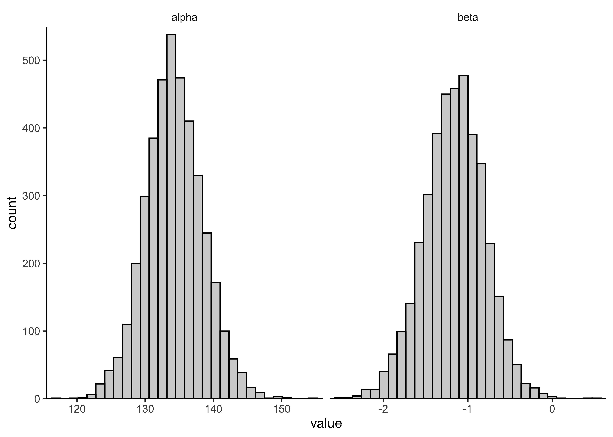
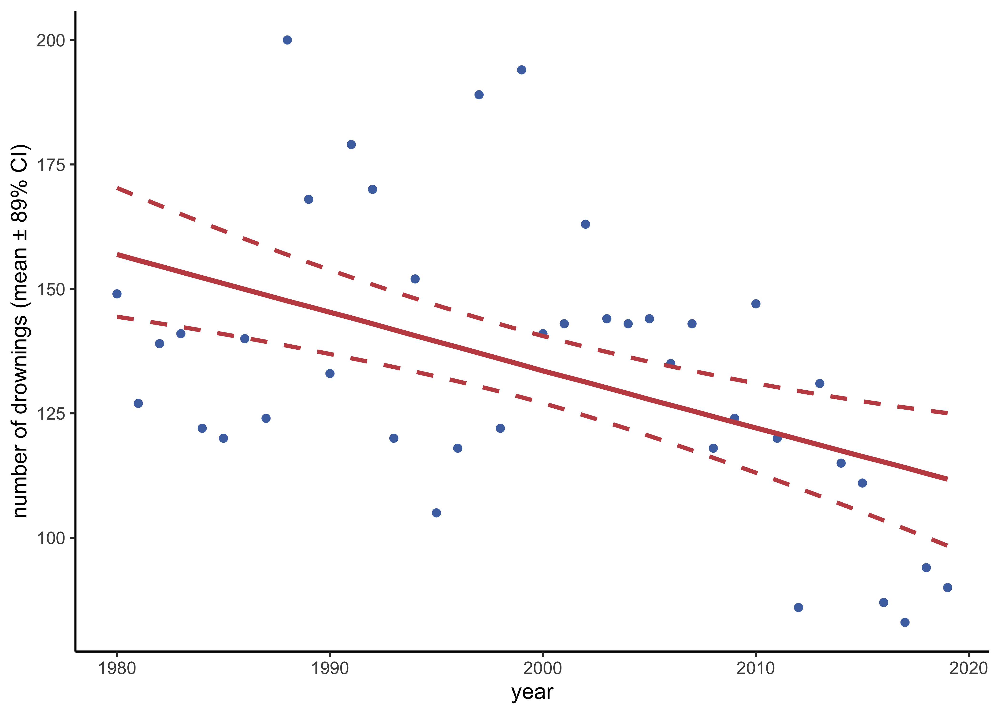
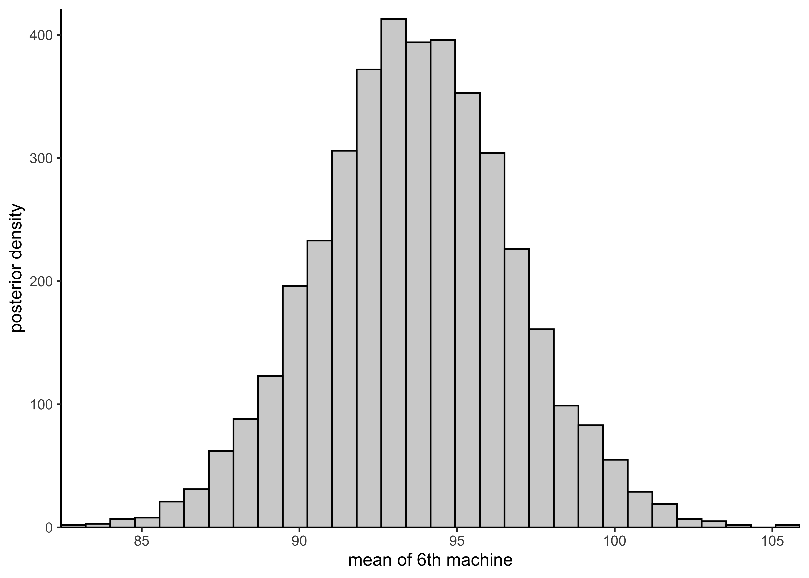

# Assignment 7

2021-10-18

## Setup


```r
knitr::opts_chunk$set(echo = TRUE, comment = "#>", dpi = 300)

for (f in list.files(here::here("src"), pattern = "R$", full.names = TRUE)) {
  source(f)
}

library(rstan)
```

```
## Loading required package: StanHeaders
```

```
## Loading required package: ggplot2
```

```
## rstan (Version 2.21.2, GitRev: 2e1f913d3ca3)
```

```
## For execution on a local, multicore CPU with excess RAM we recommend calling
## options(mc.cores = parallel::detectCores()).
## To avoid recompilation of unchanged Stan programs, we recommend calling
## rstan_options(auto_write = TRUE)
```

```r
library(tidybayes)
library(magrittr)
```

```
## 
## Attaching package: 'magrittr'
```

```
## The following object is masked from 'package:rstan':
## 
##     extract
```

```r
library(tidyverse)
```

```
## ── Attaching packages ─────────────────────────────────────────────────────────────────────────── tidyverse 1.3.1 ──
```

```
## ✔ tibble  3.1.3     ✔ dplyr   1.0.7
## ✔ tidyr   1.1.3     ✔ stringr 1.4.0
## ✔ readr   2.0.1     ✔ forcats 0.5.1
## ✔ purrr   0.3.4
```

```
## ── Conflicts ────────────────────────────────────────────────────────────────────────────── tidyverse_conflicts() ──
## ✖ tidyr::extract()   masks magrittr::extract(), rstan::extract()
## ✖ dplyr::filter()    masks stats::filter()
## ✖ dplyr::lag()       masks stats::lag()
## ✖ purrr::set_names() masks magrittr::set_names()
```

```r
theme_set(theme_classic() + theme(strip.background = element_blank()))

options(mc.cores = 2)
rstan_options(auto_write = TRUE)

drowning <- aaltobda::drowning
factory <- aaltobda::factory
```

**[Assignment 7](assignments/assignment-07.pdf)**

## 1. Linear model: drowning data with Stan

**The provided data `drowning` in the 'aaltobda' package contains the number of people who died from drowning each year in Finland 1980–2019.**
**A statistician is going to fit a linear model with Gaussian residual model to these data using time as the predictor and number of drownings as the target variable.**
**She has two objective questions:**

i) **What is the trend of the number of people drowning per year? (We would plot the histogram of the slope of the linear model.)**
ii) **What is the prediction for the year 2020? (We would plot the histogram of the posterior predictive distribution for the number of people drowning at $\tilde{x} = 2020$.)**

**Corresponding Stan code is provided in Listing 1.**
**However, it is not entirely correct for the problem.**
**First, there are *three mistakes*.**
**Second, there are no priors defined for the parameters.**
**In Stan, this corresponds to using uniform priors.**

**a) Find the three mistakes in the code and fix them.**
**Report the original mistakes and your fixes clearly in your report.**
**Include the full corrected Stan code in your report.**

1. Declaration of `sigma` on line 10 should be `real<lower=0>`.
2. Missing semicolon at the end of line 16.
3. On line 19, the prediction on new data does not use the new data in `xpred`. This has been changed to `real ypred = normal_rng(alpha + beta*xpred, sigma);`.

Below is a copy of the final model.
The full Stan file is at [models/assignment07-drownings.stan](../models/assignment07-drownings.stan).

```
data {
  int<lower=0> N;  // number of data points
  vector[N] x;     // observation year
  vector[N] y;     // observation number of drowned
  real xpred;      // prediction year
}
parameters {
  real alpha;
  real beta;
  real<lower=0> sigma;  // fix: 'upper' should be 'lower'
}
transformed parameters {
  vector[N] mu = alpha + beta*x;
}
model {
  y ~ normal(mu, sigma);  // fix: missing semicolor
}
generated quantities {
  real ypred = normal_rng(alpha + beta*xpred, sigma);  // fix: use `xpred`
}
```

**b) Determine a suitable weakly-informative prior $\text{Normal}(0,\sigma_\beta)$ for the slope $\beta$.**
**It is very unlikely that the mean number of drownings changes more than 50 % in one year.**
**The approximate historical mean yearly number of drownings is 138.**
**Hence, set $\sigma_\beta$ so that the following holds for the prior probability for $\beta$: $Pr(−69 < \beta < 69) = 0.99$.**
**Determine suitable value for $\sigma_\beta$ and report the approximate numerical value for it.**


```r
x <- rnorm(1e5, 0, 26)
print(mean(-69 < x & x < 69))
```

```
#> [1] 0.99216
```

```r
plot_single_hist(x, alpha = 0.5, color = "black") + geom_vline(xintercept = c(-69, 69)) + labs(x = "beta")
```

```
#> `stat_bin()` using `bins = 30`. Pick better value with `binwidth`.
```


**c) Using the obtained σβ, add the desired prior in the Stan code.**

From some trial and error, it seems that a prior of $\text{Normal}(0, 26)$ should work.
I have added this prior distribution to `beta` in the model at line 17.

```
beta ~ normal(0, 26);   // prior on `beta`
```

**d) In a similar way, add a weakly informative prior for the intercept alpha and explain how you chose the prior.**

To use the year directly as the values for $x$ would lead to a massive value of $\alpha$ because the values for $x$ range from 1980 to 2019.
Thus, it would be advisable to first center the year, meaning at the prior distribution for $\alpha$ can be centered around the average of the number of drownings per year and a standard deviation near that of the actual number of drownings.


```r
head(drowning)
```

```
#>   year drownings
#> 1 1980       149
#> 2 1981       127
#> 3 1982       139
#> 4 1983       141
#> 5 1984       122
#> 6 1985       120
```


```r
print(mean(drowning$drownings))
```

```
#> [1] 134.35
```

```r
print(sd(drowning$drownings))
```

```
#> [1] 28.48441
```

Therefore, I add the prior $\text{Normal}(135, 50)$ to $\alpha$ on line 16.

```
alpha ~ normal(135, 50);   // prior on `alpha`
```


```r
data <- list(
  N = nrow(drowning),
  x = drowning$year - mean(drowning$year),
  y = drowning$drownings,
  xpred = 2020 - mean(drowning$year)
)
drowning_model <- stan(
  here::here("models", "assignment07-drownings.stan"),
  data = data
)
```


```r
variable_post <- spread_draws(drowning_model, alpha, beta) %>%
  pivot_longer(c(alpha, beta), names_to = "variable", values_to = "value")
head(variable_post)
```

```
#> # A tibble: 6 × 5
#>   .chain .iteration .draw variable  value
#>    <int>      <int> <int> <chr>     <dbl>
#> 1      1          1     1 alpha    131.  
#> 2      1          1     1 beta      -1.44
#> 3      1          2     2 alpha    135.  
#> 4      1          2     2 beta      -1.26
#> 5      1          3     3 alpha    142.  
#> 6      1          3     3 beta      -1.19
```


```r
variable_post %>%
  ggplot(aes(x = .iteration, y = value, color = factor(.chain))) +
  facet_grid(rows = vars(variable), scales = "free_y") +
  geom_path(alpha = 0.5) +
  scale_x_continuous(expand = expansion(c(0, 0))) +
  scale_y_continuous(expand = expansion(c(0.02, 0.02))) +
  labs(x = "iteration", y = "value", color = "chain")
```


```r
variable_post %>%
  ggplot(aes(x = value)) +
  facet_grid(cols = vars(variable), scales = "free_x") +
  geom_histogram(color = "black", alpha = 0.3, bins = 30) +
  scale_x_continuous(expand = expansion(c(0.02, 0.02))) +
  scale_y_continuous(expand = expansion(c(0, 0.02)))
```




```r
spread_draws(drowning_model, ypred) %$%
  plot_single_hist(ypred, alpha = 0.3, color = "black") +
  labs(x = "predicted number of drownings in 2020")
```

```
#> `stat_bin()` using `bins = 30`. Pick better value with `binwidth`.
```


```r
red <- "#C34E51"

bayestestR::describe_posterior(drowning_model, ci = 0.89, test = c()) %>%
  as_tibble() %>%
  filter(str_detect(Parameter, "mu")) %>%
  select(Parameter, Median, CI_low, CI_high) %>%
  janitor::clean_names() %>%
  mutate(idx = row_number()) %>%
  left_join(drowning %>% mutate(idx = row_number()), by = "idx") %>%
  ggplot(aes(x = year)) +
  geom_point(aes(y = drownings), data = drowning, color = "#4C71B0") +
  geom_line(aes(y = median), color = red, size = 1.2) +
  geom_smooth(
    aes(y = ci_low),
    method = "loess",
    formula = "y ~ x",
    linetype = 2,
    se = FALSE,
    color = red,
    size = 1
  ) +
  geom_smooth(
    aes(y = ci_high),
    method = "loess",
    formula = "y ~ x",
    linetype = 2,
    se = FALSE,
    color = red,
    size = 1
  ) +
  labs(x = "year", y = "number of drownings (mean ± 89% CI)")
```



## 2. Hierarchical model: factory data with Stan

**The `factory` data in the 'aaltobda' package contains quality control measurements from 6 machines in a factory (units of the measurements are irrelevant here).**
**In the data file, each column contains the measurements for a single machine.**
**Quality control measurements are expensive and time-consuming, so only 5 measurements were done for each machine.**
**In addition to the existing machines, we are interested in the quality of another machine (the seventh machine).**

**For this problem, you’ll use the following Gaussian models:**

- **a separate model, in which each machine has its own model**
- **a pooled model, in which all measurements are combined and there is no distinction between machines**
- **a hierarchical model, which has a hierarchical structure as described in BDA3 Section 11.6**

**As in the model described in the book, use the same measurement standard deviation $\sigma$ for all the groups in the hierarchical model.**
**In the separate model, however, use separate measurement standard deviation $\sigma_j$ for each group $j$.**
**You should use weakly informative priors for all your models.**

**Complete the following questions for each of the three models (separate, pooled, hierarchical).**

**a) Describe the model with mathematical notation.**
**Also describe in words the difference between the three models.**

*Separate model*: The separate model is described below where each machine has its own centrality $\mu$ and dispersion $\sigma$ parameters that do not influence the parameters of the other machines.

$$
y_{ij} \sim N(\mu_j, \sigma_j) \\
\mu_j \sim N(0, 1) \\
\sigma_j \sim \text{Inv-}\chi^2(10)
$$

*Pooled model*: The pool model is described below where there is no distinction between the models but instead a single set of parameters for all of the data.

$$
y_{i} \sim N(\mu, \sigma) \\
\mu \sim N(0, 1) \\
\sigma \sim \text{Inv-}\chi^2(10)
$$

*Hierarchical model*: The hierarchical model is described below where each machine has its own centrality $\mu$ parameter which are linked through a hyper-prior distribution from which they are drawn.
The machines will all share a common dispersion paramete $\sigma$

$$
y_{ij} \sim N(\mu_j, \sigma_j) \\
\mu_j \sim N(\alpha, \tau) \\
\alpha \sim N(0, 1) \\
\tau \sim \text{HalfNormal}(2.5) \\
\sigma \sim \text{Inv-}\chi^2(10)
$$

The separate model is effectively building a different linear model for each machine where as the pooled model treats all the measurements as coming from the same model.
The hierarchical model is treating the machines as having come from a single, shared distribution.

**b) Implement the model in Stan and include the code in the report.**
**Use weakly informative priors for all your models.**


```r
print_model_code <- function(path) {
  for (l in readLines(path)) {
    cat(l, "\n")
  }
}
```

*Separate model*


```r
separate_model_code <- here::here(
  "models", "assignment07_factories_separate.stan"
)
print_model_code(separate_model_code)
```

```
#> data { 
#>   int<lower=0> N;  // number of data points per machine 
#>   int<lower=0> J;  // number of machines 
#>   vector[J] y[N];  // quality control data points 
#> } 
#>  
#> parameters { 
#>   vector[J] mu; 
#>   vector<lower=0>[J] sigma; 
#> } 
#>  
#> model { 
#>   // priors 
#>   for (j in 1:J) { 
#>     mu[j] ~ normal(100, 10); 
#>     sigma[j] ~ inv_chi_square(5); 
#>   } 
#>  
#>   // likelihood 
#>   for (j in 1:J){ 
#>     y[,j] ~ normal(mu[j], sigma[j]); 
#>   } 
#> } 
#>  
#> generated quantities { 
#>   // Compute the predictive distribution for the sixth machine. 
#>   real y6pred; 
#>   vector[J] log_lik[N]; 
#>  
#>   y6pred = normal_rng(mu[6], sigma[6]); 
#>  
#>   for (j in 1:J) { 
#>     for (n in 1:N) { 
#>       log_lik[n,j] = normal_lpdf(y[n,j] | mu[j], sigma[j]); 
#>     } 
#>   } 
#> }
```


```r
separate_model_data <- list(
  y = factory,
  N = nrow(factory),
  J = ncol(factory)
)
separate_model <- rstan::stan(
  separate_model_code,
  data = separate_model_data,
  verbose = FALSE,
  refresh = 0
)
knitr::kable(
  bayestestR::describe_posterior(separate_model, ci = 0.89, test = NULL),
  digits = 3
)
```


|   |Parameter    |  Median|   CI|  CI_low| CI_high|      ESS|  Rhat|
|:--|:------------|-------:|----:|-------:|-------:|--------:|-----:|
|31 |mu[1]        |  85.166| 0.89|  74.980|  97.261| 3251.054| 0.999|
|32 |mu[2]        | 105.244| 0.89|  98.303| 112.203| 4135.591| 1.000|
|33 |mu[3]        |  90.166| 0.89|  83.071|  97.453| 4317.695| 1.001|
|34 |mu[4]        | 110.651| 0.89| 105.939| 115.385| 3985.809| 1.000|
|35 |mu[5]        |  91.453| 0.89|  85.063|  97.716| 2496.212| 1.000|
|36 |mu[6]        |  90.721| 0.89|  81.550| 101.562| 3910.505| 1.000|
|37 |y6pred       |  90.934| 0.89|  62.391| 120.341| 3969.022| 1.000|
|1  |log_lik[1,1] |  -3.851| 0.89|  -4.408|  -3.372| 2254.016| 1.000|
|7  |log_lik[2,1] |  -3.986| 0.89|  -4.451|  -3.567| 5198.598| 1.000|
|13 |log_lik[3,1] |  -3.986| 0.89|  -4.451|  -3.567| 4791.887| 1.000|
|19 |log_lik[4,1] |  -6.254| 0.89|  -8.247|  -4.920| 4791.306| 1.000|
|25 |log_lik[5,1] |  -4.389| 0.89|  -5.041|  -3.753| 4569.820| 1.000|
|2  |log_lik[1,2] |  -4.005| 0.89|  -4.873|  -3.219| 5425.933| 1.000|
|8  |log_lik[2,2] |  -3.362| 0.89|  -3.894|  -2.881| 2617.579| 1.001|
|14 |log_lik[3,2] |  -3.690| 0.89|  -4.375|  -3.070| 2674.378| 1.000|
|20 |log_lik[4,2] |  -3.297| 0.89|  -3.791|  -2.812| 2487.099| 1.002|
|26 |log_lik[5,2] |  -4.983| 0.89|  -6.918|  -3.652| 5405.968| 1.000|
|3  |log_lik[1,3] |  -3.889| 0.89|  -4.689|  -3.258| 3285.517| 1.002|
|9  |log_lik[2,3] |  -3.411| 0.89|  -3.868|  -2.973| 2487.962| 1.000|
|15 |log_lik[3,3] |  -3.383| 0.89|  -3.836|  -2.940| 2617.579| 1.001|
|21 |log_lik[4,3] |  -3.421| 0.89|  -3.974|  -2.935| 4029.554| 1.000|
|27 |log_lik[5,3] |  -5.686| 0.89|  -7.795|  -4.180| 2362.881| 1.002|
|4  |log_lik[1,4] |  -3.271| 0.89|  -3.990|  -2.684| 3500.877| 1.000|
|10 |log_lik[2,4] |  -3.717| 0.89|  -4.640|  -2.853| 4213.943| 1.000|
|16 |log_lik[3,4] |  -3.204| 0.89|  -3.925|  -2.636| 4226.327| 1.000|
|22 |log_lik[4,4] |  -3.774| 0.89|  -5.018|  -2.900| 7094.136| 0.999|
|28 |log_lik[5,4] |  -3.204| 0.89|  -3.925|  -2.636| 2557.756| 1.000|
|5  |log_lik[1,5] |  -4.142| 0.89|  -5.216|  -3.375| 2508.702| 1.002|
|11 |log_lik[2,5] |  -3.426| 0.89|  -3.929|  -2.923| 5711.819| 1.001|
|17 |log_lik[3,5] |  -4.013| 0.89|  -5.110|  -3.263| 4569.820| 1.000|
|23 |log_lik[4,5] |  -4.142| 0.89|  -5.216|  -3.375| 3458.637| 1.000|
|29 |log_lik[5,5] |  -3.201| 0.89|  -3.702|  -2.726| 3494.754| 1.000|
|6  |log_lik[1,6] |  -5.913| 0.89|  -7.774|  -4.604| 5205.521| 1.000|
|12 |log_lik[2,6] |  -3.775| 0.89|  -4.276|  -3.363| 6854.217| 1.000|
|18 |log_lik[3,6] |  -4.149| 0.89|  -4.707|  -3.628| 3500.877| 1.000|
|24 |log_lik[4,6] |  -4.131| 0.89|  -4.766|  -3.613| 2208.270| 1.002|
|30 |log_lik[5,6] |  -3.978| 0.89|  -4.443|  -3.521| 3374.397| 1.000|

*Pooled model*


```r
pooled_model_code <- here::here("models", "assignment07_factories_pooled.stan")
print_model_code(pooled_model_code)
```

```
#> data { 
#>   int<lower=0> N;  // number of data points 
#>   vector[N] y;     // machine quality control data 
#> } 
#>  
#> parameters { 
#>   real mu; 
#>   real<lower=0> sigma; 
#> } 
#>  
#> model { 
#>   // priors 
#>   mu ~ normal(100, 10); 
#>   sigma ~ inv_chi_square(5); 
#>  
#>   // likelihood 
#>   y ~ normal(mu, sigma); 
#> } 
#>  
#> generated quantities { 
#>   real ypred; 
#>   vector[N] log_lik; 
#>  
#>   ypred = normal_rng(mu, sigma); 
#>  
#>   for (i in 1:N) 
#>     log_lik[i] = normal_lpdf(y[i] | mu, sigma); 
#>  
#> }
```


```r
pooled_model_data <- list(
  y = unname(unlist(factory)),
  N = length(unlist(factory))
)
pooled_model <- rstan::stan(
  pooled_model_code,
  data = pooled_model_data,
  verbose = FALSE,
  refresh = 0
)

knitr::kable(
  bayestestR::describe_posterior(pooled_model, ci = 0.89, test = NULL),
  digits = 3
)
```


|   |Parameter   | Median|   CI| CI_low| CI_high|      ESS|  Rhat|
|:--|:-----------|------:|----:|------:|-------:|--------:|-----:|
|31 |mu          | 93.525| 0.89| 88.446|  98.353| 2927.552| 1.001|
|32 |ypred       | 93.385| 0.89| 63.087| 120.613| 3947.755| 1.000|
|1  |log_lik[1]  | -3.978| 0.89| -4.201|  -3.764| 2728.436| 1.000|
|12 |log_lik[2]  | -3.796| 0.89| -3.997|  -3.584| 2483.788| 1.000|
|23 |log_lik[3]  | -3.796| 0.89| -3.997|  -3.584| 2483.788| 1.000|
|25 |log_lik[4]  | -7.499| 0.89| -9.012|  -6.077| 3117.402| 1.000|
|26 |log_lik[5]  | -4.942| 0.89| -5.446|  -4.461| 3409.766| 1.000|
|27 |log_lik[6]  | -4.691| 0.89| -5.106|  -4.287| 3225.707| 1.001|
|28 |log_lik[7]  | -4.190| 0.89| -4.451|  -3.942| 3333.025| 1.001|
|29 |log_lik[8]  | -4.479| 0.89| -4.822|  -4.142| 3307.006| 1.001|
|30 |log_lik[9]  | -3.977| 0.89| -4.186|  -3.759| 3056.066| 1.001|
|2  |log_lik[10] | -3.863| 0.89| -4.086|  -3.670| 2536.824| 1.000|
|3  |log_lik[11] | -3.887| 0.89| -4.094|  -3.683| 2838.934| 1.000|
|4  |log_lik[12] | -3.793| 0.89| -4.004|  -3.593| 2508.484| 1.000|
|5  |log_lik[13] | -3.796| 0.89| -3.997|  -3.584| 2483.788| 1.000|
|6  |log_lik[14] | -3.887| 0.89| -4.113|  -3.696| 2568.519| 1.000|
|7  |log_lik[15] | -4.942| 0.89| -5.446|  -4.461| 3409.766| 1.000|
|8  |log_lik[16] | -4.014| 0.89| -4.217|  -3.782| 3129.791| 1.001|
|9  |log_lik[17] | -4.852| 0.89| -5.332|  -4.410| 3171.315| 1.001|
|10 |log_lik[18] | -4.619| 0.89| -5.000|  -4.229| 3253.793| 1.001|
|11 |log_lik[19] | -3.914| 0.89| -4.124|  -3.707| 2907.494| 1.000|
|13 |log_lik[20] | -4.619| 0.89| -5.000|  -4.229| 3253.793| 1.001|
|14 |log_lik[21] | -4.142| 0.89| -4.386|  -3.891| 3073.202| 1.000|
|15 |log_lik[22] | -3.813| 0.89| -4.013|  -3.610| 2634.960| 1.000|
|16 |log_lik[23] | -3.945| 0.89| -4.156|  -3.735| 2980.771| 1.000|
|17 |log_lik[24] | -4.142| 0.89| -4.386|  -3.891| 3073.202| 1.000|
|18 |log_lik[25] | -3.796| 0.89| -3.997|  -3.584| 2483.788| 1.000|
|19 |log_lik[26] | -5.974| 0.89| -6.876|  -5.120| 3243.632| 1.000|
|20 |log_lik[27] | -3.796| 0.89| -3.997|  -3.584| 2483.788| 1.000|
|21 |log_lik[28] | -3.977| 0.89| -4.186|  -3.759| 3056.066| 1.001|
|22 |log_lik[29] | -4.243| 0.89| -4.521|  -3.983| 3237.784| 1.000|
|24 |log_lik[30] | -3.863| 0.89| -4.068|  -3.660| 2776.818| 1.000|

*Hierarchical model*


```r
hierarchical_model_code <- here::here(
  "models", "assignment07_factories_hierarchical.stan"
)
print_model_code(hierarchical_model_code)
```

```
#> data { 
#>   int<lower=0> N;  // number of data points per machine 
#>   int<lower=0> J;  // number of machines 
#>   vector[J] y[N];  // quality control data points 
#> } 
#>  
#> parameters { 
#>   vector[J] mu; 
#>   real<lower=0> sigma; 
#>   real alpha; 
#>   real<lower=0> tau; 
#> } 
#>  
#> model { 
#>   // hyper-priors 
#>   alpha ~ normal(100, 10); 
#>   tau ~ normal(0, 10); 
#>  
#>   // priors 
#>   mu ~ normal(alpha, tau); 
#>   sigma ~ inv_chi_square(5); 
#>  
#>   // likelihood 
#>   for (j in 1:J){ 
#>     y[,j] ~ normal(mu[j], sigma); 
#>   } 
#> } 
#>  
#> generated quantities { 
#>   // Compute the predictive distribution for the sixth machine. 
#>   real y6pred;  // Leave for compatibility with earlier assignments. 
#>   vector[J] ypred; 
#>   real mu7pred; 
#>   real y7pred; 
#>   vector[J] log_lik[N]; 
#>  
#>   y6pred = normal_rng(mu[6], sigma); 
#>   for (j in 1:J) { 
#>     ypred[j] = normal_rng(mu[j], sigma); 
#>   } 
#>  
#>   mu7pred = normal_rng(alpha, tau); 
#>   y7pred = normal_rng(mu7pred, sigma); 
#>  
#>   for (j in 1:J) { 
#>     for (n in 1:N) { 
#>       log_lik[n,j] = normal_lpdf(y[n,j] | mu[j], sigma); 
#>     } 
#>   } 
#> }
```


```r
hierarchical_model_data <- list(
  y = factory,
  N = nrow(factory),
  J = ncol(factory)
)
hierarchical_model <- rstan::stan(
  hierarchical_model_code,
  data = hierarchical_model_data,
  verbose = FALSE,
  refresh = 0
)
```

```
#> Warning: There were 6 divergent transitions after warmup. See
#> http://mc-stan.org/misc/warnings.html#divergent-transitions-after-warmup
#> to find out why this is a problem and how to eliminate them.
```

```
#> Warning: Examine the pairs() plot to diagnose sampling problems
```

```r
knitr::kable(
  bayestestR::describe_posterior(hierarchical_model, ci = 0.89, test = NULL),
  digits = 3
)
```


|   |Parameter    |  Median|   CI| CI_low| CI_high|      ESS|  Rhat|
|:--|:------------|-------:|----:|------:|-------:|--------:|-----:|
|32 |mu[1]        |  81.424| 0.89| 71.760|  91.742| 2272.656| 1.000|
|33 |mu[2]        | 102.656| 0.89| 92.905| 111.476| 2427.213| 0.999|
|34 |mu[3]        |  89.845| 0.89| 80.779|  98.070| 3657.076| 1.000|
|35 |mu[4]        | 106.429| 0.89| 95.377| 116.012| 1987.828| 1.000|
|36 |mu[5]        |  91.259| 0.89| 82.565|  99.955| 4119.393| 1.000|
|37 |mu[6]        |  88.446| 0.89| 79.145|  97.135| 2837.713| 1.001|
|1  |alpha        |  94.236| 0.89| 86.716| 101.887| 2970.775| 1.000|
|39 |tau          |  10.693| 0.89|  4.383|  17.177| 1819.114| 1.000|
|40 |y6pred       |  88.011| 0.89| 63.629| 112.210| 3894.067| 0.999|
|42 |ypred[1]     |  81.319| 0.89| 55.505| 104.067| 3569.206| 1.000|
|43 |ypred[2]     | 103.223| 0.89| 78.618| 128.515| 3475.386| 1.000|
|44 |ypred[3]     |  89.268| 0.89| 63.593| 112.193| 4076.488| 1.000|
|45 |ypred[4]     | 106.645| 0.89| 81.189| 131.679| 3695.514| 1.000|
|46 |ypred[5]     |  90.944| 0.89| 67.040| 115.829| 4431.780| 1.000|
|47 |ypred[6]     |  88.527| 0.89| 63.853| 113.163| 3929.167| 1.000|
|38 |mu7pred      |  94.103| 0.89| 73.737| 114.555| 3800.273| 0.999|
|41 |y7pred       |  94.283| 0.89| 61.669| 123.489| 4049.060| 1.000|
|2  |log_lik[1,1] |  -3.651| 0.89| -3.952|  -3.385| 2770.069| 1.001|
|8  |log_lik[2,1] |  -3.885| 0.89| -4.490|  -3.474| 2171.468| 0.999|
|14 |log_lik[3,1] |  -3.885| 0.89| -4.490|  -3.474| 3984.238| 0.999|
|20 |log_lik[4,1] |  -6.716| 0.89| -8.590|  -5.072| 2530.087| 1.000|
|26 |log_lik[5,1] |  -4.103| 0.89| -4.795|  -3.476| 4076.926| 1.000|
|3  |log_lik[1,2] |  -4.105| 0.89| -4.818|  -3.552| 4131.048| 1.000|
|9  |log_lik[2,2] |  -3.708| 0.89| -4.122|  -3.380| 3252.662| 1.000|
|15 |log_lik[3,2] |  -3.910| 0.89| -4.503|  -3.465| 1734.990| 1.000|
|21 |log_lik[4,2] |  -3.641| 0.89| -3.915|  -3.352| 2951.232| 1.000|
|27 |log_lik[5,2] |  -4.201| 0.89| -4.981|  -3.592| 1961.219| 1.000|
|4  |log_lik[1,3] |  -3.913| 0.89| -4.431|  -3.465| 3282.306| 1.000|
|10 |log_lik[2,3] |  -3.652| 0.89| -3.944|  -3.386| 2913.165| 1.000|
|16 |log_lik[3,3] |  -3.638| 0.89| -3.914|  -3.375| 3252.662| 1.000|
|22 |log_lik[4,3] |  -3.657| 0.89| -3.955|  -3.375| 1998.143| 0.999|
|28 |log_lik[5,3] |  -4.884| 0.89| -5.916|  -3.916| 2776.327| 1.000|
|5  |log_lik[1,4] |  -3.653| 0.89| -3.961|  -3.380| 1780.179| 1.001|
|11 |log_lik[2,4] |  -3.980| 0.89| -4.713|  -3.474| 4686.178| 1.000|
|17 |log_lik[3,4] |  -3.820| 0.89| -4.385|  -3.369| 3215.179| 1.001|
|23 |log_lik[4,4] |  -3.691| 0.89| -4.011|  -3.378| 4349.232| 1.000|
|29 |log_lik[5,4] |  -3.820| 0.89| -4.385|  -3.369| 1836.407| 1.000|
|6  |log_lik[1,5] |  -3.963| 0.89| -4.529|  -3.489| 2311.913| 1.001|
|12 |log_lik[2,5] |  -3.702| 0.89| -4.048|  -3.410| 3230.235| 1.000|
|18 |log_lik[3,5] |  -3.944| 0.89| -4.489|  -3.492| 4076.926| 1.000|
|24 |log_lik[4,5] |  -3.963| 0.89| -4.529|  -3.489| 2773.523| 1.002|
|30 |log_lik[5,5] |  -3.633| 0.89| -3.912|  -3.393| 2657.357| 1.000|
|7  |log_lik[1,6] |  -6.041| 0.89| -7.609|  -4.519| 3188.387| 0.999|
|13 |log_lik[2,6] |  -3.663| 0.89| -3.966|  -3.392| 4622.489| 1.000|
|19 |log_lik[3,6] |  -4.191| 0.89| -4.967|  -3.591| 1780.179| 1.001|
|25 |log_lik[4,6] |  -3.922| 0.89| -4.464|  -3.459| 2280.537| 1.001|
|31 |log_lik[5,6] |  -3.929| 0.89| -4.516|  -3.494| 3363.212| 1.000|

**c) Using the model (with weakly informative priors) report, comment on and, if applicable, plot histograms for the following distributions:**

i) **the posterior distribution of the mean of the quality measurements of the sixth machine.**
ii) **the predictive distribution for another quality measurement of the sixth machine.**
iii) **the posterior distribution of the mean of the quality measurements of the seventh machine.**


```r
plot_hist_mean_of_sixth <- function(vals) {
  plot_single_hist(vals, bins = 30, color = "black", alpha = 0.3) +
    labs(x = "mean of 6th machine", y = "posterior density")
}

plot_hist_sixth_predictions <- function(vals) {
  plot_single_hist(vals, bins = 30, color = "black", alpha = 0.3) +
    labs(x = "posterior predictions for 6th machine", y = "posterior density")
}

plot_hist_mean_of_seventh <- function(vals) {
  plot_single_hist(vals, bins = 30, color = "black", alpha = 0.3) +
    labs(x = "mean of 7thth machine", y = "posterior density")
}
```


*Separate model*


```r
plot_hist_mean_of_sixth(rstan::extract(separate_model)$mu[, 6])
```


```r
plot_hist_sixth_predictions(rstan::extract(separate_model)$y6pred)
```


It is not possible to estimate the posterior for the mean of some new 7th machine because all machines are treated separately.

*Pooled model*


```r
plot_hist_mean_of_sixth(rstan::extract(pooled_model)$mu)
```




```r
plot_hist_sixth_predictions(rstan::extract(pooled_model)$ypred)
```


The predicted mean for a new machine is the same as the pooled mean $mu$.


```r
plot_hist_mean_of_seventh(rstan::extract(pooled_model)$mu)
```


*Hierarchical model*


```r
plot_hist_mean_of_sixth(rstan::extract(hierarchical_model)$mu[, 6])
```


```r
plot_hist_sixth_predictions(rstan::extract(hierarchical_model)$y6pred)
```


```r
plot_hist_mean_of_seventh(rstan::extract(hierarchical_model)$mu7pred)
```


**d) Report the posterior expectation for $\mu_1$ with a 90% credible interval but using a $\text{Normal}(0,10)$ prior for the $\mu$ parameter(s) and a $\text{Gamma}(1,1)$ prior for the $\sigma$ parameter(s).**
**For the hierarchical model, use the $\text{Normal}(0, 10)$ and $\text{Gamma}(1, 1)$ as hyper-priors.**

(I'm going to skip this one, but come back to it if it is needed for future assignments.)

---


```r
sessionInfo()
```

```
#> R version 4.1.2 (2021-11-01)
#> Platform: x86_64-apple-darwin17.0 (64-bit)
#> Running under: macOS Big Sur 10.16
#> 
#> Matrix products: default
#> BLAS:   /Library/Frameworks/R.framework/Versions/4.1/Resources/lib/libRblas.0.dylib
#> LAPACK: /Library/Frameworks/R.framework/Versions/4.1/Resources/lib/libRlapack.dylib
#> 
#> locale:
#> [1] en_US.UTF-8/en_US.UTF-8/en_US.UTF-8/C/en_US.UTF-8/en_US.UTF-8
#> 
#> attached base packages:
#> [1] stats     graphics  grDevices datasets  utils     methods   base     
#> 
#> other attached packages:
#>  [1] forcats_0.5.1        stringr_1.4.0        dplyr_1.0.7         
#>  [4] purrr_0.3.4          readr_2.0.1          tidyr_1.1.3         
#>  [7] tibble_3.1.3         tidyverse_1.3.1      magrittr_2.0.1      
#> [10] tidybayes_3.0.1      rstan_2.21.2         ggplot2_3.3.5       
#> [13] StanHeaders_2.21.0-7
#> 
#> loaded via a namespace (and not attached):
#>  [1] nlme_3.1-153         matrixStats_0.61.0   fs_1.5.0            
#>  [4] lubridate_1.7.10     insight_0.14.4       httr_1.4.2          
#>  [7] rprojroot_2.0.2      tensorA_0.36.2       tools_4.1.2         
#> [10] backports_1.2.1      bslib_0.2.5.1        utf8_1.2.2          
#> [13] R6_2.5.0             mgcv_1.8-38          DBI_1.1.1           
#> [16] colorspace_2.0-2     ggdist_3.0.0         withr_2.4.2         
#> [19] tidyselect_1.1.1     gridExtra_2.3        prettyunits_1.1.1   
#> [22] processx_3.5.2       curl_4.3.2           compiler_4.1.2      
#> [25] cli_3.0.1            rvest_1.0.1          arrayhelpers_1.1-0  
#> [28] xml2_1.3.2           bayestestR_0.11.0    labeling_0.4.2      
#> [31] bookdown_0.24        posterior_1.1.0      sass_0.4.0          
#> [34] scales_1.1.1         checkmate_2.0.0      aaltobda_0.3.1      
#> [37] callr_3.7.0          digest_0.6.27        rmarkdown_2.10      
#> [40] pkgconfig_2.0.3      htmltools_0.5.1.1    highr_0.9           
#> [43] dbplyr_2.1.1         rlang_0.4.11         readxl_1.3.1        
#> [46] rstudioapi_0.13      jquerylib_0.1.4      farver_2.1.0        
#> [49] generics_0.1.0       svUnit_1.0.6         jsonlite_1.7.2      
#> [52] distributional_0.2.2 inline_0.3.19        loo_2.4.1           
#> [55] Matrix_1.3-4         Rcpp_1.0.7           munsell_0.5.0       
#> [58] fansi_0.5.0          abind_1.4-5          lifecycle_1.0.0     
#> [61] stringi_1.7.3        yaml_2.2.1           snakecase_0.11.0    
#> [64] pkgbuild_1.2.0       grid_4.1.2           parallel_4.1.2      
#> [67] crayon_1.4.1         lattice_0.20-45      splines_4.1.2       
#> [70] haven_2.4.3          hms_1.1.0            knitr_1.33          
#> [73] ps_1.6.0             pillar_1.6.2         codetools_0.2-18    
#> [76] clisymbols_1.2.0     stats4_4.1.2         reprex_2.0.1        
#> [79] glue_1.4.2           evaluate_0.14        V8_3.4.2            
#> [82] renv_0.14.0          RcppParallel_5.1.4   modelr_0.1.8        
#> [85] vctrs_0.3.8          tzdb_0.1.2           cellranger_1.1.0    
#> [88] gtable_0.3.0         datawizard_0.2.1     assertthat_0.2.1    
#> [91] xfun_0.25            janitor_2.1.0        broom_0.7.9         
#> [94] coda_0.19-4          ellipsis_0.3.2       here_1.0.1
```
