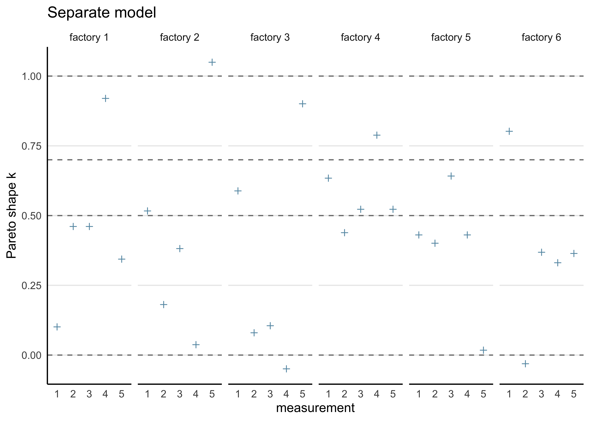
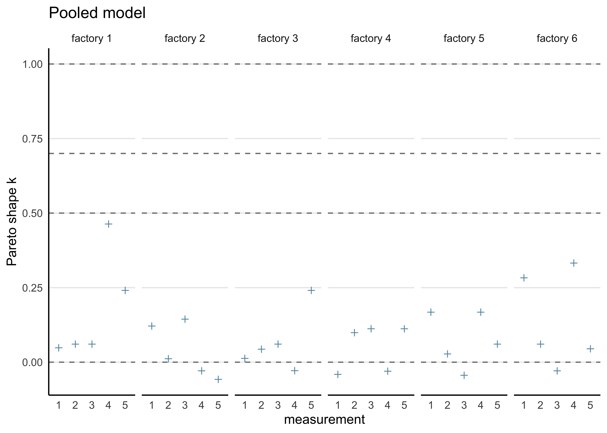
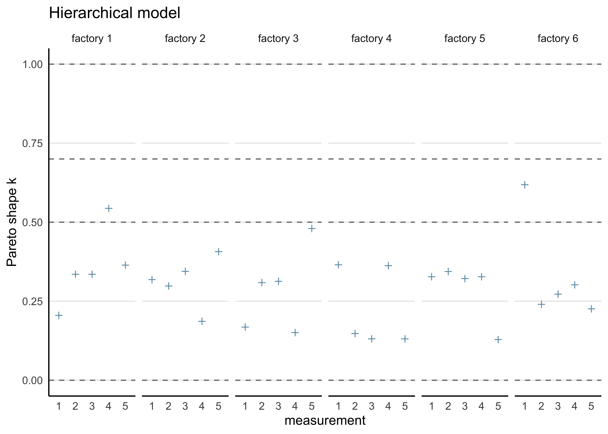

# Assignment 8

2021-11-12

## Setup


```r
knitr::opts_chunk$set(echo = TRUE, comment = "#>", dpi = 300)

for (f in list.files(here::here("src"), pattern = "R$", full.names = TRUE)) {
  source(f)
}

library(rstan)
```

```
## Loading required package: StanHeaders
```

```
## Loading required package: ggplot2
```

```
## rstan (Version 2.21.2, GitRev: 2e1f913d3ca3)
```

```
## For execution on a local, multicore CPU with excess RAM we recommend calling
## options(mc.cores = parallel::detectCores()).
## To avoid recompilation of unchanged Stan programs, we recommend calling
## rstan_options(auto_write = TRUE)
```

```r
library(bayestestR)
library(loo)
```

```
## This is loo version 2.4.1
```

```
## - Online documentation and vignettes at mc-stan.org/loo
```

```
## - As of v2.0.0 loo defaults to 1 core but we recommend using as many as possible. Use the 'cores' argument or set options(mc.cores = NUM_CORES) for an entire session.
```

```
## 
## Attaching package: 'loo'
```

```
## The following object is masked from 'package:rstan':
## 
##     loo
```

```r
library(tidybayes)
```

```
## 
## Attaching package: 'tidybayes'
```

```
## The following object is masked from 'package:bayestestR':
## 
##     hdi
```

```r
library(tidyverse)
```

```
## ── Attaching packages ─────────────────────────────────────── tidyverse 1.3.1 ──
```

```
## ✓ tibble  3.1.3     ✓ dplyr   1.0.7
## ✓ tidyr   1.1.3     ✓ stringr 1.4.0
## ✓ readr   2.0.1     ✓ forcats 0.5.1
## ✓ purrr   0.3.4
```

```
## ── Conflicts ────────────────────────────────────────── tidyverse_conflicts() ──
## x tidyr::extract() masks rstan::extract()
## x dplyr::filter()  masks stats::filter()
## x dplyr::lag()     masks stats::lag()
```

```r
rstan_options(auto_write = TRUE)
options(mc.cores = 2)

theme_set(theme_classic() + theme(strip.background = element_blank()))

factory <- aaltobda::factory
set.seed(678)
```

**[Assignment 8](assignments/assignment-08.pdf)**

## Exercise 1. Model assessment: LOO-CV for factory data with Stan

**Use leave-one-out cross-validation (LOO-CV) to assess the predictive performance of the pooled, separate and hierarchical Gaussian models for the factory dataset (see the second exercise in Assignment 7).**

**a) Fit the models with Stan as instructed in Assignment 7.**
**To use the `loo` or `psisloo` functions, you need to compute the log-likelihood values of each observation for every posterior draw (i.e. an $S$-by-$N$ matrix, where $S$ is the number of posterior draws and $N = 30$ is the total number of observations).**
**This can be done in the `generated quantities` block in the Stan code; for a demonstration, see the Gaussian linear model `lin.stan` in the R Stan examples that can be found here.**


*Separate model*


```r
separate_model_code <- here::here(
  "models", "assignment07_factories_separate.stan"
)

separate_model_data <- list(
  y = factory,
  N = nrow(factory),
  J = ncol(factory)
)

separate_model <- rstan::stan(
  separate_model_code,
  data = separate_model_data,
  verbose = FALSE,
  refresh = 0
)

print(separate_model, pars = c("mu", "sigma"))
```

```
#> Inference for Stan model: assignment07_factories_separate.
#> 4 chains, each with iter=2000; warmup=1000; thin=1; 
#> post-warmup draws per chain=1000, total post-warmup draws=4000.
#> 
#>            mean se_mean   sd   2.5%    25%    50%    75%  97.5% n_eff Rhat
#> mu[1]     85.74    0.13 7.30  72.77  80.60  85.40  90.50 101.41  2985    1
#> mu[2]    105.07    0.07 4.40  96.26 102.25 105.16 107.86 113.48  3528    1
#> mu[3]     90.40    0.08 4.62  81.81  87.40  90.12  93.23 100.44  3546    1
#> mu[4]    110.56    0.06 3.12 104.01 108.86 110.67 112.45 116.16  2523    1
#> mu[5]     91.46    0.06 3.90  84.00  89.00  91.29  93.83  99.79  3928    1
#> mu[6]     91.25    0.11 6.31  79.88  87.09  90.80  94.99 104.94  3392    1
#> sigma[1]  19.28    0.14 6.92  10.51  14.54  17.85  22.36  36.47  2495    1
#> sigma[2]  10.41    0.06 3.32   6.14   8.14   9.78  11.92  18.78  2971    1
#> sigma[3]  11.42    0.07 3.76   6.62   8.86  10.57  13.13  20.71  2825    1
#> sigma[4]   6.85    0.06 2.47   3.90   5.26   6.37   7.82  12.71  1640    1
#>  [ reached getOption("max.print") -- omitted 2 rows ]
#> 
#> Samples were drawn using NUTS(diag_e) at Wed Feb  2 06:45:27 2022.
#> For each parameter, n_eff is a crude measure of effective sample size,
#> and Rhat is the potential scale reduction factor on split chains (at 
#> convergence, Rhat=1).
```

*Pooled model*


```r
pooled_model_code <- here::here("models", "assignment07_factories_pooled.stan")

pooled_model_data <- list(
  y = unname(unlist(factory)),
  N = length(unlist(factory))
)

pooled_model <- rstan::stan(
  pooled_model_code,
  data = pooled_model_data,
  verbose = FALSE,
  refresh = 0
)

print(pooled_model, pars = c("mu", "sigma"))
```

```
#> Inference for Stan model: assignment07_factories_pooled.
#> 4 chains, each with iter=2000; warmup=1000; thin=1; 
#> post-warmup draws per chain=1000, total post-warmup draws=4000.
#> 
#>        mean se_mean   sd  2.5%   25%   50%   75% 97.5% n_eff Rhat
#> mu    93.64    0.06 3.15 87.50 91.56 93.62 95.67 99.94  2906    1
#> sigma 17.74    0.04 2.33 13.92 16.06 17.47 19.16 22.88  2707    1
#> 
#> Samples were drawn using NUTS(diag_e) at Wed Feb  2 06:45:29 2022.
#> For each parameter, n_eff is a crude measure of effective sample size,
#> and Rhat is the potential scale reduction factor on split chains (at 
#> convergence, Rhat=1).
```

*Hierarchical model*


```r
hierarchical_model_code <- here::here(
  "models", "assignment07_factories_hierarchical.stan"
)

hierarchical_model_data <- list(
  y = factory,
  N = nrow(factory),
  J = ncol(factory)
)

hierarchical_model <- rstan::stan(
  hierarchical_model_code,
  data = hierarchical_model_data,
  verbose = FALSE,
  refresh = 0
)
```

```
#> Warning: There were 29 divergent transitions after warmup. See
#> http://mc-stan.org/misc/warnings.html#divergent-transitions-after-warmup
#> to find out why this is a problem and how to eliminate them.
```

```
#> Warning: Examine the pairs() plot to diagnose sampling problems
```

```r
print(hierarchical_model, pars = c("alpha", "tau", "mu", "sigma"))
```

```
#> Inference for Stan model: assignment07_factories_hierarchical.
#> 4 chains, each with iter=2000; warmup=1000; thin=1; 
#> post-warmup draws per chain=1000, total post-warmup draws=4000.
#> 
#>         mean se_mean   sd  2.5%    25%    50%    75%  97.5% n_eff Rhat
#> alpha  94.49    0.08 4.59 85.49  91.41  94.51  97.42 103.75  3438 1.00
#> tau    10.94    0.12 4.10  3.65   8.07  10.58  13.41  19.85  1222 1.01
#> mu[1]  81.63    0.17 6.34 69.57  77.30  81.40  85.80  94.85  1382 1.00
#> mu[2] 102.56    0.12 5.77 91.48  98.58 102.49 106.34 114.27  2445 1.00
#> mu[3]  89.79    0.10 5.57 78.62  86.16  89.88  93.51 100.59  3159 1.00
#> mu[4] 106.30    0.14 6.32 93.89 102.01 106.47 110.66 118.44  2004 1.00
#> mu[5]  91.32    0.09 5.38 80.68  87.73  91.38  94.88 101.74  3999 1.00
#> mu[6]  88.65    0.12 5.69 77.27  84.95  88.75  92.59  99.52  2244 1.00
#> sigma  14.34    0.05 2.19 10.78  12.78  14.07  15.58  19.52  1980 1.00
#> 
#> Samples were drawn using NUTS(diag_e) at Wed Feb  2 06:45:31 2022.
#> For each parameter, n_eff is a crude measure of effective sample size,
#> and Rhat is the potential scale reduction factor on split chains (at 
#> convergence, Rhat=1).
```

**b) Compute the PSIS-LOO elpd values and the $\hat{k}$-values for each of the three models.**
**Hint! It will be convenient to visualize the $\hat{k}$-values for each model so that you can easily see how many of these values fall in the range $\hat{k} > 0.7$ to assess the reliability of the PSIS-LOO estimate for each model.**
**You can read more about the theoretical guarantees for the accuracy of the estimate depending on $\hat{k}$ from the original article (see here or here), but regarding this assignment, it suffices to understand that if all the $\hat{k}$-values are $\hat{k} \le 0.7$, the PSIS-LOO estimate can be considered to be reliable, otherwise there is a concern that it may be biased (too optimistic, overestimating the predictive accuracy of the model).**


```r
calc_loo <- function(mdl) {
  log_lik <- loo::extract_log_lik(mdl, merge_chains = FALSE)
  r_eff <- loo::relative_eff(exp(log_lik))
  loo_res <- loo::loo(log_lik, r_eff = r_eff)
  return(loo_res)
}
```

*Separate model*


```r
separate_loo <- calc_loo(separate_model)
```

```
#> Warning: Some Pareto k diagnostic values are too high. See help('pareto-k-diagnostic') for details.
```

```r
print(separate_loo)
```

```
#> 
#> Computed from 4000 by 30 log-likelihood matrix
#> 
#>          Estimate   SE
#> elpd_loo   -131.7  7.1
#> p_loo        13.6  3.5
#> looic       263.5 14.2
#> ------
#> Monte Carlo SE of elpd_loo is NA.
#> 
#> Pareto k diagnostic values:
#>                          Count Pct.    Min. n_eff
#> (-Inf, 0.5]   (good)     19    63.3%   1810      
#>  (0.5, 0.7]   (ok)        6    20.0%   572       
#>    (0.7, 1]   (bad)       4    13.3%   32        
#>    (1, Inf)   (very bad)  1     3.3%   12        
#> See help('pareto-k-diagnostic') for details.
```

*Pooled model*


```r
pooled_loo <- calc_loo(pooled_model)
print(pooled_loo)
```

```
#> 
#> Computed from 4000 by 30 log-likelihood matrix
#> 
#>          Estimate  SE
#> elpd_loo   -130.9 4.9
#> p_loo         2.1 0.9
#> looic       261.9 9.7
#> ------
#> Monte Carlo SE of elpd_loo is 0.0.
#> 
#> All Pareto k estimates are good (k < 0.5).
#> See help('pareto-k-diagnostic') for details.
```

*Hierarchical model*


```r
hierarchical_loo <- calc_loo(hierarchical_model)
```

```
#> Warning: Some Pareto k diagnostic values are slightly high. See help('pareto-k-diagnostic') for details.
```

```r
print(hierarchical_loo)
```

```
#> 
#> Computed from 4000 by 30 log-likelihood matrix
#> 
#>          Estimate   SE
#> elpd_loo   -127.0  5.1
#> p_loo         6.1  1.8
#> looic       254.0 10.1
#> ------
#> Monte Carlo SE of elpd_loo is 0.1.
#> 
#> Pareto k diagnostic values:
#>                          Count Pct.    Min. n_eff
#> (-Inf, 0.5]   (good)     28    93.3%   1358      
#>  (0.5, 0.7]   (ok)        2     6.7%   250       
#>    (0.7, 1]   (bad)       0     0.0%   <NA>      
#>    (1, Inf)   (very bad)  0     0.0%   <NA>      
#> 
#> All Pareto k estimates are ok (k < 0.7).
#> See help('pareto-k-diagnostic') for details.
```

**c) Compute the effective number of parameters $p_\text{eff} for each of the three models.**
**Hint! The estimated effective number of parameters in the model can be computed from equation (7.15) in the book, where elpdloo-cv is the PSIS-LOO value (sum of the LOO log densities) and lpd is given by equation (7.5) in the book.**


```r
extract_p_eff <- function(loo_res) {
  loo_res$estimates[2, ]
}

bind_rows(
  extract_p_eff(separate_loo),
  extract_p_eff(pooled_loo),
  extract_p_eff(hierarchical_loo)
) %>%
  add_column(model = c("separate", "pooled", "hierarchical"))
```

```
#> # A tibble: 3 × 3
#>   Estimate    SE model       
#>      <dbl> <dbl> <chr>       
#> 1    13.6  3.47  separate    
#> 2     2.13 0.892 pooled      
#> 3     6.07 1.76  hierarchical
```

**d) Assess how reliable the PSIS-LOO estimates are for the three models based on the $\hat{k}$-values.**


```r
plot_khat <- function(loo_res, factory_data) {
  khat <- as.data.frame(loo_res$pointwise)$influence_pareto_k
  factory_data %>%
    mutate(idx = row_number()) %>%
    pivot_longer(-idx, names_to = "factory", values_to = "measure") %>%
    arrange(factory) %>%
    mutate(
      khat = !!khat,
      factory = str_replace(factory, "V", "factory ")
    ) %>%
    ggplot(aes(x = factor(idx), y = khat)) +
    facet_wrap(vars(factory), nrow = 1, scales = "free_x") +
    geom_hline(yintercept = c(0, 0.5, 0.7, 1.0), linetype = 2, color = "grey50") +
    geom_point(shape = 3, color = "#6497B1") +
    theme(axis.ticks = element_blank(), panel.grid.major.y = element_line()) +
    labs(x = "measurement", y = "Pareto shape k")
}
```


```r
plot_khat(separate_loo, factory) + labs(title = "Separate model")
```




```r
plot_khat(pooled_loo, factory) + labs(title = "Pooled model")
```




```r
plot_khat(hierarchical_loo, factory) + labs(title = "Hierarchical model")
```



**e) An assessment of whether there are differences between the models with regard to the elpdloo-cv, and if so, which model should be selected according to PSIS-LOO.**


```r
extract_elpd <- function(loo_res) {
  loo_res$estimates[1, ]
}
```


```r
bind_rows(
  extract_elpd(separate_loo),
  extract_elpd(pooled_loo),
  extract_elpd(hierarchical_loo)
) %>%
  add_column(model = c("separate", "pooled", "hierarchical"))
```

```
#> # A tibble: 3 × 3
#>   Estimate    SE model       
#>      <dbl> <dbl> <chr>       
#> 1    -132.  7.08 separate    
#> 2    -131.  4.86 pooled      
#> 3    -127.  5.05 hierarchical
```

From the ELPD and $\hat{k}$ values, the hierarchical model is superior to the seaprate and pooled models.

**f) Both the Stan and R code should be included in your report.**

All of the R code is included in this file.
All of the models are described in [Assignment 7](jhcook-assignment-07.html).
Below is a list of the Stan code for all of the models (available in the [`models/`](./models/) directory):

1. [separate models](../models/assignment07_factories_separate.stan)
2. [pooled model](../models/assignment07_factories_pooled.stan)
3. [hierarchical model](../models/assignment07_factories_hierarchical.stan)

---


```r
sessionInfo()
```

```
#> R version 4.1.2 (2021-11-01)
#> Platform: x86_64-apple-darwin17.0 (64-bit)
#> Running under: macOS Big Sur 10.16
#> 
#> Matrix products: default
#> BLAS:   /Library/Frameworks/R.framework/Versions/4.1/Resources/lib/libRblas.0.dylib
#> LAPACK: /Library/Frameworks/R.framework/Versions/4.1/Resources/lib/libRlapack.dylib
#> 
#> locale:
#> [1] en_US.UTF-8/en_US.UTF-8/en_US.UTF-8/C/en_US.UTF-8/en_US.UTF-8
#> 
#> attached base packages:
#> [1] stats     graphics  grDevices datasets  utils     methods   base     
#> 
#> other attached packages:
#>  [1] forcats_0.5.1        stringr_1.4.0        dplyr_1.0.7         
#>  [4] purrr_0.3.4          readr_2.0.1          tidyr_1.1.3         
#>  [7] tibble_3.1.3         tidyverse_1.3.1      tidybayes_3.0.1     
#> [10] loo_2.4.1            bayestestR_0.11.0    rstan_2.21.2        
#> [13] ggplot2_3.3.5        StanHeaders_2.21.0-7
#> 
#> loaded via a namespace (and not attached):
#>  [1] fs_1.5.0             matrixStats_0.61.0   lubridate_1.7.10    
#>  [4] insight_0.14.4       httr_1.4.2           rprojroot_2.0.2     
#>  [7] tensorA_0.36.2       tools_4.1.2          backports_1.2.1     
#> [10] bslib_0.2.5.1        utf8_1.2.2           R6_2.5.0            
#> [13] DBI_1.1.1            colorspace_2.0-2     ggdist_3.0.0        
#> [16] withr_2.4.2          tidyselect_1.1.1     gridExtra_2.3       
#> [19] prettyunits_1.1.1    processx_3.5.2       curl_4.3.2          
#> [22] compiler_4.1.2       rvest_1.0.1          cli_3.0.1           
#> [25] arrayhelpers_1.1-0   xml2_1.3.2           labeling_0.4.2      
#> [28] bookdown_0.24        posterior_1.1.0      sass_0.4.0          
#> [31] scales_1.1.1         checkmate_2.0.0      aaltobda_0.3.1      
#> [34] callr_3.7.0          digest_0.6.27        rmarkdown_2.10      
#> [37] pkgconfig_2.0.3      htmltools_0.5.1.1    highr_0.9           
#> [40] dbplyr_2.1.1         rlang_0.4.11         readxl_1.3.1        
#> [43] rstudioapi_0.13      jquerylib_0.1.4      farver_2.1.0        
#> [46] generics_0.1.0       svUnit_1.0.6         jsonlite_1.7.2      
#> [49] distributional_0.2.2 inline_0.3.19        magrittr_2.0.1      
#> [52] Rcpp_1.0.7           munsell_0.5.0        fansi_0.5.0         
#> [55] abind_1.4-5          lifecycle_1.0.0      stringi_1.7.3       
#> [58] yaml_2.2.1           pkgbuild_1.2.0       grid_4.1.2          
#> [61] parallel_4.1.2       crayon_1.4.1         lattice_0.20-45     
#> [64] haven_2.4.3          hms_1.1.0            knitr_1.33          
#> [67] ps_1.6.0             pillar_1.6.2         codetools_0.2-18    
#> [70] clisymbols_1.2.0     stats4_4.1.2         reprex_2.0.1        
#> [73] glue_1.4.2           evaluate_0.14        V8_3.4.2            
#> [76] renv_0.14.0          RcppParallel_5.1.4   modelr_0.1.8        
#> [79] vctrs_0.3.8          tzdb_0.1.2           cellranger_1.1.0    
#> [82] gtable_0.3.0         assertthat_0.2.1     datawizard_0.2.1    
#> [85] xfun_0.25            broom_0.7.9          coda_0.19-4         
#> [88] ellipsis_0.3.2       here_1.0.1
```
