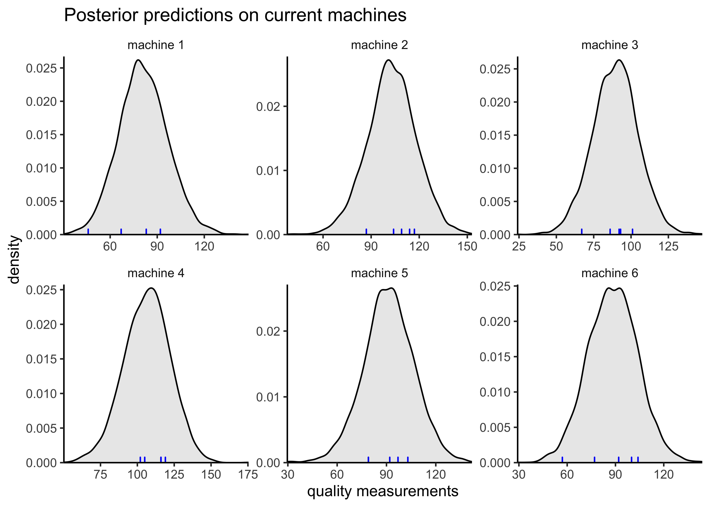
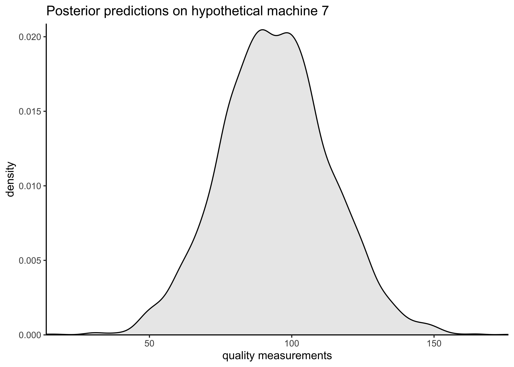

# Assignment 9

2021-11-18

## Setup


```r
knitr::opts_chunk$set(echo = TRUE, comment = "#>", dpi = 300)

library(glue)
library(rstan)
```

```
## Loading required package: StanHeaders
```

```
## Loading required package: ggplot2
```

```
## rstan (Version 2.21.2, GitRev: 2e1f913d3ca3)
```

```
## For execution on a local, multicore CPU with excess RAM we recommend calling
## options(mc.cores = parallel::detectCores()).
## To avoid recompilation of unchanged Stan programs, we recommend calling
## rstan_options(auto_write = TRUE)
```

```r
library(tidybayes)
library(tidyverse)
```

```
## ── Attaching packages ─────────────────────────────────────────────────────────────────────────── tidyverse 1.3.1 ──
```

```
## ✔ tibble  3.1.3     ✔ dplyr   1.0.7
## ✔ tidyr   1.1.3     ✔ stringr 1.4.0
## ✔ readr   2.0.1     ✔ forcats 0.5.1
## ✔ purrr   0.3.4
```

```
## ── Conflicts ────────────────────────────────────────────────────────────────────────────── tidyverse_conflicts() ──
## ✖ dplyr::collapse() masks glue::collapse()
## ✖ tidyr::extract()  masks rstan::extract()
## ✖ dplyr::filter()   masks stats::filter()
## ✖ dplyr::lag()      masks stats::lag()
```

```r
for (f in list.files(here::here("src"), pattern = "R$", full.names = TRUE)) {
  source(f)
}

rstan_options(auto_write = TRUE)
options(mc.cores = 2)

theme_set(theme_classic() + theme(strip.background = element_blank()))

factory <- aaltobda::factory
set.seed(678)
```

**[Assignment 9](assignments/assignment-09.pdf)**

## Exercise 1. Decision analysis for the factory data

**Your task is to decide whether or not to buy a new (7th) machine for the company.**
**The decision should be based on our best knowledge about the machines.**

**The following is known about the production process:**

- **The given data contains quality measurements of single products from the six machines that are ordered from the same seller. (columns: different machines, rows: measurements)**
- **Customers pay 200 euros for each product.**
  – **If the quality of the product is below 85, the product cannot be sold**
  – **All the products that have sufficient quality are sold.**
- **Raw-materials, the salary of the machine user and the usage cost of the machine for each product cost 106 euros in total.**
  – **Usage cost of the machine also involves all investment and repair costs divided by the number of products a machine can create. So there is no need to take the investment cost into account as a separate factor.**
- **The only thing the company owner cares about is money. Thus, as a utility function, use the profit of a new product from a machine.**

**a) For each of the six machines, compute and report the expected utility of one product of that machine.**


```r
PURCHASE_RPICE <- 200
MIN_QUALITY_TO_SELL <- 85
COST_TO_PRODUCE <- 106

utility <- function(draws) {
  purchased <- PURCHASE_RPICE * sum(draws >= MIN_QUALITY_TO_SELL)
  cost_to_produce <- -1 * COST_TO_PRODUCE * length(draws)
  u <- (purchased + cost_to_produce) / length(draws)
  return(u)
}

# Test case given in the assignment.
test_y_pred <- c(123.80, 85.23, 70.16, 80.57, 84.91)
test_res <- utility(draws = test_y_pred)
stop_if_not_close_to(test_res, -26)
```

Fit the hierarchical model and gather posterior predictions from each machine.


```r
hierarchical_model_code <- here::here(
  "models", "assignment07_factories_hierarchical.stan"
)

hierarchical_model_data <- list(
  y = factory,
  N = nrow(factory),
  J = ncol(factory)
)

hierarchical_model <- rstan::stan(
  hierarchical_model_code,
  data = hierarchical_model_data,
  verbose = FALSE,
  refresh = 0
)
```

```
#> Warning: There were 20 divergent transitions after warmup. See
#> http://mc-stan.org/misc/warnings.html#divergent-transitions-after-warmup
#> to find out why this is a problem and how to eliminate them.
```

```
#> Warning: Examine the pairs() plot to diagnose sampling problems
```

```r
print(hierarchical_model, pars = c("alpha", "tau", "mu", "sigma"))
```

```
#> Inference for Stan model: assignment07_factories_hierarchical.
#> 4 chains, each with iter=2000; warmup=1000; thin=1; 
#> post-warmup draws per chain=1000, total post-warmup draws=4000.
#> 
#>         mean se_mean   sd  2.5%    25%    50%    75%  97.5% n_eff Rhat
#> alpha  94.55    0.08 4.83 85.43  91.32  94.37  97.72 104.49  3501    1
#> tau    11.10    0.12 4.16  4.08   8.23  10.66  13.54  20.47  1212    1
#> mu[1]  81.53    0.16 6.34 69.02  77.32  81.42  85.70  94.91  1618    1
#> mu[2] 102.52    0.11 5.86 91.11  98.64 102.57 106.40 113.99  3076    1
#> mu[3]  89.82    0.09 5.55 79.06  86.07  89.76  93.49 100.91  4114    1
#> mu[4] 106.41    0.13 6.13 93.57 102.51 106.57 110.50 118.39  2285    1
#> mu[5]  91.29    0.08 5.37 80.40  87.93  91.28  94.86 102.05  4113    1
#> mu[6]  88.51    0.10 5.47 78.00  84.76  88.50  92.29  99.23  3143    1
#> sigma  14.27    0.04 2.08 10.87  12.79  14.02  15.50  18.81  2940    1
#> 
#> Samples were drawn using NUTS(diag_e) at Thu Feb  3 07:35:00 2022.
#> For each parameter, n_eff is a crude measure of effective sample size,
#> and Rhat is the potential scale reduction factor on split chains (at 
#> convergence, Rhat=1).
```

Extract the posterior predictions for each machine and compare them to the observations.


```r
factory_ypred <- rstan::extract(hierarchical_model, pars = "ypred")$ypred

tidy_factory_measure_matrix <- function(factory_mat) {
  as.data.frame(factory_mat) %>%
    set_names(glue("machine {seq(ncol(factory_mat))}")) %>%
    pivot_longer(-c(), names_to = "machine", values_to = "quality_measurement")
}

factory_long <- tidy_factory_measure_matrix(factory)

tidy_factory_measure_matrix(factory_ypred) %>%
  ggplot(aes(x = quality_measurement)) +
  facet_wrap(vars(machine), nrow = 2, scales = "free") +
  geom_density(fill = "black", alpha = 0.1) +
  geom_rug(data = factory_long, color = "blue") +
  scale_x_continuous(expand = expansion(c(0, 0))) +
  scale_y_continuous(expand = expansion(c(0, 0.02))) +
  labs(
    x = "quality measurements",
    y = "density",
    title = "Posterior predictions on current machines"
  )
```



Calculate the expected utility for each current machine.


```r
machine_utilities <- apply(factory_ypred, 2, utility)
tibble(
  machine = glue("machine {seq(length(machine_utilities))}"),
  expected_utility = machine_utilities
) %>%
  kableExtra::kbl()
```

<table>
 <thead>
  <tr>
   <th style="text-align:left;"> machine </th>
   <th style="text-align:right;"> expected_utility </th>
  </tr>
 </thead>
<tbody>
  <tr>
   <td style="text-align:left;"> machine 1 </td>
   <td style="text-align:right;"> -26.15 </td>
  </tr>
  <tr>
   <td style="text-align:left;"> machine 2 </td>
   <td style="text-align:right;"> 70.15 </td>
  </tr>
  <tr>
   <td style="text-align:left;"> machine 3 </td>
   <td style="text-align:right;"> 17.50 </td>
  </tr>
  <tr>
   <td style="text-align:left;"> machine 4 </td>
   <td style="text-align:right;"> 76.45 </td>
  </tr>
  <tr>
   <td style="text-align:left;"> machine 5 </td>
   <td style="text-align:right;"> 27.45 </td>
  </tr>
  <tr>
   <td style="text-align:left;"> machine 6 </td>
   <td style="text-align:right;"> 11.05 </td>
  </tr>
</tbody>
</table>

**b) Rank the machines based on the expected utilities.**
**In other words order the machines from worst to best.**
**Also briefly explain what the utility values tell about the quality of these machines.**
**E.g. Tell which machines are profitable and which are not (if any).**

Based on their expected utility, the rankings of the machines from worst to best is: 1, 6, 3, 5, 2, 4.
Machine 1 has a negative utility, indicating that it is expected to be unprofitable.

**c) Compute and report the expected utility of the products of a new (7th) machine.**


```r
machine7_pred <- rstan::extract(hierarchical_model, pars = "y7pred")$y7pred

ggplot(tibble(x = unlist(machine7_pred)), aes(x = x)) +
  geom_density(fill = "black", alpha = 0.1) +
  scale_x_continuous(expand = expansion(c(0, 0))) +
  scale_y_continuous(expand = expansion(c(0, 0.02))) +
  labs(
    x = "quality measurements",
    y = "density",
    title = "Posterior predictions on hypothetical machine 7"
  )
```




```r
# Expected utility from machine 7.
utility(machine7_pred)
```

```
#> [1] 30.7
```

The expected utility of hypothetical machine 7 is **30.7**.

**d) Based on your analysis, discuss briefly whether the company owner should buy a new (7th) machine.**

Based on this analysis, purchasing another machine would be expected to be profitable.
It might be worth replacing machine 1 with this new machine.

**e) As usual, remember to include the source code for both Stan and R (or Python).**

The model is available here ["assignment07_factories_hierarchical.stan"](../models/assignment07_factories_hierarchical.stan).

The only changes were made in the `generated quantities` block:

```
...
generated quantities {
  // Compute the predictive distribution for the sixth machine.
  real y6pred;  // Leave for compatibility with earlier assignments.
  vector[J] ypred;
  real mu7pred;
  real y7pred;
  vector[J] log_lik[N];

  y6pred = normal_rng(mu[6], sigma);
  for (j in 1:J) {
    ypred[j] = normal_rng(mu[j], sigma);
  }

  mu7pred = normal_rng(alpha, tau);
  y7pred = normal_rng(mu7pred, sigma);

  for (j in 1:J) {
    for (n in 1:N) {
      log_lik[n,j] = normal_lpdf(y[n,j] | mu[j], sigma);
    }
  }
}
```

---


```r
sessionInfo()
```

```
#> R version 4.1.2 (2021-11-01)
#> Platform: x86_64-apple-darwin17.0 (64-bit)
#> Running under: macOS Big Sur 10.16
#> 
#> Matrix products: default
#> BLAS:   /Library/Frameworks/R.framework/Versions/4.1/Resources/lib/libRblas.0.dylib
#> LAPACK: /Library/Frameworks/R.framework/Versions/4.1/Resources/lib/libRlapack.dylib
#> 
#> locale:
#> [1] en_US.UTF-8/en_US.UTF-8/en_US.UTF-8/C/en_US.UTF-8/en_US.UTF-8
#> 
#> attached base packages:
#> [1] stats     graphics  grDevices datasets  utils     methods   base     
#> 
#> other attached packages:
#>  [1] forcats_0.5.1        stringr_1.4.0        dplyr_1.0.7         
#>  [4] purrr_0.3.4          readr_2.0.1          tidyr_1.1.3         
#>  [7] tibble_3.1.3         tidyverse_1.3.1      tidybayes_3.0.1     
#> [10] rstan_2.21.2         ggplot2_3.3.5        StanHeaders_2.21.0-7
#> [13] glue_1.4.2          
#> 
#> loaded via a namespace (and not attached):
#>  [1] matrixStats_0.61.0   fs_1.5.0             lubridate_1.7.10    
#>  [4] webshot_0.5.2        httr_1.4.2           rprojroot_2.0.2     
#>  [7] tensorA_0.36.2       tools_4.1.2          backports_1.2.1     
#> [10] bslib_0.2.5.1        utf8_1.2.2           R6_2.5.0            
#> [13] DBI_1.1.1            colorspace_2.0-2     ggdist_3.0.0        
#> [16] withr_2.4.2          tidyselect_1.1.1     gridExtra_2.3       
#> [19] prettyunits_1.1.1    processx_3.5.2       curl_4.3.2          
#> [22] compiler_4.1.2       cli_3.0.1            rvest_1.0.1         
#> [25] arrayhelpers_1.1-0   xml2_1.3.2           labeling_0.4.2      
#> [28] bookdown_0.24        posterior_1.1.0      sass_0.4.0          
#> [31] scales_1.1.1         checkmate_2.0.0      aaltobda_0.3.1      
#> [34] callr_3.7.0          systemfonts_1.0.3    digest_0.6.27       
#> [37] svglite_2.0.0        rmarkdown_2.10       pkgconfig_2.0.3     
#> [40] htmltools_0.5.1.1    highr_0.9            dbplyr_2.1.1        
#> [43] rlang_0.4.11         readxl_1.3.1         rstudioapi_0.13     
#> [46] jquerylib_0.1.4      farver_2.1.0         generics_0.1.0      
#> [49] svUnit_1.0.6         jsonlite_1.7.2       distributional_0.2.2
#> [52] inline_0.3.19        magrittr_2.0.1       kableExtra_1.3.4    
#> [55] loo_2.4.1            Rcpp_1.0.7           munsell_0.5.0       
#> [58] fansi_0.5.0          abind_1.4-5          lifecycle_1.0.0     
#> [61] stringi_1.7.3        yaml_2.2.1           pkgbuild_1.2.0      
#> [64] grid_4.1.2           parallel_4.1.2       crayon_1.4.1        
#> [67] lattice_0.20-45      haven_2.4.3          hms_1.1.0           
#> [70] knitr_1.33           ps_1.6.0             pillar_1.6.2        
#> [73] codetools_0.2-18     clisymbols_1.2.0     stats4_4.1.2        
#> [76] reprex_2.0.1         evaluate_0.14        V8_3.4.2            
#> [79] renv_0.14.0          RcppParallel_5.1.4   modelr_0.1.8        
#> [82] vctrs_0.3.8          tzdb_0.1.2           cellranger_1.1.0    
#> [85] gtable_0.3.0         assertthat_0.2.1     xfun_0.25           
#> [88] broom_0.7.9          coda_0.19-4          viridisLite_0.4.0   
#> [91] ellipsis_0.3.2       here_1.0.1
```
