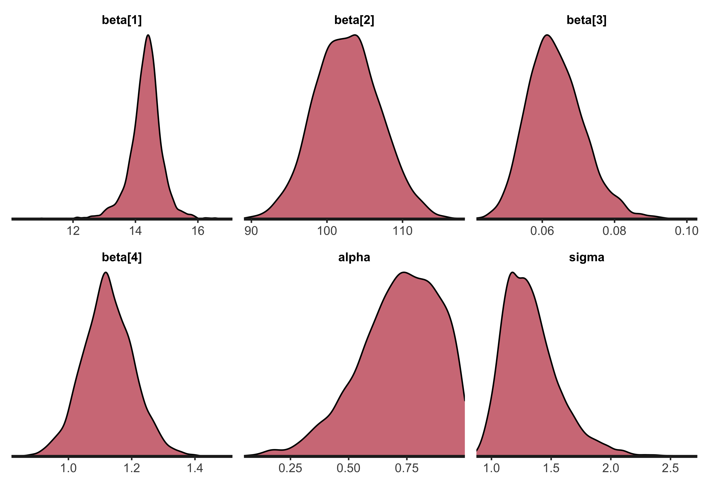

# Chapter 19 Exercises - Reproducing the the 'serial dilution assay'

2021-12-10


> I turned this exercise into a blog post on my [webiste](https://joshuacook.netlify.app).

In chapter 17 "Parametric nonlinear models" of *Bayesian Data Analysis*[^1] by Gelman *et al.*, the authors present an example of fitting a curve to a [serial dilution](https://en.wikipedia.org/wiki/Serial_dilution) standard curve and using it to estimate unknown concentrations.
Below, I build the model with Stan and fit it using MCMC.
Unfortunately, I was unable to find the original data in Gelman's original publication of the model[^2].
The best I could do was copy the data for the standard curve from a table in the book and build the model to fit that data.

> The source code for this post is in a [repository](https://github.com/jhrcook/bayesian-data-analysis-course) of my work for Aki Vehtari's Bayesian Data Analysis [course](https://avehtari.github.io/BDA_course_Aalto/index.html).

[^1]: Gelman, Andrew, et al. Bayesian Data Analysis. CRC Press Etc., 2015.
[^2]: Gelman A, Chew GL, Shnaidman M. Bayesian analysis of serial dilution assays. Biometrics. 2004 Jun;60(2):407-17. doi: 10.1111/j.0006-341X.2004.00185.x. PMID: 15180666. https://pubmed.ncbi.nlm.nih.gov/15180666/

## Setup


```r
library(rstan)
library(tidybayes)
library(patchwork)
library(tidyverse)

options(mc.cores = parallel::detectCores())
rstan_options(auto_write = TRUE)

theme_set(
  theme_classic() +
    theme(
      panel.grid.major = element_line(),
      strip.background = element_blank(),
      plot.title = element_text(hjust = 0.5)
    )
)

SNS_BLUE <- "#1F77B4"
STAN_RED <- "#B2171D"
```

As mentioned above, I couldn't find the original data, so I copied it from the book's figure 19.3 on page 473.


```r
dilution_standards_data <- tibble::tribble(
  ~conc, ~dilution, ~y,
  0.64, 1, c(101.8, 121.4),
  0.32, 1 / 2, c(105.2, 114.1),
  0.16, 1 / 4, c(92.7, 93.3),
  0.08, 1 / 8, c(72.4, 61.1),
  0.04, 1 / 16, c(57.6, 50.0),
  0.02, 1 / 32, c(38.5, 35.1),
  0.01, 1 / 64, c(26.6, 25.0),
  0, 0, c(14.7, 14.2),
) %>%
  mutate(rep = purrr::map(conc, ~ c("a", "b"))) %>%
  unnest(c(y, rep))

knitr::kable(dilution_standards_data)
```


| conc| dilution|     y|rep |
|----:|--------:|-----:|:---|
| 0.64| 1.000000| 101.8|a   |
| 0.64| 1.000000| 121.4|b   |
| 0.32| 0.500000| 105.2|a   |
| 0.32| 0.500000| 114.1|b   |
| 0.16| 0.250000|  92.7|a   |
| 0.16| 0.250000|  93.3|b   |
| 0.08| 0.125000|  72.4|a   |
| 0.08| 0.125000|  61.1|b   |
| 0.04| 0.062500|  57.6|a   |
| 0.04| 0.062500|  50.0|b   |
| 0.02| 0.031250|  38.5|a   |
| 0.02| 0.031250|  35.1|b   |
| 0.01| 0.015625|  26.6|a   |
| 0.01| 0.015625|  25.0|b   |
| 0.00| 0.000000|  14.7|a   |
| 0.00| 0.000000|  14.2|b   |

The following plot shows the two standard dilution curves.
They are quite similar.


```r
data_plot <- dilution_standards_data %>%
  ggplot(aes(x = conc, y = y, color = rep)) +
  geom_line(alpha = 0.5, linetype = 2) +
  geom_point(alpha = 0.8) +
  scale_x_continuous(expand = expansion(c(0, 0.02)), limits = c(0, NA)) +
  scale_y_continuous(expand = expansion(c(0, 0.02)), limits = c(0, NA)) +
  scale_color_brewer(type = "qual", palette = "Set1") +
  theme(
    legend.position = c(0.8, 0.2),
    legend.background = element_blank()
  ) +
  labs(
    x = "concentration",
    y = "y",
    title = "Serial dilution standard curve",
    color = "replicate"
  )

data_plot
```


## Modeling

### Model specification

The model uses a normal likelihood to describe the posterior distribution $p(y|x)$.
The mean of the likelihood is defined for a given concentration $x$ using the standard equation used in the field:

$$
\text{E}[y | x, \beta] = g(x, \beta) = \beta_1 + \frac{\beta_2}{1 + (x/\beta_3)^{-\beta_4}} \\
$$


The model is a scaled and shifted logistic curve.
This structure results in the following interpretations for $\beta$, all of which are restricted to positive values:

1. $\beta_1$: color intensity when the concentration is 0
2. $\beta_2$: increase to saturation
3. $\beta_3$: the inflection point of the curve
4. $\beta_4$: rate of saturation

Below are the prior distributions for $\beta$. Note that they are are drastically different scales - this is critical to help the model fit the data.

$$
\beta_1 \sim N(10, 2.5) \\
\beta_2 \sim N(100, 5) \\
\beta_3 \sim N(0, 1) \\
\beta_4 \sim N(0, 2.5)
$$

The measurement error of the model, representing the variance in the model's likelihood is defined as follows:

$$
\tau(\alpha, \sigma_y, g(x, \beta), A) = \lgroup \frac{g(x,\beta)}{A} \rgroup^{2\alpha} \sigma^2_y
$$

Here, $\alpha$, restricted to lie between 0 and 1, allows the variance to be higher for larger measurement values.
$A$ is a constant (set to 30 by the authors) that allows $\sigma_y$ to be more easily interpreted as the variance from "typical" measurements.
Below are the priors for the new variables in the model.

$$
\alpha \sim \text{Beta}(1, 1) \qquad
\sigma \sim |N(0, 2.5)|
$$

### In Stan

Below is the Stan code for the model.
It looks very similar to the mathematical description of the model, a nice feature of the Stan probabilistic programming language.

The centrality and variance of the likelihood are calculated separately as `g` and `tau` so they can be used in the `model` and `generated quantities` block without duplicating the code.
The `log_lik` is calculated so that PSIS-LOO cross validation can be estimated.
I also included the ability to provide new data to make predictions over as `xnew`.


```r
dilution_model_file <- here::here("models", "serial-dilution.stan")
writeLines(readLines(dilution_model_file))
```

```
#> data {
#>   int<lower=0> N;           // number of data points
#>   int<lower=0> A;           // constant used in model of measurement error
#>   vector<lower=0>[N] x;     // concentration values
#>   vector<lower=0>[N] y;     // observed color intensity
#>   int<lower=0> M;           // number of new x values
#>   vector<lower=0>[M] xnew;  // new x values
#> }
#> 
#> parameters {
#>   vector<lower=0>[4] beta;
#>   real<lower=0,upper=1> alpha;
#>   real<lower=0> sigma;
#> }
#> 
#> transformed parameters {
#>   vector<lower=0>[N] g;
#>   vector<lower=0>[N] tau;
#> 
#>   for (i in 1:N) {
#>     g[i] = beta[1] + beta[2] / (1 + (x[i] / beta[3]) ^ (-beta[4]));
#>     tau[i] = ((g[i] / A) ^ (2.0 * alpha)) * (sigma ^ 2.0);
#>   }
#> }
#> 
#> model {
#>   // Priors
#>   alpha ~ beta(1, 1);
#>   beta[1] ~ normal(10, 2.5);
#>   beta[2] ~ normal(100, 5);
#>   beta[3] ~ normal(0, 1);
#>   beta[4] ~ normal(0, 2.5);
#>   sigma ~ normal(0, 2.5);
#> 
#>   // Likelihood
#>   for (i in 1:N) {
#>     y[i] ~ normal(g[i], tau[i]);
#>   }
#> }
#> 
#> generated quantities {
#>   vector[N] ypred;
#>   vector[N] log_lik;
#> 
#>   vector[M] g_hat;
#>   vector[M] tau_hat;
#>   vector[M] ynew;
#> 
#>   for (i in 1:N) {
#>     ypred[i] = normal_rng(g[i], tau[i]);
#>     log_lik[i] = normal_lpdf(y[i] | g[i], tau[i]);
#>   }
#> 
#>   for (i in 1:M) {
#>     g_hat[i] = beta[1] + beta[2] / (1 + (xnew[i] / beta[3]) ^ (-beta[4]));
#>     tau_hat[i] = ((g_hat[i] / A) ^ (2.0 * alpha)) * (sigma ^ 2.0);
#>     ynew[i] = normal_rng(g_hat[i], tau_hat[i]);
#>   }
#> }
```

### Sampling

As mentioned above, specifically defining the prior distributions for each $\beta$ is necessary for MCMC to accurately sample from the posterior.
With those helping restrict the range of their values, the model fit very well.


```r
xnew <- seq(0, max(dilution_standards_data$conc), 0.001)
model_data <- list(
  N = nrow(dilution_standards_data),
  A = 30,
  x = dilution_standards_data$conc,
  y = dilution_standards_data$y,
  M = length(xnew),
  xnew = xnew
)

dilution_model <- stan(
  dilution_model_file,
  model_name = "serial-dilution",
  data = model_data,
  refresh = 1000
)
```

### Posterior distributions

The next step is to analyze the posterior draws of the model.
We can check the success of MCMC by visualizing the traces of the chains, looking for good mixing ("fuzzy caterpillars") and checking diagnostic values such as $\widehat{R}$ and $n_\text{eff}$.
The trace plots are shown below followed by a table of the posteriors with the diagnostic values.
Everything looks good suggesting MCMC was successful.


```r
model_pars <- c("beta", "alpha", "sigma")
rstan::stan_trace(dilution_model, pars = model_pars, ncol = 2, alpha = 0.7) +
  scale_x_continuous(expand = expansion(c(0, 0))) +
  scale_y_continuous(expand = expansion(c(0.02, 0.02))) +
  theme(legend.position = "bottom")
```


```r
print(dilution_model, pars = model_pars)
```

```
#> Inference for Stan model: serial-dilution.
#> 4 chains, each with iter=2000; warmup=1000; thin=1; 
#> post-warmup draws per chain=1000, total post-warmup draws=4000.
#> 
#>           mean se_mean   sd  2.5%   25%    50%    75%  97.5% n_eff Rhat
#> beta[1]  14.33    0.02 0.55 13.12 14.08  14.36  14.61  15.33  1074    1
#> beta[2] 102.70    0.10 4.30 94.48 99.67 102.61 105.60 111.32  1755    1
#> beta[3]   0.06    0.00 0.01  0.05  0.06   0.06   0.07   0.08  1633    1
#> beta[4]   1.13    0.00 0.08  0.97  1.07   1.12   1.18   1.29  1870    1
#> alpha     0.72    0.01 0.17  0.33  0.61   0.74   0.85   0.98  1074    1
#> sigma     1.33    0.01 0.24  0.98  1.16   1.30   1.45   1.92   893    1
#> 
#> Samples were drawn using NUTS(diag_e) at Wed Feb  2 06:46:16 2022.
#> For each parameter, n_eff is a crude measure of effective sample size,
#> and Rhat is the potential scale reduction factor on split chains (at 
#> convergence, Rhat=1).
```

The following density plots show the posterior distributions of the model parameters $\beta$, $\alpha$, and $\sigma$.


```r
rstan::stan_dens(
  dilution_model,
  pars = model_pars,
  separate_chains = FALSE,
  alpha = 0.6
) +
  scale_x_continuous(expand = expansion(c(0, 0))) +
  scale_y_continuous(expand = expansion(c(0, 0.02)))
```



### Posterior predictive check

Below is a plot of the posterior predictive distributions of the model on the original data.
1,000 individual simulations are plotted in blue and the mean in black.
The simulated curves visually appear to correspond well with the observed data indicating the model has good fit.


```r
dilution_post_pred <- rstan::extract(dilution_model, "ypred")$ypred %>%
  as.data.frame() %>%
  as_tibble() %>%
  set_names(seq(1, ncol(.))) %>%
  mutate(draw = 1:n()) %>%
  pivot_longer(-c(draw), names_to = "idx") %>%
  left_join(
    dilution_standards_data %>% mutate(idx = as.character(1:n())),
    by = "idx"
  )
```


```r
plt_n_draws <- 1000
plt_draws <- sample(1:max(dilution_post_pred$draw), plt_n_draws)

ppc_mean <- dilution_post_pred %>%
  group_by(conc) %>%
  summarize(value = mean(value)) %>%
  ungroup()

dilution_post_pred %>%
  filter(draw %in% !!plt_draws) %>%
  mutate(grp = glue::glue("{draw}-{rep}")) %>%
  ggplot(aes(x = conc, y = value)) +
  geom_line(aes(group = grp), alpha = 0.05, color = SNS_BLUE) +
  geom_line(group = "a", data = ppc_mean, color = "black") +
  geom_point(data = ppc_mean, color = "black") +
  geom_line(
    aes(y = y, group = rep),
    data = dilution_standards_data,
    color = STAN_RED
  ) +
  geom_point(aes(y = y), data = dilution_standards_data, color = STAN_RED) +
  scale_x_continuous(expand = expansion(c(0, 0))) +
  scale_y_continuous(expand = expansion(c(0.02, 0.02))) +
  labs(
    x = "concentration",
    y = "y",
    title = "Posterior predictive distribution"
  )
```


I also had the model make posterior predictions on concentrations across the observed range at smaller step-sizes.
The mean and 89% HDI are shown in blue below along with the observed data in red.
The inset plot is a zoomed-in view of the posterior predictive distribution at the lower concentrations.


```r
ynew_mean <- apply(rstan::extract(dilution_model, pars = "ynew")$ynew, 2, mean)
ynew_hdi <- apply(
  rstan::extract(dilution_model, pars = "ynew")$ynew,
  2,
  bayestestR::hdi,
  ci = 0.89
)
ynew_ppc <- tibble(
  conc = xnew,
  ynew_mean = ynew_mean,
  ynew_hdi_low = purrr::map_dbl(ynew_hdi, ~ unlist(.x)[[2]]),
  ynew_hdi_hi = purrr::map_dbl(ynew_hdi, ~ unlist(.x)[[3]])
)
```


```r
plot_posterior_pred <- function(ppc_df, obs_df, pt_size = 1.5) {
  ppc_df %>%
    ggplot(aes(x = conc, y = ynew_mean)) +
    geom_ribbon(
      aes(ymin = ynew_hdi_low, ymax = ynew_hdi_hi),
      fill = SNS_BLUE,
      alpha = 0.5
    ) +
    geom_line(group = "a") +
    geom_line(
      aes(y = y, group = rep),
      data = obs_df,
      color = STAN_RED
    ) +
    geom_point(aes(y = y), data = obs_df, size = pt_size, color = STAN_RED) +
    scale_x_continuous(expand = expansion(c(0, 0))) +
    scale_y_continuous(expand = expansion(c(0.02, 0.02)))
}

ppc_plot <- plot_posterior_pred(ynew_ppc, dilution_standards_data) +
  labs(
    x = "concentration",
    y = "y",
    title = "Posterior predictive distribution"
  )

sub_max <- 0.04
sub_ppc_plot <- plot_posterior_pred(
  ynew_ppc %>% filter(conc <= sub_max),
  dilution_standards_data %>% filter(conc <= sub_max),
  pt_size = 0.6
) +
  theme(axis.title = element_blank())

ppc_plot +
  inset_element(sub_ppc_plot, left = 0.5, bottom = 0.05, right = 0.9, top = 0.5)
```


---

## Session info


```r
sessionInfo()
```

```
#> R version 4.1.2 (2021-11-01)
#> Platform: x86_64-apple-darwin17.0 (64-bit)
#> Running under: macOS Big Sur 10.16
#> 
#> Matrix products: default
#> BLAS:   /Library/Frameworks/R.framework/Versions/4.1/Resources/lib/libRblas.0.dylib
#> LAPACK: /Library/Frameworks/R.framework/Versions/4.1/Resources/lib/libRlapack.dylib
#> 
#> locale:
#> [1] en_US.UTF-8/en_US.UTF-8/en_US.UTF-8/C/en_US.UTF-8/en_US.UTF-8
#> 
#> attached base packages:
#> [1] stats     graphics  grDevices datasets  utils     methods   base     
#> 
#> other attached packages:
#>  [1] forcats_0.5.1        stringr_1.4.0        dplyr_1.0.7         
#>  [4] purrr_0.3.4          readr_2.0.1          tidyr_1.1.3         
#>  [7] tibble_3.1.3         tidyverse_1.3.1      patchwork_1.1.1     
#> [10] tidybayes_3.0.1      rstan_2.21.2         ggplot2_3.3.5       
#> [13] StanHeaders_2.21.0-7
#> 
#> loaded via a namespace (and not attached):
#>  [1] fs_1.5.0             matrixStats_0.61.0   lubridate_1.7.10    
#>  [4] insight_0.14.4       RColorBrewer_1.1-2   httr_1.4.2          
#>  [7] rprojroot_2.0.2      tensorA_0.36.2       tools_4.1.2         
#> [10] backports_1.2.1      bslib_0.2.5.1        utf8_1.2.2          
#> [13] R6_2.5.0             DBI_1.1.1            colorspace_2.0-2    
#> [16] ggdist_3.0.0         withr_2.4.2          tidyselect_1.1.1    
#> [19] gridExtra_2.3        prettyunits_1.1.1    processx_3.5.2      
#> [22] curl_4.3.2           compiler_4.1.2       rvest_1.0.1         
#> [25] cli_3.0.1            arrayhelpers_1.1-0   xml2_1.3.2          
#> [28] bayestestR_0.11.0    labeling_0.4.2       bookdown_0.24       
#> [31] posterior_1.1.0      sass_0.4.0           scales_1.1.1        
#> [34] checkmate_2.0.0      callr_3.7.0          digest_0.6.27       
#> [37] rmarkdown_2.10       pkgconfig_2.0.3      htmltools_0.5.1.1   
#> [40] highr_0.9            dbplyr_2.1.1         rlang_0.4.11        
#> [43] readxl_1.3.1         rstudioapi_0.13      jquerylib_0.1.4     
#> [46] farver_2.1.0         generics_0.1.0       svUnit_1.0.6        
#> [49] jsonlite_1.7.2       distributional_0.2.2 inline_0.3.19       
#> [52] magrittr_2.0.1       loo_2.4.1            Rcpp_1.0.7          
#> [55] munsell_0.5.0        fansi_0.5.0          abind_1.4-5         
#> [58] lifecycle_1.0.0      stringi_1.7.3        yaml_2.2.1          
#> [61] pkgbuild_1.2.0       grid_4.1.2           parallel_4.1.2      
#> [64] crayon_1.4.1         lattice_0.20-45      haven_2.4.3         
#> [67] hms_1.1.0            knitr_1.33           ps_1.6.0            
#> [70] pillar_1.6.2         codetools_0.2-18     clisymbols_1.2.0    
#> [73] stats4_4.1.2         reprex_2.0.1         glue_1.4.2          
#> [76] evaluate_0.14        V8_3.4.2             renv_0.14.0         
#> [79] RcppParallel_5.1.4   modelr_0.1.8         vctrs_0.3.8         
#> [82] tzdb_0.1.2           cellranger_1.1.0     gtable_0.3.0        
#> [85] datawizard_0.2.1     assertthat_0.2.1     xfun_0.25           
#> [88] broom_0.7.9          coda_0.19-4          ellipsis_0.3.2      
#> [91] here_1.0.1
```
