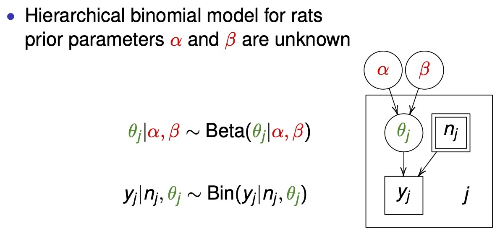
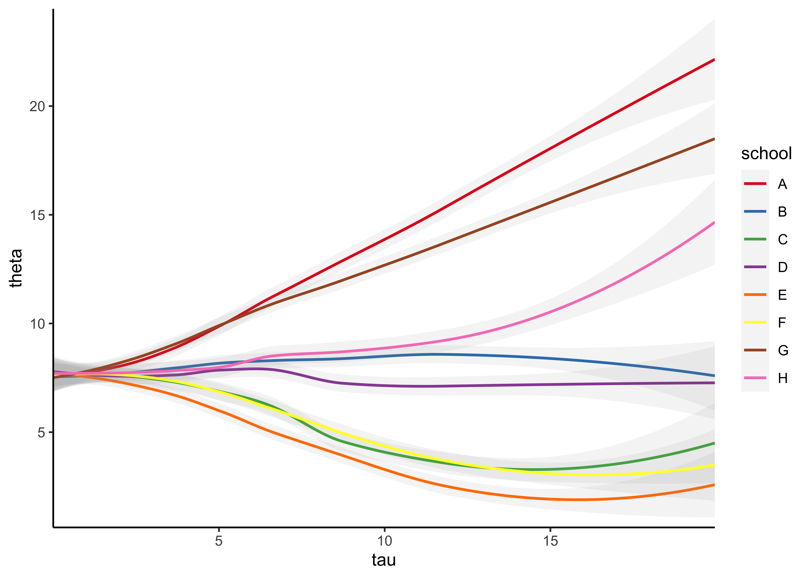

# Section 7. Hierarchical models and exchangeability

2021-10-12


## Resources

- BDA3 chapter 5 and [reading instructions](https://github.com/jhrcook/bayesian-data-analysis-course/tree/master/course-material/BDA3_ch05_reading-instructions.pdf)
- lectures:
  - ['7.1. Hierarchical models'](https://aalto.cloud.panopto.eu/Panopto/Pages/Viewer.aspx?id=79dee6de-afa9-446f-b533-aaf400cabf2b)
  - ['7.2. Exchangeability'](https://aalto.cloud.panopto.eu/Panopto/Pages/Viewer.aspx?id=c822561c-f95d-44fc-a1d0-aaf400d9fae3)
- [slides](https://github.com/jhrcook/bayesian-data-analysis-course/tree/master/course-material/slides_ch5.pdf)
- [Assignment 7](https://github.com/jhrcook/bayesian-data-analysis-course/tree/master/course-material/assignment-07.pdf)

## Notes

### Reading instructions

- "The hierarchical models in the chapter are simple to keep computation simple. More advanced computational tools are presented in Chapters 10-12 (part of the course) and 13 (not part of the course)."

#### Exchangeability vs. independence {-}

- exchangeability and independence are two separate concepts; neither necessarily implies the other
  - independent identically distributed variables/parameters are exchangeable
  - exchangeability is less strict condition than independence

#### Weakly informative priors for hierarchical variance parameters {-}

- suggestions have changed since writing section 5.7
  - section 5.7 recommends use of half-Cauchy as weakly informative prior for hierarchical variance parameters
  - now recommend a "half-normal if you have substantial information on the high end values, or or half-$t_4$ if you there might be possibility of surprise"
  - "half-normal produces usually more sensible prior predictive distributions and is thus better justified"
  - "half-normal leads also usually to easier inference"

### Chapter 5. Hierarchical models

- individual parameters for groups can be modeled as coming from a *population distribution*
  - model these relationships hierarchically
- hierarchical models can often have more parameters than data but avoid overfitting of traditional linear models
- sections
  - 5.2: how to construct a hierarchical prior distribution in the context of a fully Bayesian analysis
  - 5.7: weakly informative priors

#### 1. Constructing a parameterized prior distribution {-}

- have historical data to inform our model
  - can use it to construct a prior for our new data or use it as data to inform the posterior
  - probably should not use it for both though, thus favor using it directly in the model alongside our new data
- for each experiment $j$, with data $y_j$, estimate the parameter $\theta_j$
  - the parameters $\theta_j$ can come from a *population distribution* parameterized by $\text{Beta}(\alpha, \beta)$


#### 5.2 Exchangeability and hierarchical models {-}

- if no information (other than $y$) is available to distinguish any of the $\theta_j$'s, and no ordering (time) or grouping can be made, then we must assume symmetry among the parameters in the prior distribution
  - *this symmetry is represented probabilistically by exchangeability*: the parameters $(\theta_1, \dots, \theta_J)$ are *exchangeable* in the join distribution if $p(\theta_1, \dots, \theta_J)$ is invariant to permutations of the indices $(1, \dots, J)$
- "in practice, ignorance implies exchangeability" (pg. 104)
  - the less we know about a problem, the more confident we can claim exchangeability (i.e. we don't know any better)
- exchangeability is not the same as i.i.d:
  - probability of a die landing on each face: parameters $(\theta_1, \dots, \theta_6)$ are exchangeable because we think the faces are all the same, but they are not independent because the total must sum to 1
- exchangeability when additional information is available on the groups
  - if the observations can be grouped in their own submodels, but the group properties are unknown, can make a common prior distribution for the group properties
  - if $y_i$ has additional information $x_i$ so that $y_i$ are not exchangeable, but $(y_i, x_i)$ are exchangeable, we can make a join model for $(y_i, x_i)$ or a conditional model $y_i | x_i$
- the usual way to model exchangeability with covariates is through conditional independence

$$
p(\theta_1, \dots, \theta_J | x_1, \dots, x_J) = \int [\prod_{j=1}^J p(\theta_j | \phi, x_j)] p(\phi|x) d \phi
$$

- $phi$ is unknown, so it gets a prior distribution, too $p(\phi)$
  - the posterior distribution is of the vector $(\phi, \theta)$
  - thus the joint prior is: $p(\phi, \theta) = p(\phi) p(\theta|\phi)$
- joint posterior:

$$
\begin{aligned}
p(\phi, \theta | y) &\propto p(\phi, \theta) p(y|\phi, \theta) \\
 &= p(\phi, \theta) p(y|\theta)
\end{aligned}
$$

- posterior predictive distributions
  - get predictions on both levels

#### 5.3 Bayesian analysis of conjugate hierarchical models {-}

- analysis derivation of conditional and marginal distributions
  1. write the (unnormalized) joint posterior density $p(\theta, \phi | y)$ as a product of the hyperprior $p(\phi)$, the population distribution $p(\theta|\phi)$ and the likelihood $p(y|\theta)$
  2. determine the conditional posterior density of $\theta$ given $\phi$: $p(\theta | \phi, y)$
  3. estimate $\phi$ from its marginal posterior distribution $p(\phi|y)$
- drawing simulations from the posterior distribution
  1. draw $\phi$ from $p(\phi|y)$
  2. draw $\theta$ from its conditional posterior distribution $p(\theta | \phi, y)$ using the values of $\phi$ from the previous step
  3. draw predictive values $\tilde{y}$ given the values of $\theta$
- example on rat tumors is a good demonstration of the shrinkage of parameter estimates in a hierarchical model
  - the 1:1 line represents where the posteriors would be for a non-pooling model
  - can see the shrinkage of the extreme values towards the average
  - the effect is stronger for experiments with fewer rats


#### 5.4 Normal model with exchangeable parameters {-}

- drawing posterior predictive samples:
  1. for new data $\tilde{y}$ of existing groups $J$, use the posterior distributions for $(\theta_1, \dots, \theta_j)$
  2. for new data $\tilde{y}$ for $\tilde{J}$ new groups:
    1. draw values for the hyperparameters $\mu, \tau$ (in this case)
    2. draw $\tilde{J}$ new parameters $(\tilde{\theta}_1, \dots, \tilde{\theta}_\tilde{J})$ from $p(\tilde{\theta} | \mu, \tau)$
    3. draw $\tilde{y}$ given $\tilde{\theta}$

#### 5.5 Example: parallel experiments in eight schools {-}

- a full example of a Bayesian hierarchical modeling process and analysis

#### 5.6 Hierarchical modeling applied to a meta-analysis {-}

- another good example of analyzing the results of a Bayesian hierarchical model
  - notes the importance of interpreting both the mean and standard error hyperparameters to interpret the distribution of possible parameter values

#### 5.7 Weakly informative priors for variance parameters {-}

- "It turns out the the choice of 'noninformative' prior distribution can have a big effect on inferences," (pg. 128)
  - uniform prior distributions will often lead to overly-dispersed posteriors
    - this is especially true for the standard error term of a hyperparameter when there are few groups
  - half-Cauchy is often a good balance between restricting the prior to reasonable value but with fat enough tails to allow for uncertainty
    - particularly good for variance parameters of hierarchical models with few groups

### Lecture notes

#### ['7.1. Hierarchical models'](https://aalto.cloud.panopto.eu/Panopto/Pages/Viewer.aspx?id=79dee6de-afa9-446f-b533-aaf400cabf2b) {-}

- description of the diagram of a hierarchical model
  - box: known value
    - double box: indicates a fixed experimental value (e.g. decided how many rats to include in an experiment)
  - circle: unknown parameter
  - box with the subscript $j$: indicates that everything within the box is repeated $J$ times



- hierarchical model shrinkage effects with sample size
  - below example shows how shrinkage is stronger for data points with smaller sample size (county radon example)


- below, I replicate the 8-schools model in Stan and try to make the plot of $\theta$ over $\tau$


```r
library(rstan)
```

```
#> Loading required package: StanHeaders
```

```
#> Loading required package: ggplot2
```

```
#> rstan (Version 2.21.2, GitRev: 2e1f913d3ca3)
```

```
#> For execution on a local, multicore CPU with excess RAM we recommend calling
#> options(mc.cores = parallel::detectCores()).
#> To avoid recompilation of unchanged Stan programs, we recommend calling
#> rstan_options(auto_write = TRUE)
```

```r
library(tidybayes)
suppressPackageStartupMessages(library(tidyverse))

options(mc.cores = 2)
rstan_options(auto_write = TRUE)

schools_data <- list(
  J = 8,
  y = c(28, 8, -3, 7, -1, 1, 18, 12),
  sigma = c(15, 10, 16, 11, 9, 11, 10, 18)
)

eight_schools <- stan(
  file = here::here("models", "8-schools.stan"),
  data = schools_data,
  chains = 4,
  warmup = 1000,
  iter = 2000,
  cores = 2,
  refresh = 0
)

eight_schools
```

```
#> Inference for Stan model: 8-schools.
#> 4 chains, each with iter=2000; warmup=1000; thin=1; 
#> post-warmup draws per chain=1000, total post-warmup draws=4000.
#> 
#>            mean se_mean   sd   2.5%    25%    50%    75%  97.5% n_eff Rhat
#> mu         7.93    0.10 5.11  -2.36   4.67   7.87  11.05  18.19  2776    1
#> tau        6.51    0.13 5.48   0.18   2.45   5.28   9.10  20.66  1651    1
#> eta[1]     0.37    0.01 0.97  -1.62  -0.26   0.38   1.04   2.22  4447    1
#> eta[2]     0.01    0.01 0.86  -1.71  -0.54   0.00   0.56   1.73  5131    1
#> eta[3]    -0.20    0.01 0.91  -2.00  -0.80  -0.22   0.41   1.61  5300    1
#> eta[4]    -0.04    0.01 0.88  -1.80  -0.63  -0.05   0.55   1.70  4508    1
#> eta[5]    -0.33    0.01 0.86  -1.98  -0.91  -0.36   0.23   1.43  4005    1
#> eta[6]    -0.20    0.01 0.89  -1.95  -0.79  -0.21   0.37   1.63  4784    1
#> eta[7]     0.33    0.01 0.90  -1.49  -0.27   0.38   0.93   2.07  4682    1
#> eta[8]     0.05    0.01 0.92  -1.78  -0.54   0.06   0.66   1.87  5721    1
#>  [ reached getOption("max.print") -- omitted 9 rows ]
#> 
#> Samples were drawn using NUTS(diag_e) at Tue Feb  8 07:01:41 2022.
#> For each parameter, n_eff is a crude measure of effective sample size,
#> and Rhat is the potential scale reduction factor on split chains (at 
#> convergence, Rhat=1).
```


```r
theta_tau_post <- eight_schools %>%
  spread_draws(theta[school], tau) %>%
  mutate(school = purrr::map_chr(school, ~ LETTERS[[.x]]))

theta_tau_post %>%
  filter(tau < 20) %>%
  arrange(tau) %>%
  ggplot(aes(x = tau, y = theta, color = school)) +
  geom_smooth(
    method = "loess", formula = "y ~ x", n = 250, size = 0.8, alpha = 0.1
  ) +
  scale_x_continuous(expand = expansion(c(0, 0))) +
  scale_y_continuous(expand = expansion(c(0.02, 0.02))) +
  scale_color_brewer(type = "qual", palette = "Set1") +
  theme_classic()
```



#### ['7.2. Exchangeability'](https://aalto.cloud.panopto.eu/Panopto/Pages/Viewer.aspx?id=c822561c-f95d-44fc-a1d0-aaf400d9fae3) {-}

- **exchangeability**: parameters $\theta_1, \dots ,\theta_J$ (or observations $y_1, \dots , y_J$) are exchangeable if the joint distribution $p$ is invariant to the permutation of indices $(1, \dots, J)$
  - e.g.: $p(\theta_1, \theta_2, \theta_3) = p(\theta_2, \theta_3, \theta_1)$
- exchangeability implies symmetry
   - if there is no information which can be used a priori to separate $\theta_j$ form each other, we can assume exchangeability
   - ”Ignorance implies exchangeability”
