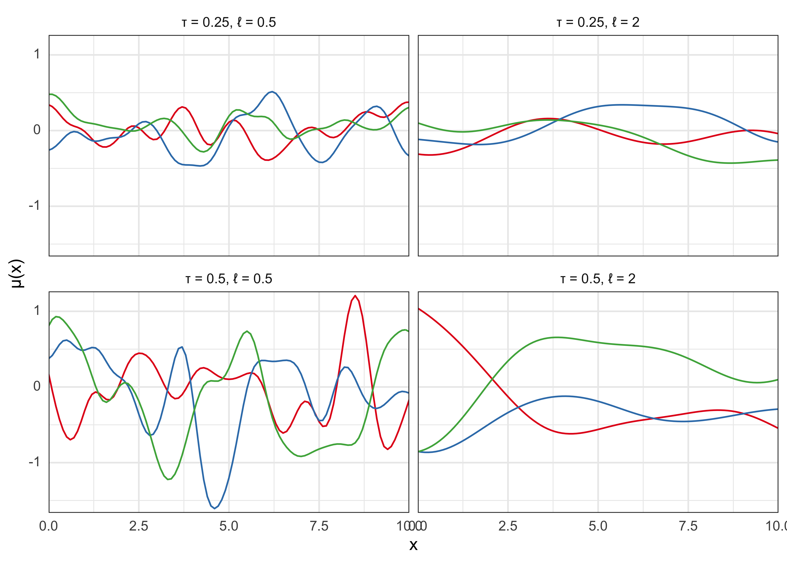

# Section 19. Notes on 'Ch 21. Gaussian process models'

2022-01-13


```r
knitr::opts_chunk$set(echo = TRUE, dpi = 300, comment = "#>")

library(glue)
library(ggtext)
library(tidyverse)

theme_set(
  theme_bw() +
    theme(axis.ticks = element_blank(), strip.background = element_blank())
)
```


> These are just notes on a single chapter of *BDA3* that were not part of the course.

## Chapter 21. Gaussian process models

- *Gaussian process* (GP): "flexible class of models for which any finite-dimensional marginal distribution is Gaussian" (pg. 501)
  - "can be viewed as a potentially infinite-dimensional generalization of Gaussian distribution" (pg. 501)

### 21.1 Gaussian process regression {-}

- realizations from a GP correspond to random functions
  - good prior for an unknown regression function $\mu(x)$
- $\mu \sim \text{GP}(m,k)$
  - $m$: mean function
  - $k$: covariance function
- $\mu$ is a random function ("stochastic process") where the values at any $n$ pooints $x_1, \dots, x_n$ are drawn from the $n-dimensional$ normal distribution
  - with mean $m$ and covariance $K$:

$$
\mu(x_1), \dots, \mu(x_n) \sim \text{N}((m(x_1), \dots, m(x_n)), K(x_1, \dots, x_n))
$$

- the GP $\mu \sim \text{GP}(m,k)$ is nonparametric with infinitely many parameters
  - the mean function $m$ represents an inital guess at the regression function
  - the covariance function $k$ represents the covariance between the process at any two points
    - controls the smoothness of realizations from the GP and degree of shrinkage towards the mean
- below is an example of realizations from a GP with mean function 0 and the *squared exponential* (a.k.a. exponentiated quadratic, Gaussian) covariance function with different parameters

$$
k(x, x^\prime) = \tau^2 \exp(-\frac{|x-x^\prime|^2}{2l^2})
$$


```r
squared_exponential_cov <- function(x, tau, l) {
  n <- length(x)
  k <- matrix(0, nrow = n, ncol = n)
  denom <- 2 * (l^2)
  for (i in 1:n) {
    for (j in 1:n) {
      a <- x[i]
      b <- x[j]
      k[i, j] <- tau^2 * exp(-(abs(a - b)^2) / (denom))
    }
  }
  return(k)
}

my_gaussian_process <- function(x, tau, l, n = 3) {
  m <- rep(0, length(x))
  k <- squared_exponential_cov(x = x, tau = tau, l = l)
  gp_samples <- mvtnorm::rmvnorm(n = n, mean = m, sigma = k)
  return(gp_samples)
}

tidy_gp <- function(x, tau, l, n = 3) {
  my_gaussian_process(x = x, tau = tau, l = l, n = n) %>%
    as.data.frame() %>%
    as_tibble() %>%
    set_names(x) %>%
    mutate(sample_idx = as.character(1:n())) %>%
    pivot_longer(-sample_idx, names_to = "x", values_to = "y") %>%
    mutate(x = as.numeric(x))
}

set.seed(0)
x <- seq(0, 10, by = 0.1)
gp_samples <- tibble(tau = c(0.25, 0.5, 0.25, 0.5), l = c(0.5, 0.5, 2, 2)) %>%
  mutate(samples = purrr::map2(tau, l, ~ tidy_gp(x = x, tau = .x, l = .y, n = 3))) %>%
  unnest(samples)

gp_samples %>%
  mutate(grp = glue("\u03C4 = {tau}, \u2113 = {l}")) %>%
  ggplot(aes(x = x, y = y)) +
  facet_wrap(vars(grp), nrow = 2) +
  geom_line(aes(color = sample_idx)) +
  scale_x_continuous(expand = expansion(c(0, 0))) +
  scale_y_continuous(expand = expansion(c(0.02, 0.02))) +
  scale_color_brewer(type = "qual", palette = "Set1") +
  theme(legend.position = "none", axis.text.y = element_markdown()) +
  labs(x = "x", y = "\u03BC(x)")
```



#### Covariance functions {-}

- "Different covariance functions can be used to add structural prior assumptions like smoothness, nonstationarity, periodicity, and multi-scale or hierarchical structures." (pg. 502)
  - sums and products of GPs are also GPs so can combine them in the same model
- can also use "anisotropic" GPs covariance functions for multiple predictors

#### Inference {-}

- computing the mean and covariance in the $n$-variate normal conditional posterior for $\tilde{\mu}$ involves a matrix inversion that requires $O(n^3)$ computation
  - this needs to be repeated for each MCMC step
  - limits the size of the data set and number of covariates in a model

#### Covariance function approximations {-}

- there are approximations to the GP that can speed up computation
  - generally work by reducing the matrix inversion burden

### 21.3 Latent Gaussian process models {-}

- with non-Gaussian likelihoods, the GP prior becomes a latent function $f$ which determines the likelihood $p(y|f,\phi)$ through a link function

### 21.4 Functional data analysis {-}

- *functional data analysis*: considers responses and predictors not a scalar/vector-valued random variables but as random functions with infinitely-many points
  - GPs fit this need well with little modification

### 21.5 Density estimation and regression {-}

- can get more flexibility by modeling the conditional observation model as a nonparametric GP
  - so far have used a GP as a prior for a function controlling location or shape of a parametric observation model
  - one solution is the *logistic Gaussian process* (LGP) or a Dirichlet process (covered in a later chapter)

#### Density estimation {-}

- LGP generates a random surface from a GP and then transforms the surface to the space of probability densities
  - with 1D, the surface is just a curve
  - use the continuous logistic transformation to constrain to non-negative and integrate to 1
- there is illustrative example in the book on page 513

#### Density regression {-}

- generalize the LPG to density regression by putting a prior on the collection of conditional densities

#### Latent-variable regression {-}

- an alternative to LPG

---


```r
sessionInfo()
```

```
#> R version 4.1.2 (2021-11-01)
#> Platform: x86_64-apple-darwin17.0 (64-bit)
#> Running under: macOS Big Sur 10.16
#> 
#> Matrix products: default
#> BLAS:   /Library/Frameworks/R.framework/Versions/4.1/Resources/lib/libRblas.0.dylib
#> LAPACK: /Library/Frameworks/R.framework/Versions/4.1/Resources/lib/libRlapack.dylib
#> 
#> locale:
#> [1] en_US.UTF-8/en_US.UTF-8/en_US.UTF-8/C/en_US.UTF-8/en_US.UTF-8
#> 
#> attached base packages:
#> [1] stats     graphics  grDevices datasets  utils     methods   base     
#> 
#> other attached packages:
#>  [1] forcats_0.5.1   stringr_1.4.0   dplyr_1.0.7     purrr_0.3.4    
#>  [5] readr_2.0.1     tidyr_1.1.3     tibble_3.1.3    ggplot2_3.3.5  
#>  [9] tidyverse_1.3.1 ggtext_0.1.1    glue_1.4.2     
#> 
#> loaded via a namespace (and not attached):
#>  [1] Rcpp_1.0.7         lubridate_1.7.10   mvtnorm_1.1-2      clisymbols_1.2.0  
#>  [5] assertthat_0.2.1   digest_0.6.27      utf8_1.2.2         R6_2.5.0          
#>  [9] cellranger_1.1.0   backports_1.2.1    reprex_2.0.1       evaluate_0.14     
#> [13] highr_0.9          httr_1.4.2         pillar_1.6.2       rlang_0.4.11      
#> [17] readxl_1.3.1       rstudioapi_0.13    jquerylib_0.1.4    rmarkdown_2.10    
#> [21] labeling_0.4.2     munsell_0.5.0      gridtext_0.1.4     broom_0.7.9       
#> [25] compiler_4.1.2     modelr_0.1.8       xfun_0.25          pkgconfig_2.0.3   
#> [29] htmltools_0.5.1.1  tidyselect_1.1.1   bookdown_0.24      fansi_0.5.0       
#> [33] crayon_1.4.1       tzdb_0.1.2         dbplyr_2.1.1       withr_2.4.2       
#> [37] grid_4.1.2         jsonlite_1.7.2     gtable_0.3.0       lifecycle_1.0.0   
#> [41] DBI_1.1.1          magrittr_2.0.1     scales_1.1.1       cli_3.0.1         
#> [45] stringi_1.7.3      farver_2.1.0       renv_0.14.0        fs_1.5.0          
#> [49] xml2_1.3.2         bslib_0.2.5.1      ellipsis_0.3.2     generics_0.1.0    
#> [53] vctrs_0.3.8        RColorBrewer_1.1-2 tools_4.1.2        markdown_1.1      
#> [57] hms_1.1.0          yaml_2.2.1         colorspace_2.0-2   rvest_1.0.1       
#> [61] knitr_1.33         haven_2.4.3        sass_0.4.0
```
