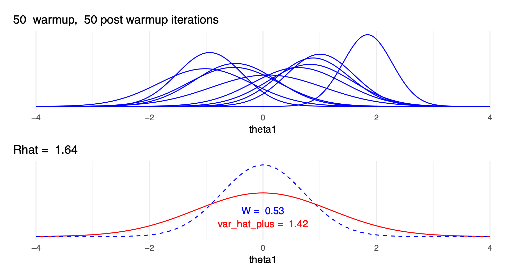
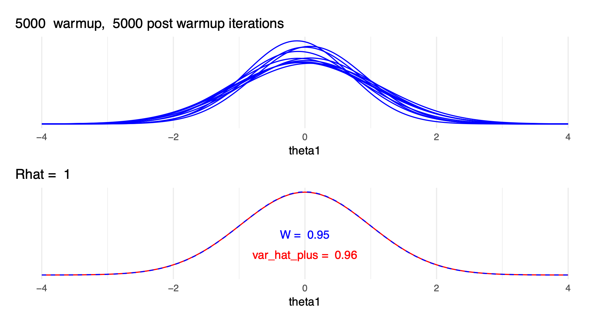
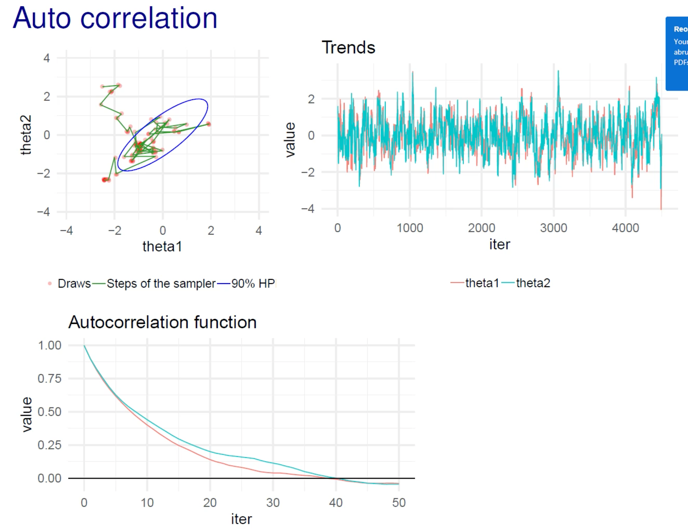

# Section 5. Markov chain Monte Carlo

2021-09-26

```{r setup, warning=FALSE, message=FALSE}
knitr::opts_chunk$set(echo = TRUE, dpi = 300, comment = "#>")

library(glue)
library(ggtext)
library(patchwork)
library(tidyverse)

theme_set(theme_bw())
```

## Resources

- BDA3 chapter 11 and [reading instructions](`r paste0(CM_URL, "BDA3_ch11_reading-instructions.pdf")`)
- lectures:
  - ['5.1. Markov chain Monte Carlo, Gibbs sampling, Metropolis algorithm'](https://aalto.cloud.panopto.eu/Panopto/Pages/Viewer.aspx?id=098dfdb4-f3b8-46aa-b988-aadf00bd3177)
  - ['5.2. Warm-up, convergence diagnostics, R-hat, and effective sample size'](https://aalto.cloud.panopto.eu/Panopto/Pages/Viewer.aspx?id=9f657178-d8cf-4cb8-af62-aadf00cd9423)
- [slides](`r paste0(CM_URL, "slides_ch11.pdf")`)
- [Assignment 5](`r paste0(CM_URL, "assignment-05.pdf")`)

## Notes

### Reading instructions

- Outline of the chapter 11
  - Markov chain simulation: before section 11.1, pages 275-276
  - 11.1 Gibbs sampler (an example of simple MCMC method)
  - 11.2 Metropolis and Metropolis-Hastings (an example of simple MCMC method)
  - 11.3 Using Gibbs and Metropolis as building blocks (can be skipped)
  - 11.4 Inference and assessing convergence (important)
  - 11.5 Effective number of simulation draws (important)
  - 11.6 Example: hierarchical normal model (skip this)
- Animations
  - Nice animations with discussion: (Markov Chains: Why Walk When You Can Flow?)[http://elevanth.org/blog/2017/11/28/build-a-better-markov-chain/]
  - And just the animations with more options to experiment: (The Markov-chain Monte Carlo Interactive Gallery)[https://chi-feng.github.io/mcmc-demo/]
- Convergence
  - theoretical convergence in an infinite time is different than practical convergence in a finite time
  - no exact moment when chain has converged
    - convergence diagnostics can help to find out if the chain is unlikely to be representative of the target distribution
- $\widehat{R}$ effective sample size (ESS, previously $n_\text{eff}$)
  - there are many versions of $\widehat{R}$ and effective sample size
    - some software packages compute these using old inferior approaches
    - updated version in [*Rank-normalization, folding, and localization: An improved $\widehat{R} for assessing convergence of MCMC*](https://projecteuclid.org/euclid.ba/1593828229)

### Chapter 11. Basics of Markov chain simulation

#### Introduction {-}

- **MCMC**: general method based on drawing values of $\theta$ from approximate distributions and then correcting those draws to better approximate the target posterior distribution $p(\theta, y)$
  - **Markov chain**: a sequence of random variables $\theta^1, \theta^2, \dots$ for which, for any $t$, the distribution of $\theta^t$ given all previous $\theta$'s depends only on the previous value $\theta^{t-1}$
- general process:
  1. create several independent sequences
  2. each sequence $\theta^1, \theta^2, \dots$ starts from some point $\theta^0$
  3. for each $t$, draws $\theta^t$ from the *transition distribution $T_t (\theta^t | \theta^{t-1})$
- essential to check convergence of chains
- this chapter introduces the *Gibbs sampler* and *Metropolis-Hastings algorithm*

#### 11.1 Gibbs sampler {-}

- algorithm:
  1. separate the parameter vector $\theta$ into $d$ components (also called subvectors) $\theta = (\theta_1, \dots, \theta_d)$
  2. for each iteration $t$, each component is cycled through (thus, there are $d$ steps for each iteration)
  3. for each iteration $t$, for each $j$ component of $\theta$, each $\theta_j^t$ is sampled from the conditional distribution given all the other current values of $\theta$: $p(\theta_j | \theta_{-j}^{t-1})$
    - where $\theta_{-j}^{t-1} = (\theta_1^t, \dots, \theta_{j-1}^t, \theta_{j+1}^{t-1}, \dots, \theta_d^{t-1})$
    - is just all of the current values of $\theta$ where some have yet to be update in iteration $t$
- ex: bivariate normal distribution
  - a bivariate normally distribution population with mean $\theta = (\theta_1, \theta_2)$ (so $d = 2$ for this example) and covariance matrix $\begin{pmatrix} 1 & \rho \\ \rho  & 1 \\ \end{pmatrix}$
  - given single observation $(y_1, y_2)$
  - uniform prior on $\theta$
  - posterior distribution defined in \@ref(eq:gibbs-posterior)
  - need conditional posterior distribution for each $\theta_j$ on the other components of $\theta$
    - here, use equations A.1 from appendix A (pg. 582): \@ref(eq:gibbs-conditional-posterior)
  - Gibbs sampler just alternatively samples from these two conditional distributions

\begin{equation}
  \begin{pmatrix}
    \theta_1 \\ \theta_2 \end{pmatrix} | y
    \sim \text{N}
    \begin{pmatrix}
    \begin{pmatrix} y_1 \\ y_2 \end{pmatrix},
    \begin{pmatrix} 1 & \rho \\ \rho  & 1 \\ \end{pmatrix}
  \end{pmatrix}
  (\#eq:gibbs-posterior)
\end{equation}

\begin{align}
  \begin{split}
  \theta_1 | \theta_2, y &\sim \text{N}(y_1 + \rho (\theta_2 - y_2), 1 - \rho^2) \\
  \theta_2 | \theta_1, y &\sim \text{N}(y_2 + \rho (\theta_1 - y_1), 1 - \rho^2)
  \end{split}
  (\#eq:gibbs-conditional-posterior)
\end{align}

- below is the code for the example described above

```{r}
chain_to_df <- function(chain, names) {
  purrr::map_dfr(chain, ~ as.data.frame(t(.x))) %>%
    tibble::as_tibble() %>%
    purrr::set_names(names)
}

# Run a single chain of a Gibbs sampler for a bivariate normal distribution.
gibbs_sample_demo <- function(data, rho, theta_t0, N = 100) {
  theta_1 <- theta_t0[[1]]
  theta_2 <- theta_t0[[2]]
  y1 <- data[[1]]
  y2 <- data[[2]]

  chain <- as.list(rep(theta_t0, n = (2 * N) + 1))
  chain[[1]] <- c(theta_1, theta_2, 1)

  for (t in seq(2, N)) {
    theta_1 <- rnorm(1, y1 + rho * (theta_2 - y2), 1 - rho^2)
    chain[[2 * (t - 1)]] <- c(theta_1, theta_2, t)
    theta_2 <- rnorm(1, y2 + rho * (theta_1 - y1), 1 - rho^2)
    chain[[2 * (t - 1) + 1]] <- c(theta_1, theta_2, t)
  }

  chain_df <- chain_to_df(chain, names = c("theta_1", "theta_2", "t"))
  return(chain_df)
}


rho <- 0.8
y <- c(0, 0)
starting_points <- list(
  c(-2.5, -2.5), c(2.5, -2.5), c(-2.5, 2.5), c(2.5, 2.5)
)

set.seed(0)
gibbs_demo_chains <- purrr::map_dfr(
  seq(1, 4),
  ~ gibbs_sample_demo(y, rho, starting_points[[.x]]) %>%
    add_column(chain = as.character(.x))
)

plot_chains <- function(chain_df, x = theta_1, y = theta_2, color = chain) {
  chain_df %>%
    ggplot(aes(x = {{ x }}, y = {{ y }}, color = {{ color }})) +
    geom_path(alpha = 0.6, show.legend = FALSE) +
    scale_color_brewer(type = "qual", palette = "Set1")
}

plot_points <- function(chain_df, x = theta_1, y = theta_2, color = chain) {
  chain_df %>%
    ggplot(aes(x = {{ x }}, y = {{ y }}, color = {{ color }})) +
    geom_point(size = 0.75, alpha = 0.75) +
    scale_color_brewer(type = "qual", palette = "Set1")
}

theta_axis_labs <- function(p) {
  p +
    theme(
      axis.title.x = element_markdown(),
      axis.title.y = element_markdown()
    ) +
    labs(x = "θ<sub>1</sub>", y = "θ<sub>2</sub>")
}

gibbs_plot_chains <- plot_chains(gibbs_demo_chains) %>%
  theta_axis_labs()

gibbs_plot_points <- gibbs_demo_chains %>%
  group_by(chain, t) %>%
  slice_tail(n = 1) %>%
  ungroup() %>%
  plot_points() %>%
  theta_axis_labs()

(gibbs_plot_chains | gibbs_plot_points) + plot_annotation(title = "Gibbs sampler")
```

#### 11.2 Metropolis and Metropolis-Hastings algorithms {-}

- the Metropolis-Hastings algorithm is a generalized version of the Metropolis algorithm

##### The Metropolis algorithm {-}

- is a random walk with an acceptance and rejection rule to converge to the target distribution
- steps:
  1. draws a starting point $\theta^0$ from a *starting distribution* $p_0(\theta)$ such that $p(\theta^0|y) > 0$
  2. for time $t = 1, 2, \dots$:
    a. sample a *proposal* $\theta^*$ from a *jumping/proposal distribution* $J_t(\theta^*|\theta^{t-1})$
    b. calculate the ratio of the densities: $r = \frac{p(\theta^*|y)}{p(\theta^{t-1}|y)}$
    c. set $\theta^t = \theta^*$ with probability $\min(r, 1)$, else $\theta^t = \theta^{t-1}$
      - if the proposal is more likely, it is always accepted, otherwise the ratio $r$ is used as the probability of acceptance
- the jumping distribution $J_t$ must be symmetric such that $J_t(\theta_a|\theta_b) = J_t(\theta_b|\theta_a)$
- the iteration still counts even if the proposal $\theta^*$ is rejected
- ex: bivariate normal distribution (same as before):
  - target density as bivariate normal: $p(\theta|y) = \text{N}(\theta | 0, I)$
  - jumping distribution as a bivariate normal with smaller deviations and centered around the previous iteration's $\theta^{t-1}$: $J_t(\theta^*|\theta^{t-1}) = \text{N}(\theta^* | \theta^{t-1}, 0.2^2I)$
  - thus, the density ratio: $r = \text{N}(\theta^*|0, I) / \text{N}(\theta^{t-1}|0, I)$

```{r, message=TRUE}
calc_metropolis_density_ratio <- function(t_star, t_m1, data, prior_cov_mat) {
  numerator <- mvtnorm::dmvnorm(t_star, data, prior_cov_mat)
  denominator <- mvtnorm::dmvnorm(t_m1, data, prior_cov_mat)
  return(numerator / denominator)
}

metropolis_algorithm_demo <- function(data, theta_t0, N = 1000, quiet = FALSE) {
  theta_t <- unlist(theta_t0)
  prior_dist_mu <- data
  prior_dist_cov_mat <- matrix(c(1, 0, 0, 1), nrow = 2)
  jumping_dist_cov_mat <- prior_dist_cov_mat * 0.2^2

  chain <- as.list(rep(NA_real_, n = N + 1))
  chain[[1]] <- theta_t

  n_accepts <- 0

  for (t in seq(2, N + 1)) {
    theta_star <- mvtnorm::rmvnorm(
      n = 1, mean = theta_t, sigma = jumping_dist_cov_mat
    )[1, ]

    density_ratio <- calc_metropolis_density_ratio(
      t_star = theta_star,
      t_m1 = theta_t,
      data = data,
      prior_cov_mat = prior_dist_cov_mat
    )

    accept <- runif(1) < min(c(1, density_ratio))
    if (accept) {
      theta_t <- theta_star
      n_accepts <- n_accepts + 1
    }
    chain[[t]] <- theta_t
  }
  if (!quiet) {
    frac_accepts <- n_accepts / N
    message(glue("fraction of accepted jumps: {frac_accepts}"))
  }
  return(chain_to_df(chain, names = c("theta_1", "theta_2")))
}

set.seed(0)
metropolis_chains <- purrr::map_dfr(
  seq(1, 4),
  ~ metropolis_algorithm_demo(c(0, 0), starting_points[[.x]]) %>%
    add_column(chain = as.character(.x))
)

metropolis_plot_chains <- plot_chains(metropolis_chains) %>%
  theta_axis_labs()
metropolis_plot_points <- metropolis_chains %>%
  group_by(chain) %>%
  slice_tail(n = 500) %>%
  plot_points() %>%
  theta_axis_labs()

(metropolis_plot_chains | metropolis_plot_points) + plot_annotation(title = "Metropolis algorithm")
```

##### The Metropolis-Hastings algorithm {-}

- two changes to generalize the Metropolis algorithm:
  1. the jumping rule $J_t$ need not be symmetric
    - generally results in a faster random walk
  2. a new ratio $r$ \@ref(eq:mh-ratio)
    - can interpret at a re-weighting of the numerator and denominator by the probability of accepting or rejecting $\theta^*$

\begin{equation}
  r = \frac{p(\theta^* | y) / J_t(\theta^* | \theta^{t-1})}{p(\theta^{t-1} | y) / J_t(\theta^{t-1} | \theta^*)}
  (\#eq:mh-ratio)
\end{equation}

- properties of a good jumping rule:
  1. easy to sample $J(\theta^*|\theta)$ for any $\theta$
  2. easy to compute the ratio $r$
  3. each jump travels a "reasonable" distance
  4. the jumpy are not rejected too frequently

#### 11.2 Metropolis and Metropolis-Hastings algorithms {-}

- for Bayesian analysis, we want to be able to use the posterior samples for inference, but requires special care when using iterative simulation

##### Difficulties of inference from iterative simulation {-}

- two main challenges:
  1. "if the iterations have not proceeded long enough... the simulations may be grossly unrepresentative of the target distribution" (pg 282)
  2. correlation between draws: "simulation inference from correlated draws is generally less precise than from the same number of independent draws" (pg 282)
- to address these issues:
  - design the simulations to enable monitoring of convergence
  - compare variation between and within chains

##### Discarding early iterations of the simulation runs {-}

- *warm-up*: remove first portion of draws to diminish the influence on the starting location
  - how many to drop depends on the specific case, but dropping the first half of the chain is usually good

##### Dependence of the iterations in each sequence {-}

- *thinning* a chain: keeping every $k$th simulation draw
  - not necessary if the chains have converged
  - can help with preserving RAM if many parameters

##### Multiple sequences with overdispersed starting points {-}

- use multiple chains to be able to compare with each other
  - *mixing* and *stationarity* discussed below

##### Monitoring scalar estimands {-}

- check estimated parameter values and any other computed values of interest to see if their posterior distributions settle

##### Challenges of monitoring convergence: missing and stationarity {-}

- *mixing*: when the chains converge to the same distribution
- *stationarity*: when each chains has converged to a consistent distribution of values

##### Splitting each saved sequence into two parts {-}

- a method for checking convergence and stationarity of multiple chains:
  - (after adjusting for warm-up) split each chain in half and check if all of the halves have mixed
  - checks mixing: if all of the chains have mixed, the separate parts of the different chains should also have mixed
  - checks stationarity: the first and second half of each sequence should be traversing the same distribution

##### Assessing mising using between- and within-sequence variances {-}

- calculations for mixing of the split chains:
  - $m$: number of chains after splitting; $n$: length of each split chain
  - $\psi$: each labeled estimand (parameter or calculated value of interest)
    - label the simulations as $\psi_{ij}$ where $(i=1, \dots, n; j=1, \dots, m)$
  - between-sequence variance $B$ \@ref(eq:Bvar) and within-sequence variance $W$ \@ref(eq:Wvar)
  - estimate $\text{var}(\psi|y)$ as a weighted average of $B$ and $W$ \@ref(eq:seq-var)
    - is actually an overestimate
  - use $\widehat{\text{var}}^+(\psi|y)$ to calculate a factor by which the scale of the current distribution for $\psi$ might be reduced if the simulations were continued $\widehat{R}$
    - the calculation for $\widehat{R}$ has been updated since publishing *BDA3*
    - if $\widehat{R}$ is above 1, indicates that letting the chains run longer would improve inference
  - using these calculations of variance is more reliable than visually checking for mixing, convergence, and stationarity using trace-plots
     - is also more practical when there are many parameters (such as is common for hierarchical distributions)

\begin{equation}
  B = \frac{n}{m-1} \sum_j^m (\bar{\psi}_{.j} - \bar{\psi}_{..})^2 \\
  \quad \text{where} \quad
    \bar{\psi}_{.j} = \frac{1}{n} \sum _i^n \psi_{ij}
    \quad \text{and} \quad
    \bar{\psi}_{..} = \frac{1}{m} \sum_j^m \bar{\psi}_{.j}
  (\#eq:Bvar)
\end{equation}

\begin{equation}
  W = \frac{1}{m} \sum_j^m s_j^2
    \quad \text{where} \quad
    s_j^2 = \frac{1}{n-1} \sum_i^n (\psi_ij - \bar{\psi}_{.j})^2
  (\#eq:Wvar)
\end{equation}

\begin{equation}
  \widehat{\text{var}}^+(\psi|y) = \frac{n-1}{n}W + \frac{1}{n}B
  (\#eq:seq-var)
\end{equation}

#### 11.5 Effective number of simulation draws {-}

- compute an approximate "effective number of independent simulation draws" $n_\text{eff}$
  - if all draws were truly independent, then $B \approx \text{var}(\psi|y)$
  - but usually draws of $\psi$ are autocorrelated and $B$ will be larger than $\text{var}(\psi|y)$
- with non-normal posterior samples, may need to first transform the draws before calculating $n_\text{eff}$ and $\widehat{R}$
- recommendation is to sample until $\widehat{R} \le 1.1$ and $n_\text{eff} \ge 5m$ where $m$ is the number of split chains (i.e. $\text{number of chains} \times 2$) (pg. 287)

### Lecture notes

#### 5.1. Markov chain Monte Carlo, Gibbs sampling, Metropolis algorithm {-}

- Gibbs sampler
  - with conditionally conjugate priors, the sampling from the conditional distributions is easy for wide range of models
    - software: BUGS, WinBUGS, OpenBUGS, JAGS
  - benefit: no algorithm parameters to tune
  - slow if parameters are highly dependent in the posterior
    - the high correlation create a narrow region in which the sampler moves, slowing exploration of the posterior

#### 5.2. Warm-up, convergence diagnostics, R-hat, and effective sample size {-}

- $\widehat{R}$ with only a few draws and with many draws:




- update $\widehat{R}$ is *rank normalized $\widehat{R}$*
  - original $\widehat{R}$ requires that the target distribution has finite mean and variance
  - rank normalized removes this requirement
  - improved detection of different scales between chains
  - the paper also proposes local convergence diagnostics and practical MCSE estimates for quantiles
- autocorrelation in the chains (think of as a time series analysis)
  - describes the correlation given a certain lag
    - how many steps does it take for the chain to forget a previous step
  - can be used to compare efficiency of MCMC algorithms and parameterizations
  - in the example below, the autocorrelation plot shows that it takes about 40 steps to reach a correlation of 0
    - the x-axis should be "lag"


- calculating autocorrelation function
  - $\hat{\rho}_{n,m}$ is the autocorrelation at lag $n$ for chain $m$ of $M$ chains
  - can see the use of $W$ and $\widehat{\text{var}}^+$ from the calculation of $\widehat{R}$ so that is accounts for how well the chains mix

$$
\hat{\rho}_n = 1 - \frac{W - \frac{1}{M} \sum_m^M \hat{\rho}_{n,m}}{2 \widehat{\text{var}}^+}
$$

---

```{r}
sessionInfo()
```
