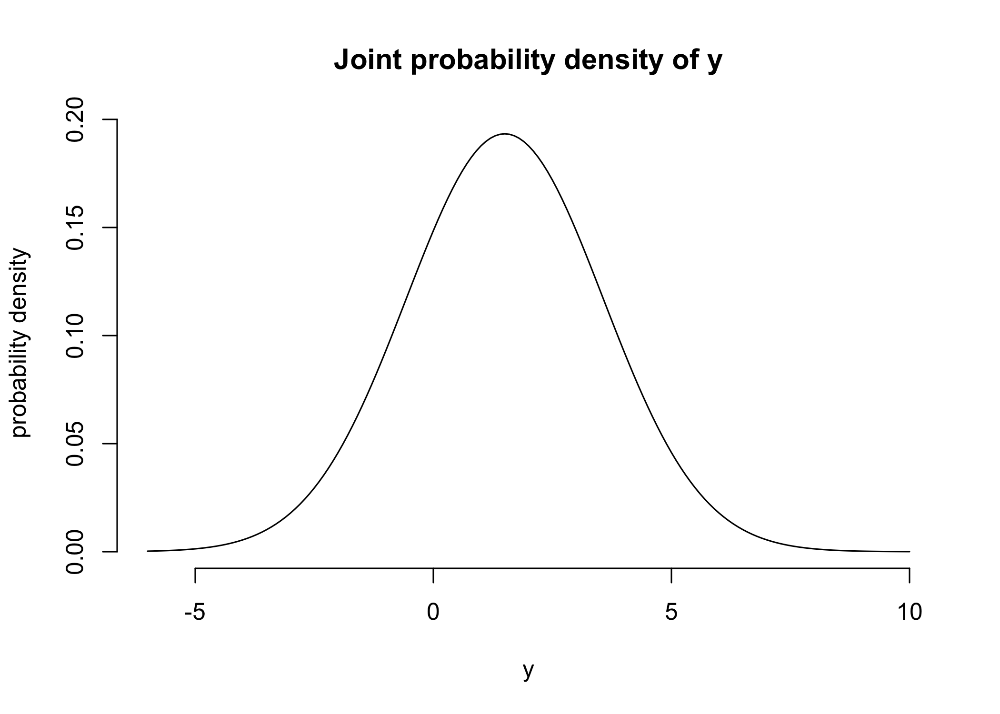

001. Course introduction and prerequisites
================

## Resources

-   BDA Chapter 1 and [chapter
    instructions](../reading-instructions/BDA-notes-ch1.pdf)
-   video: [‘Computational probabilistic
    modeling’](https://www.youtube.com/watch?v=ukE5aqdoLZI)
-   video[‘Introduction to uncertainty and
    modelling’](https://aalto.cloud.panopto.eu/Panopto/Pages/Viewer.aspx?id=d841f429-9c3d-4d24-8228-a9f400efda7b)
-   video: [‘Introduction to the course
    contents’](https://aalto.cloud.panopto.eu/Panopto/Pages/Viewer.aspx?id=13fc7889-cfd1-4d99-996c-a9f400f6e5a2)
-   [slides](../slides/bayes_intro.pdf)
-   Assignment 1 (to-do)

## Notes

### Chapter instructions

-   model vs. likelihood for *p*(*y*\|*θ*,*M*)
    -   *model* when the function is in terms of *y*
        -   should be written as *p*<sub>*y*</sub>(*y*\|*θ*,*M*) used to
            describe uncertainty about *y* given values of *θ* and *M*
    -   *likelihood* when in the function is in terms of *θ*
        -   should be written as *p*<sub>*θ*</sub>(*y*\|*θ*,*M*)
        -   the posterior distribution describes the probability for
            different values of *θ* given fixed values for *y*
        -   “The likelihood function is unnormalized probability
            distribution describing uncertainty related to *θ* (and
            that’s why Bayes rule has the normalization term to get the
            posterior distribution).”
-   *exchangeability*
    1.  independence is stronger condition than exchangeability
    2.  independence implies exchangeability
    3.  exchangeability does not imply independence
    4.  exchangeability is related to what information is available
        instead of the properties of unknown underlying data generating
        mechanism

### Introduction to uncertainty and modelling

-   two types of uncertainty:
    -   *aleatoric*: due to randomness
    -   *epistemic*: due to lack of knowledge
-   model vs. likelihood:
    -   model
        -   *p*<sub>*y*</sub>(*y*\|*θ*,*M*)
        -   a function of *y* given fixed values of *θ*
        -   describes *aleatoric* uncertainty
    -   likelihood
        -   *p*<sub>*θ*</sub>(*y*\|*θ*,*M*)
        -   function of *θ* given fixed values of *y*
        -   provides information about the *epistemic* uncertainty
        -   is *not* a probability distribution
    -   Bayes rule combines the likelihood with prior uncertainty to
        update the posterior uncertainty
    -   example with a bag containing red and yellow chips:
        -   probability of red = #red / #red + #yellow = *θ*
        -   *p*(*y*=red\|*θ*): aleatoric uncertainty
            -   predicting the probability of pulling a red chip has
                uncertainty due to randomness even if we new *θ* exactly
        -   *p*(*θ*): epistemic uncertainty
            -   we don’t know *θ* but could compute it exactly if we
                knew the contents of the bag

### Introduction to the course contents

-   benefits of Bayesian approach
    1.  integrate over uncertainties to focus on interesting parts
    2.  use relevant prior information
    3.  hierarchical models
    4.  model checking and evaluation

---

## BDA Exercises

Questions 1-4 and 6-8

**Question 1**: When *θ* = 1, then *y* = *N*(*μ*=1,*σ*) and when
*θ* = 2, then *y* = *N*(*μ*=2,*σ*). Pr (*θ*=1) = Pr (*θ*=2) = 0.5.

1.  If *σ* = 2 what is the marginal probability density for *y*?

$$
\\begin{aligned}
&= \\sigma\_{\\theta=1}^{\\Theta} \\Pr(\\theta) N(y \| \\mu\_\\theta, \\sigma) \\\\
&= \\frac{1}{2} N(y\|1,2) + \\frac{1}{2} N(y\|2,2)
\\end{aligned}
$$

``` r
y <- seq(-6, 10, 0.1)
d <- 0.5 * dnorm(y, 1, 2) + 0.5 * dnorm(y, 2, 2)
plot(y, d, type="l", frame=FALSE, xlab="y", ylab="probability density", main = "Joint probability density of y")
```

<!-- -->

2.  What is Pr (*θ*=1\|*y*=1) with *σ* = 2.

Solve using Baye’s rule:

$$
\\begin{aligned}
\\Pr(\\theta \| y) &= \\frac{\\Pr(\\theta) \\Pr(y \| \\theta)}{\\Pr(y)} \\\\
\\Pr(\\theta=1 \| y=1) &= \\frac{\\Pr(\\theta=1) \\Pr(y=1 \| \\theta=1)}{\\Pr(y=1)} \\\\
\\end{aligned}
$$

where

$$
\\Pr(\\theta = 1) = 0.5 \\\\
\\Pr(y=1 \| \\theta=1) = N(y=1\|1,2) \\\\
\\Pr(y=1) = \\frac{1}{2} N(y=1\|1,2) + \\frac{1}{2} N(y=1\|2,2)
$$

thus

$$
\\begin{aligned}
\\Pr(\\theta=1 \| y=1) &= \\frac{\\Pr(\\theta=1) \\Pr(y=1 \| \\theta=1)}{\\Pr(y=1)} \\\\
&= \\frac{\\frac{1}{2} N(y=1\|1,2)}{\\frac{1}{2} N(y=1\|1,2) + \\frac{1}{2} N(y=1\|2,2)} \\\\
\\end{aligned}
$$

``` r
(0.5 * dnorm(1, 1, 2)) / (0.5 * dnorm(1, 1, 2) + 0.5 * dnorm(1, 2, 2))
```

    #> [1] 0.5312094

3.  Describe the posterior density of *θ* as *σ* increases or decreases.

As *σ* → ∞, the probabilities Pr (*y*\|*θ*) and Pr (*y*) become
increasingly wide, resulting in the prior probability Pr (*θ*) consuming
the equation resulting in $\\Pr(\\theta=1\|y=1) = \\frac{1}{2}$. This
situation would be analogous to having no data.

As *σ* → 0, the opposite occurs and the prior is overwhelmed by the
probability Pr (*y*=1\|*θ*=1). Thus Pr (*θ*=1\|*y*=1) = 1; complete
certainty in the value of *θ*. This situation would be analogous to
collecting a lot of highly homogeneous data.

**Question 2**: Conditional means and variances: show that equations 1.8
and 1.9 hold if *u* is a vector.

Equation 1.8: E(*u*) = E(E(*u*\|*v*))

For a vector *u*, Equation 1.8 would be computed componentwise:
E(*u*<sub>*i*</sub>) = E(E(*u*<sub>*i*</sub>\|*v*)).

Equation 1.9: var(*u*) = E(var(*u*\|*v*)) + var(E(*u*\|*v*))

For a vecotr *u*, the diagnoals for Euqation 1.9 would be computed
componentwise:
var(*u*<sub>*i*</sub>) = E(var(*u*<sub>*i*</sub>\|*v*)) + var(E(*u*<sub>*i*</sub>\|*v*)).
For off-diagonals, the result is the covariance between the indeices of
*u*: cov(*u*<sub>*i*</sub>,*u*<sub>*j*</sub>).

**Question 3**:
