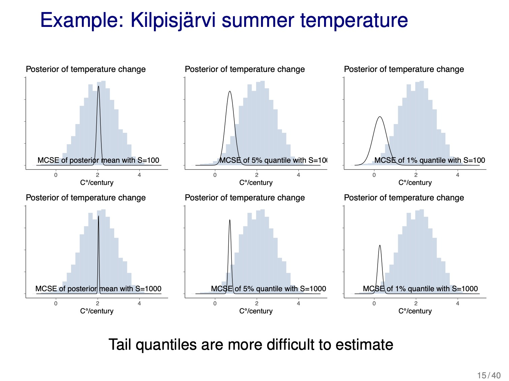
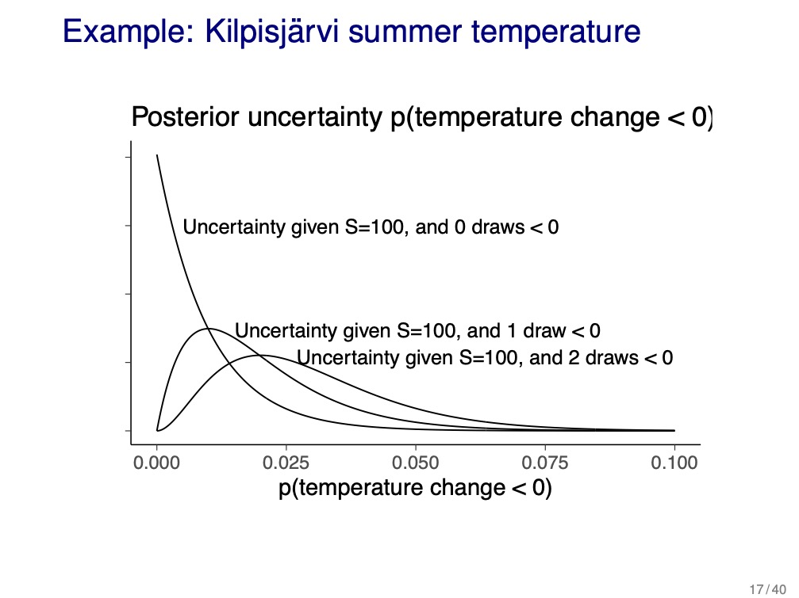

```{r setup, include=FALSE}
knitr::opts_chunk$set(echo = TRUE, dpi = 300, comment = "#>")
```

## Resources

- BDA3 chapter 10 and [reading instructions](../reading-instructions/BDA3_ch10_reading-instructions.pdf)
- lectures:
  - ['Numerical issues, Monte Carlo, how many simulation draws are needed, how many digits to report'](https://aalto.cloud.panopto.eu/Panopto/Pages/Viewer.aspx?id=8a3c7bbc-e2b8-4c16-97b2-aad800ba7927)
  - ['Direct simulation, curse of dimensionality, rejection sampling, and importance sampling'](https://aalto.cloud.panopto.eu/Panopto/Pages/Viewer.aspx?id=44446861-eaa2-41b5-bf33-aad800caf18a)
- [slides](../slides/slides_ch10.pdf)
- [Assignment 1](assignments/assignment-04.pdf)

## Notes

### Reading instructions

Overview of chapter sections:

- 10.1 Numerical integration (overview)
- 10.2 Distributional approximations (overview, more in Chapter 4 and 13)
- 10.3 Direct simulation and rejection sampling (overview)
- 10.4 Importance sampling (used in PSIS-LOO discussed later)
- 10.5 How many simulation draws are needed? (Important! Ex 10.1 and 10.2) • 10.6 Software (can be skipped)
- 10.7 Debugging (can be skipped)

Other comments:

- "Importance sampling is useful in importance sampling leave-one-out cross-validation (LOO-CV)" and Pareto smoothed importance sampling (PSIS-LOO).
- "BDA3 p. 266 recommends importance resampling without replacement. At the time of writing that in 2013, we had less experience with importance sampling and there were some reasonable papers showing reduced variance doing resampling without replacement. We don’t recommend this anymore as Pareto smoothed importance sampling works better and is also applicable when the resample sample size is equal to the original sample size."

### Chapter 10. Introduction to Bayesian computation

- Bayesian computation revolves around 2 steps:
  1. computing the posterior distribution $p(\theta|y)$
  2. computing the posterior predictive distribution $p(\tilde{y}|y)$
- this chapter summarizes statistical procedures for approximately evaluating integrals
- define two distributions:
  - *target distribution*: distribution to be simulated $p(\theta$|y)
  - *unnormalized density*: distribution to be simulated $q(\theta$|y)
    - $q(\theta|y)/p(\theta|y)$ is a constant only dependent on $y$
    - thus, for Bayes theorem, use $p(\theta)p(y|\theta) \propto p(\theta|y)$
- when possible, use log posterior densities to avoid computational over/underflows

#### 10.1 Numerical integration

- methods where the integral over a continuous function is evaluated by computing the value of the function at a finite number of points
  - included simulation methods (such as Monte Carlo) and deterministic methods
- posterior expectation of a function $h(\theta)$: $\text{E}(h(\theta)|y) = \int h(\theta) p(\theta|y) d\theta$
  - thus can express any integral over $\theta$ as a posterior expectation by properly defining $h(\theta)$
- simulation methods obtain random samples of $\theta^s$ from the target dist. $p(\theta)$ and estimate the expectation of and function $h(\theta)$:

$$
\text{E}(h(\theta)|y) = int h(\theta)p(\theta|y) d\theta \approx \frac{1}{S} \sum_{s=1}^S h(\theta^s)
$$

- Monte Carlo methods produce independent samples and are described in this chapter
- Markov chain Monte Carlo methods better adapt to higher-dimensional, complex distributions, but produce dependent samples (discussed in chapter 11 and 12)

#### 10.2 Distributional approximations

- approx the posterior with a simpler parameter distribution
  - can solve these integrals analytically or use them as starting points for simulation-based methods
  - often useful to create a simpler model that can be solved analytically to get a approx for the original posterior

#### 10.3 Direct simulation and rejection sampling

- can often draw directly from the posterior distribution for simpler models
  - otherwise, often good to factor the distribution analytically and simulate it in parts
- *grid approximation*: compute the target density $p(\theta|y)$ at a set of evenly spaced values $\theta_1, \dots, \theta_N$ that cover the parameter space for $\theta$
  - then normalize the samples by dividing over the sum of all probs.
  - difficult for high-dimensional $\theta$
- *rejection sampling*
  - require a positive function $g(\theta)$ defined for all $\theta$ where the posterior is positive $p(\theta|y)>0$ and:
    1. we can draw from the probability density proportional to $g$ and $g(\theta)$ has a finite integral
    2. there must be a known upper bound $M$ on $\frac{p(\theta|y)}{g(\theta)} \le M \text{ } \forall \text{ } \theta$
  - rejection sampling algorithm:
    1. sample $\theta$ from the probability density proportional to $g(\theta)$
    2. accept $\theta$ as a draw from $p$ with a probability $\frac{p(\theta|y)}{Mg(\theta)}$ (the *importance ratio*); if rejected, return to step 1
- *the distribution of accepted $\theta$ is $p(\theta|y)$*
- ideally $g \propto p$
  - else, the bound for $M$ must be large to ensure the importance ratio in step 2 is $\frac{p(\theta|y)}{g(\theta)} \le M$, causing a lot of rejections in step 2 of the algorithm
  - the function $g(\theta)$ is implicitly dependent on $y$, but that is not of interest so it is not reflected in the notation

#### 10.4 Importance sampling

- *importance sampling*: used for computing expectations using a random sample drawn from an approx to the target dist $p(\theta|y)$
  - related to rejection sampling
  - precursor to Metropolis algorithm in chapter 11
- suppose we are interested in $\text{E}(h(\theta)|y)$, but cannot generate random draws of $\theta$ from $p(\theta|y)$:

$$
\begin{aligned}
\text{E}(h(\theta)|y) &= \frac{\int h(\theta)p(\theta|y) d \theta}{\int q(\theta|y) d \theta} \\
 &= \frac{\int [h(\theta) q(\theta|y) / g(\theta)] g(\theta) d \theta}{\int[q(\theta|y)/g(\theta)] g(\theta) d \theta}
\end{aligned}
$$

which can be estimated using $S$ draws $\theta^1, \dots \theta^S$ from $g(\theta)$ by:

$$
\text{E}(h(\theta)|y) \approx \frac{\frac{1}{s} \sum^S h(\theta^s) w(\theta^s)}{\frac{1}{S} \sum^S w(\theta^s)} \text{ where } w(\theta^s) = \frac{q(\theta^s|y)}{g(\theta^s)}
$$

- $w(\theta^s)$ is the *importance ratio/weight*
  - can run into problem if some weights are much larger than others
  - diagnose by looking at histogram of weights or calculating effective sample size $1 / \sum^S (\tilde{w}(\theta^s))^s$ where $\tilde{w}$ are normalized weights
- there is a variant called *importance resampling* that offers a fix to the problem of uneven weights, but it is no longer recommended (chapter notes)
- importance sampling in Bayesian computation:
  - obtain a starting point for iterative simulations of the posterior
  - useful for LOO-CV where the original posterior is used as an approximation to the modified posterior dist

#### 10.5 How many simulation draws are needed?

- goal: "...enough draws $S$ so that quantities of interest can be estimated with reasonable accuracy"
  - for most examples, $S=100$ *independent* draws are enough
  - often convenient to have more draws for numerical stability of posterior summaries
- accuracy of estimates of $\theta$ as a normal distribution:
  - for $\mu_\theta$, accuracy: $\sum_\theta / \sqrt{S}$
  - for $\sum_\theta$, accuracy: $\sum_\theta \sqrt{1 + 1/S}$
    - for $S=100$, $\sqrt{1 + 1/S} = 1.005$ indicating that Monte Carlo error has little effect on the uncertainty
- for rare events:
  - ex: probability of very large differences between parameter values; may be 0 posterior draws, but doesn't mean there is 0 probability
  - can make more draws to have a non-zero number of rare events
  - *semi-analytically*
    1. use the draws to estimate the parameters of a $\theta$'s posterior distribution
      - ex: $\mu_\theta$ and $\sum_\theta$ is $\theta$ is described as a normal distribution
    2. use the described distribution to answer further questions

#### 10.6 Computing environments

- the *Stan* program is named after the mathematician Stanislaw Ulam

#### 10.7 Debugging Bayesian computing

- running multiple chains and checking for convergence and mixing
- debugging using fake data:
  1. pick a reasonable value as a "true" parameter vector $\theta$ (can sample from prior distributions unless too weak)
  2. if model is hierarchical, sample hyperparameters and use those for lower down values of $\theta$
  3. simulate a fake dataset $y^{\text{fake}}$ from the data distribution $p(y|\theta)$
  4. sample from the posterior $p(\theta|y^{\text{fake}})$
  5. compare estimated $\theta$ to known $\theta$

### Lecture notes

#### 4.1 Numerical issues, Monte Carlo, how many simulation draws are needed, how many digits to report

- numerical accuracy:
  - in R, more accuracy near 0:

```{r}
pbeta(0.5, 241945, 251527)
pbeta(0.5, 241945, 251527, lower.tail = FALSE) # 1 - p
```

- use logarithms of probabilities and avoid exponentiation until as late as possible
  - ex: for $a>b$, compute
    - $\log(\exp(a) + \exp(b)) = a + \log(1 + \exp(b-a))$
    - $\log(\exp(800) + \exp(800)) \to \infty$ while $800 + \log(1 + \exp(800-800)) \approx 800.69$
- using unnormalized posterior for computing expectations:
  - $E_{p(\theta|y)}[f(\theta)] = \int f(\theta) p(\theta|y) d \theta$
  - where $p(\theta|y) = \frac{p(y|\theta) p(\theta)}{\int p(y|\theta) p(\theta) d \theta}$
    - easy to compute $p(y|\theta) p(\theta)$ for any $\theta$, but the denominator is difficult
  - thus, use $q(\theta|y) = p(y|\theta)p(\theta)$ and $q(\theta|y) \propto p(\theta|y)$
  - then:
    - gird evaluation with self-normalization: $E_{p(\theta|y)} [f(\theta)] \approx \frac{\sum^S [f(\theta^s) q(\theta^s|y)]}{\sum^S q(\theta^s|y)}$
    - Monte Carlo methods that sample from $p(\theta^s|y)$ using $q(\theta^s|y)$: $E_{p(\theta|y)}[f(\theta)] \approx \frac{1}{S} \sum^S f(\theta^s)$
- number of posterior samples to take
  - to get estimates of mean and variance, do not need too many draws, but if we want certain accuracy for percent intervals, may need more draws to accurately describe the tails (see slide 15, below)
  - estimating the probability of $\theta$ to be in some interval $A$, can estimate uncertainty as a binomial distribution and calculate certainty of a value for a given number of draws $S$ and probability (slide 16)
    - effect gets worse for smaller probabilities because need more samples to get enough draws of the rare event (demonstrated in slide 17, below)




#### 4.2 Direct simulation, curse of dimensionality, rejection sampling, and importance sampling
