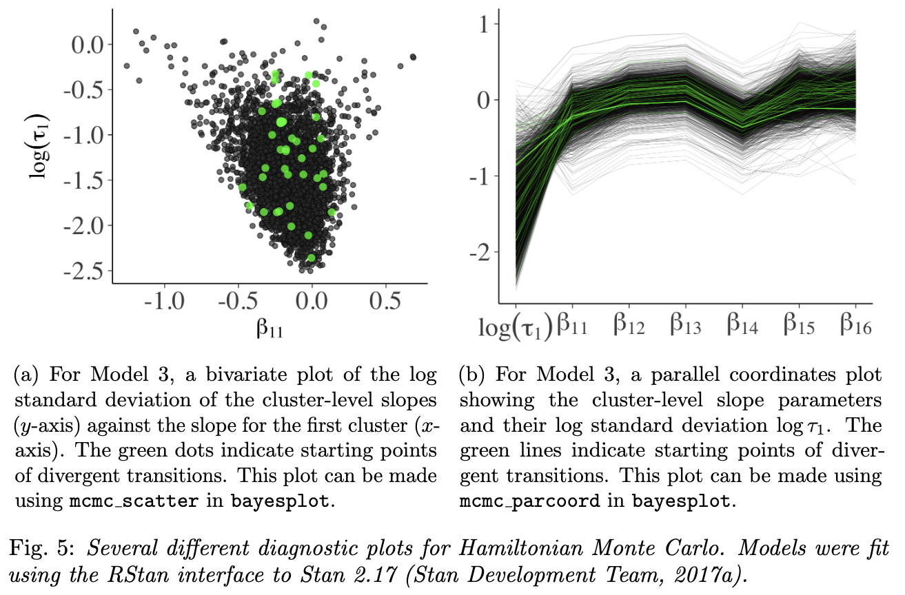

```{r setup, include=FALSE}
knitr::opts_chunk$set(echo = TRUE, dpi = 300, comment = "#>")
```

## Resources

- reading:
  - BDA3 ch. 6 "Model checking" and [ch. 6 reading instructions](../reading-instructions/BDA3_ch06_reading-instructions.pdf)
  - BDA3 ch. 7 "Evaluating, comparing, and expanding models" and [ch. 7 reading instructions](../reading-instructions/BDA3_ch07_reading-instructions.pdf)
  - read *Visualization in Bayesian workflow* ([pdf](additional-reading/Visualization-in-Bayesian-workflow.pdf), [link](https://doi.org/10.1111/rssa.12378))
  - read *Practical Bayesian model evaluation using leave-one-out cross-validation and WAIC* ([pdf](additional-reading/Practical-Bayesian-model-evaluation-using-leave-one-out-cross-validation-and-WAIC.pdf), [link](https://arxiv.org/abs/1507.04544))
  - additional reading material:
    - [Model assesment, selection and inference after selection](https://avehtari.github.io/modelselection/)
    - [Cross-validation FAQ](https://avehtari.github.io/modelselection/CV-FAQ.html)
- lectures:
  - ['Lecture 8.1. Model Checking'](https://aalto.cloud.panopto.eu/Panopto/Pages/Viewer.aspx?id=7047e366-0df6-453c-867f-aafb00ca2d78)
  - ['Lecture 8.2. Cross-Validation (part 1)'](https://aalto.cloud.panopto.eu/Panopto/Pages/Viewer.aspx?id=d7849131-0afd-4ae6-ad64-aafb00da36f4)
- slides:
  - [ch 6 slides](../slides/slides_ch6.pdf)
  - [ch 7 slides](../slides/slides_ch7.pdf)
  - [ch 7b slides](../slides/slides_ch7b.pdf)

## Notes

### Chapter 6 reading instructions

- Replicates vs. future observation
  - predictive $\tilde{y}$: the next yet unobserved possible observation
  - $y^\text{rep}$: replicating the whole experiment (with same values of $x$) and obtaining as many replicated observations as in the original data
- Posterior predictive *p*-values
  - **do not recommend *p*-values any more** especially in a form of hypothesis testing
- Prior predictive checking
  - using just the prior predictive distributions for assessing the sensibility of the model and priors before observing any data

### Chapter 6. Model checking

#### 6.1 The place of model checking in applied Bayesian statistics

- must assess the fit of a model to the data and to our substantive domain knowledge

##### Sensitivity analysis and model improvement

- *sensitivity analysis*: "how much do posterior inference change when other reasonable probability models are used in place of the present model?" (pg. 141)

##### Judging model flaws by their practical implications

- not interested in if the model is true or false - will likely always be false
- more interested in the question: "Do the model's deficiencies have a noticeable effect on the substantive inferences?" (pg. 142)
  - keep focus on the more important parts of the model, too

#### 6.2 Do the inferences from the model make sense?

- there will be knowledge that is not included in the model
  - if the additional information suggests that posterior inferences are false, this suggests an option for improving the model's accuracy

##### External validation

- *external validation*: "using the model to make predictions about future data, and then collecting those data and comparing to their predictions" (pg. 142)

#### 6.3 Posterior predictive checking

- if the model fits, then generated replicate data should look like the observed data
  - "the observed data should look plausible under the posterior predictive distribution" (pg. 143)
  - is a *self-consistency check*
- important to choose test quantities that are of interest of the goals of the model
  - may be inaccurate in some regards, but the relevance should be taken into account
- need not worry about adjusting for multiple comparisons:
  - "We are not concerned with 'Type I error' rate... because we use the checks not to accept or reject a model but rather to understand the limits of its applicability in realistic replications." (pg. 150)

#### 6.4 Graphical posterior predictive checks

- three types of graphical display to start a posterior predictive check:
  1. direct display of all the data
    - may need to get clever with how to do this effectively
  2. display of data summaries or parameter inferences
    - useful when dataset is very large or want to focus on a particular part of the model
  3. graphs of residuals or other measures of discrepancy between the model and data
    - description of how to do this effectively for discrete data

#### 6.5 Model checking for the educational testing example

- check that posterior parameter values and predictions are reasonable
- compare summary statistics of real data and predictive distributions
  - min. and max. values, averages, skewness
- sensitivity analysis can assuage concerns that the outcome was not determined by specific choices of priors

### Chapter 6. Lecture notes

#### Lecture 8.1. Model Checking

- model checking overview:
  - Sensibility with respect to additional information not used in modeling
    - e.g., if posterior would claim that hazardous chemical decreases probability of death
  - External validation
    - compare predictions to completely new observations
    - compare to theoretical values
      - e.g., relativity theory predictions on the speed of light (not based on model optimized to data)
  - Internal validation
    - posterior predictive checking
    - cross-validation predictive checking
- example of posterior checks with air quality model
- examples with binary data and logistic regression
- get posterior predictive distribution in Stan:

```
data {
  int<lower=1> N;
  int<lower=0> y[N];
}
parameters {
  real<lower=0> lambda;
}
model {
  lambda ~ exponential(0.2);
  y ~ poisson(lambda);
}
generated_quantities {
  real log_lik[N];
  int y_rep[N];
  for (n in 1:N) {
    y_rep[n] = poisson_rng(lambda);
    log_lik[n] = poisson_lpmf(y[n] | lambda);
  }
}
```

---

### Chapter 7 reading instructions

- reading
  - 7.1 Measures of predictive accuracy
  - 7.2 Information criteria and cross-validation
    - replace with: *Practical Bayesian model evaluation using leave-one-out cross-validation and WAIC*[^1]
  - 7.3 Model comparison based on predictive performance
    - replace with: *Practical Bayesian model evaluation using leave-one-out cross-validation and WAIC*[^1]
  - 7.4 Model comparison using Bayes factors
  - 7.5 Continuous model expansion / sensitivity analysis
  - 7.6 Example (may be skipped)
- extra material
  - [LOO package glossary](https://mc-stan.org/loo/reference/loo-glossary.html) summarizes many important terms used in the assignments[^2]
  - article discussing “How should I evaluate my modelling choices?”: *Between the devil and the deep blue sea: Tensions between scientific judgement and statistical model selection.*[^3]
  - website about model selection by Vehtari: [Model assesment, selection and inference after selection](https://avehtari.github.io/modelselection/)
  - sections 1 & 5 of *Uncertainty in Bayesian Leave-One-Out Cross-Validation Based Model Comparison*[^4] clarify how to interpret standard error in model comparison
  - *A survey of Bayesian predictive methods for model assessment, selection and comparison.*[^5]
  - *Comparison of Bayesian predictive methods for model selection.*[^6]


[^1]: Vehtari, Aki, Andrew Gelman, and Jonah Gabry. 2017. “Practical Bayesian Model Evaluation Using Leave-One-out Cross-Validation and WAIC.” Statistics and Computing 27 (5): 1413–32.
[^2]: https://CRAN.R-project.org/package=loo
[^3]: Navarro, D.J. Between the Devil and the Deep Blue Sea: Tensions Between Scientific Judgement and Statistical Model Selection. Comput Brain Behav 2, 28–34 (2019). https://doi.org/10.1007/s42113-018-0019-z
[^4]: Tuomas Sivula, Måns Magnusson, Aki Vehtari "Uncertainty in Bayesian Leave-One-Out Cross-Validation Based Model Comparison," arXiv, 2008.10296, (2020)
[^5]: Aki Vehtari, Janne Ojanen "A survey of Bayesian predictive methods for model assessment, selection and comparison," Statistics Surveys, Statist. Surv. 6(none), 142-228, (2012)
[^6]: Piironen, J., Vehtari, A. Comparison of Bayesian predictive methods for model selection. Stat Comput 27, 711–735 (2017). https://doi.org/10.1007/s11222-016-9649-y

### Chapter 7. Evaluating, comparing, and expanding models

- goal of this chapter is not to check model fit but to compare models and explore directions for improvement

#### 7.1 Measures of predictive accuracy

- can use predictive accuracy for comparing models
- **log predictive density**: the logarithmic score for predictions is the log predictive density $\log p(y|\theta)$
  - expected log predictive density as a measure of overall model fit
- *external validation*: ideally, would check a model's fit on out-of-sample (new) data

##### Averaging over the distirbution of future data

- *expected log predictive density* (*elpd*) for a new data point:
  - where $f$ is the true data-generating process and $p_\text{post}(y)$ is the posterior probability of $y$
  - $f$ is usually unknown

$$
\text{elpd} =
  \text{E}_f(\log p_\text{post}(\tilde{y}_i)) =
  \int (\log p_\text{post}(\tilde{y}_i)) f(\tilde{y}_i) d\tilde{y}
$$

- for a new *dataset* (instead of a single point) of $n$ data points
  - kept as pointwise so can be related to cross-validation

$$
\text{elppd} =
  \text{expected log pointwise predictive density} =
  \sum_{i=1}^{n} \text{E}_f (\log p_\text{post}(\tilde{y}_i))
$$

##### Evaluating predictive accuracy for a fitted model

- in practice, we do not know $\theta$ so cannot know the log predictive density $\log p(y|\theta)$
- want to use the posterior distribution $p_\text{post}(\theta) = p(\theta|y)$ and summarize the predictive accuracy of a fitted model to data:

$$
\begin{aligned}
\text{lppd} &= \text{log pointwise predictive density} \\
  &= \log \prod_{i=1}^{n} p_\text{post}(y_i) \\
  &= \sum_{i=1}^{n} \log \int p(y_i|\theta) p_\text{post}(\theta) d\theta
\end{aligned}
$$

- to actually compute *lppd*, evaluate the expectation using the draws from $p_\text{post}(\theta)$, $\theta^s$:
  - this equation is a biased version of *elppd* so need to correct it (next section in information criteria)

$$
\begin{aligned}
\text{computed lppd} &= \text{computed log pointwise predictive density} \\
  &= \sum_{i=1}^{n} \log \lgroup \frac{1}{S} \sum_{s=1}^{S} p(y_i|\theta^s) \rgroup
\end{aligned}
$$

#### 7.2 Information criteria and cross-validation

- historically, measures of predictive accuracy are referred to as *information criteria*
  - are typically defined based on the deviance

##### Estimating out-of-sample predictive accuracy using available data

- estimate the expected predictive accuracy without waiting for new data
- some reasonable approximations for out-of-sample predictive accuracy
  - *within-sample predictive accuracy*: "naive estimate of the expected log predictive density for new data is the log predictive density for existing data" (pg 170)
  - *adjusted within-sample predictive accuracy*: information criteria such as WAIC
  - *cross-validation*: estimate out-of-sample prediction error by fitting to training data and evaluating predictive accuracy on the held-out data

- descriptions of Akaike information criterion (AIC), deviance information criterion (DIC), and Watanabe-Akaike information criterion (or widely applicable information criterion; WAIC)
  - DIC and WAIC try to adjust for the *effective* number of parameters
  - WAIC is the best for Bayesian because it uses the full posterior distributions, not point estimates
    - there are actually two formulations for WAIC, and Gelman *et al.* recommend the second form they describe

##### Effective number of parameters as a random variable

- DIC and WAIC adjust the effective number of parameters according to the model structure and the data
  - the latter seems unintuitive
- example: image a simple model: $y_i, \dots, y_n \sim N(\theta, 1)$ with $n$ large and $\theta \sim U(0, \infty)$
  - $\theta$ is constrained to be positive but is otherwise uninformed
  - if the measure of $y$ is near 0, then the effective number of parameters $p$ is effectively $\frac{1}{2}$ because the prior removed all negative values
  - if the measure of $y$ is a large positive value, then the constraint by the prior is unimportant and the effective number of parameters $p$ is essentially 1

- Bayesian information criterion (BIC) is not comparable to AIC, DIC, and WAIC as it serves a different purpose
  - more discussion on pg. 175

#### 7.3 Model comparison based on predictive performance

- in comparing "nested" models, the large model is often better fit, but is more difficult to understand and compute
  - "nested" models are where one contains the structure of the other and a little more
    - either broader priors or additional parameters
  - key questions of model comparison:
    1. Is the improvement in fit large enough to justify the additional difficulty of fitting?
    2. Is the prior distribution on the additional parameters reasonable?
- for non-nested models, not typically interested in *choosing* one over the other, but more interested in seeing the differences between them
  - ideally, could construct a single model containing both of the non-nested models
- authors recommend using LOO-=CV where possible and WAIC, otherwise (pg. 182)

#### 7.4 Model comparison using Bayes factor

- generally not recommended (pg. 182 for reasons why)

#### 7.5 Continuous model expansion

- posterior distributions of model parameters can either overestimate or underestimate different aspects of the "true" posterior uncertainty
  - overestimate uncertainty because the model usually does not contain *all* of one's substantive knowledge
  - underestimate uncertainty by
    - the model is almost always wrong (i.e. imperfect) - the reason for posterior predictive checking
    - other reasonable models could have fit the data equally well - the reason for sensitivity analysis

##### Adding parameters to a model

- reasons to expand a model:
  1. add knew parameters if the model does not fit the data or prior knowledge in some important way
  2. the class of models can be broadened if some modeling assumption was unfounded
  3. if two different models are under consideration, they can be combined into a larger model with a continuous parameterization that includes both models as special cases
    - e.g. complete-pooling and no-pooling can be combined into a hierarchical model
  4. expanding a model to include new data

#### Practical advice for model checking and expansion

- examine posterior distributions of substantively important parameters and predicted quantities
  - e.g. number of zeros in a count model
  - maximum and minimum predicted values
- compare posterior distributions and posterior predictions with substantive knowledge
  - this includes the observed data

### Additional Reading

#### *Visualization in Bayesian workflow*

([pdf](additional-reading/Visualization-in-Bayesian-workflow.pdf), [link](https://doi.org/10.1111/rssa.12378))

- the phases of statistical workflow:
  a. exploratory data analysis
    - aid in setting up an initial model
  b. computational model checks using fake-data simulation and the prior predictive distribution
  c. computational checks to ensure the inference algorithm works reliably
  d. posterior predictive checks and other juxtapositions of data and predictions under the fitted model
  e. model comparison via tools such as cross-validation

##### 3. Fake data can be almost as valuable as real data for building your model

- visualize simulations from the prior marginal distribution of the data to assess the consistency of the chosen priors with domain knowledge
- *weakly informative  prior*: if draws from the prior data generating distribution $p(y)$ could represent any dataset that could plausibly be observed
  - this prior predictive distribution for the data has at least some mass around extreme but plausible data sets
  - there should be no mass on completely implausible data sets
  - generate a “flip book” of simulated datasets that can be used to investigate the variability and multivariate structure of the distribution

##### 4. Graphical Markov chain Monte Carlo diagnostics: moving beyond trace plots

- catching divergent draws heuristically is a powerful feature of HMC
  - sometimes get falsely flagged, so must check that the divergences were infact outside of the typical set
  - two additional plots for diagnosing troublesome areas of the parameter space
    1. bivariate scatterplots that highlight divergent transitions
      - bad sign: if the divergences were clustered
    2. parallel coordinate plot
      - bad sign: the divergences would have similar structure



#### 5. How did we do? Posterior predictive checks are vital for model evaluation

- "The idea behind posterior predictive checking is simple: if a model is a good fit we should be able to use it to generate data that resemble the data we observed"
  - "can also perform similar checks within levels of a grouping variable"
- check that predictions are calibrated using LOO-CV predictive cumulative density function values which should be uniform (for continuous data)

#### 6. Pointwise plots for predictive model comparison

- identify unusual points in the data
  - are other either outliers or points with high leverage
  - indicate how the model can be modified to better fut the data
- main tool for this analysis is the LOO predictive distribution $p(y_i|y_{-i})$
  - examine LOO log-predictive density values to find observations that are difficult to predict
  - can be used for model comparison by checking which model best captures each held-out data point
- also compare the full data log-posterior predictive density against each LOO log-predictive density to see which data points are difficult to model but not very influential
  - this is automatically calculated in PSIS-LOO as the parameter $\hat{k}$

#### *Practical Bayesian model evaluation using leave-one-out cross-validation and WAIC*

([pdf](additional-reading/Practical-Bayesian-model-evaluation-using-leave-one-out-cross-validation-and-WAIC.pdf), [link](https://arxiv.org/abs/1507.04544))

> Here we lay out fast and stable computations for LOO and WAIC that can be performed usingexisting simulation draws.
> We introduce an efficient computation of LOO using Pareto-smoothed importance sampling (PSIS), a new procedure for regularizing importance weights.
> Although WAIC is asymptotically equal to LOO, we demonstrate that PSIS-LOO is more robust in thefinite case with weak priors or influential observations.

##### Introduction

- exact CV requires re-fitting the model with every new training set
- can approximate this with LOO-CV using importance sampling, but results can be very noisy
- use *Pareto smoothed importance sampling* (PSIS) to calculate a more accurate and stable estimate
   - fit a Pareto distribution to the upper tail of the distribution of the importance weights
- this paper demonstrates that PSIS-LOO is better than WAIC in the finite case
  - also provide diagnostics for which method, WAIC or PSIS-LOO, is better or whether *k*-fold CV should be used instead

##### Estimating out-of-sample pointwise predictive accuracy using posterior simulations

- posterior predictive distribution: $p(\tilde{y}|y) = \int p(\tilde{y}_i|\theta) p(\theta|y) d\theta$
- expected log pointwise predictive density (ELPD)
  - measure of predictive accuracy for the $n$ data points in a dataset
  - $p_t(\tilde{y}_i)$: distribution of the true data-generating process for $\tilde{y}_i$
  - $p_t(\tilde{y}_i)$ is usually unknown so CV and WAIC are used to approximate ELPD

$$
\text{elpd} = \sum_{i=1}^n \int p_t(\tilde{y}_i) \log p(\tilde{y}_i|y) d\tilde{y}_i
$$

- useful quantity is the log pointwise predictive density (LPD)
  - "The LPD of observed data $y$ is an overestimate of the ELPD for future data."

$$
\text{lpd} = \sum_{i=1}^n \log p(y_i|y) = \sum_{i=1}^n \int p(y_i|\theta) p(\theta|y) d\theta
$$

- to compute LPD in practice, evaluate the expectation using draws for the posteior $p_\text{post}(\theta)$, $\theta^s$ for $s = 1, \dots, S$
  - $\widehat{lpd}$: computed log pointwise predictive density

$$
\widehat{lpd} = \sum_{i=1}^n \lgroup \frac{1}{S} \sum_{s=1}^S p(y_i|\theta^s) \rgroup
$$
##### Pareto smoothed importance sampling

- fit the right tail of importance weights to smooth the values
- The estimated shape parameter $\hat{k}$ of the generalized Pareto distribution can be used to assessthe reliability of the estimate:
  - $k < \frac{1}{2}$: the variance of the raw importance ratios is finite, the central limit theorem holds, and the estimate converges quickly
  - $\frac{1}{2} < k < 1$: the variance of the raw importance ratios is infinite but the mean exists, the generalized central limit theorem for stable distributions holds, and the convergence of the estimate is slower
    - the variance of the PSIS estimate is finite but may be large
  - $k > 1$: the variance and the mean of the raw ratios distribution do not exist
    - the variance of the PSIS estimate is finite but may be large
- "If the estimated tail shape parameter $\hat{k}$ exceeds 0.5, the user should be warned, although in practice we have observed good performance for values of$\hat{k}$ up to 0.7."
- if the PSIS estimate has a finite variance, when $\hat{k} > 0.7$ the user should consider:
  1. sampling directly from $p(\theta^s|y_{−i})$ for the problematic $i$,
  2. use *k*-fold CV, or
  3. use a more robust model


#### Model assesment, selection and inference after selection

([link](https://avehtari.github.io/modelselection/))

#### Cross-validation FAQ

([link](https://avehtari.github.io/modelselection/CV-FAQ.html))

### Chapter 7. Lecture notes

#### Lecture 8.2. Cross-Validation (part 1)

- predictive performance
  - true predictive performance can be found by making predictions on new data and comparing to true observation
     - *external validation*
  - *expected* predictive performance as an approximation
- calculating the posterior predictive density for a data point:
  - generate a posterior predictive distribution for the data point
  - find the density of the distribution at the actual observed value
- good walk-through of calculating posterior predictive distributions and LOO analyses
- some discussion of making predictions in parts of $x$ not in the data set
  - e.g. predictions in the future of time series models
